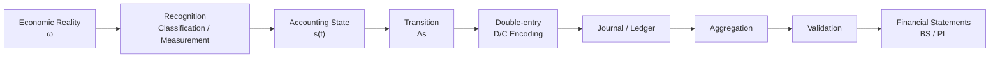
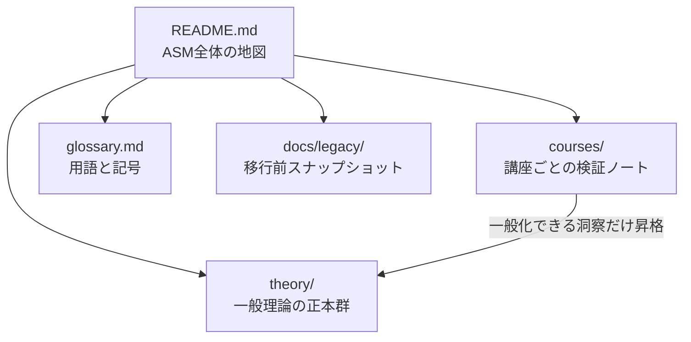
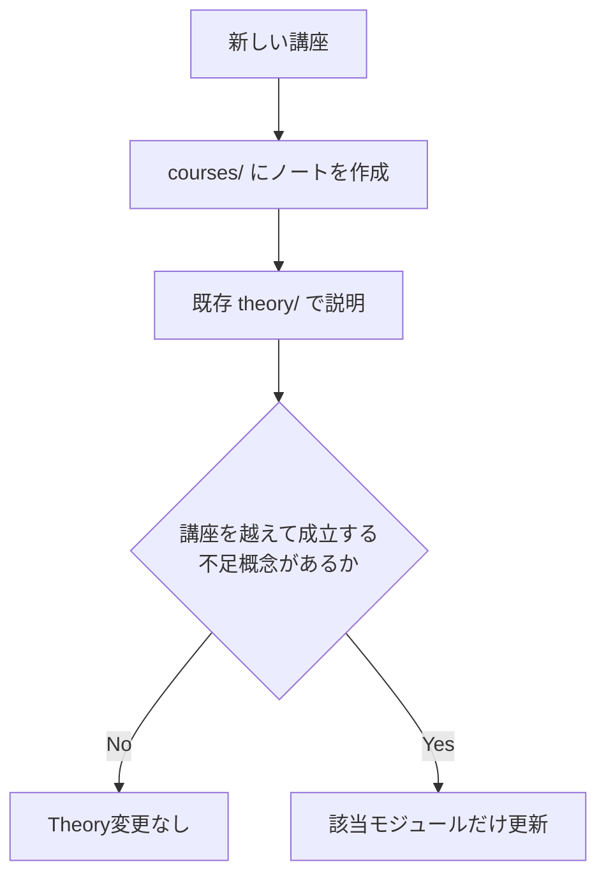

# Accounting State Model (ASM)

Accounting State Model (ASM) は、簿記・会計を次のように捉えるための数学モデルです。

> 認識された経済的事象による制約付き状態遷移と、その記録・再索引化・集約・検証

このリポジトリでは、一般化された理論を `theory/`、各講座で理論を検証した記録を `courses/` に分けます。README は両者を結ぶ地図です。

## Core Pipeline

状態遷移の中心式は、

$$
s^+=s^-+\Delta s
$$

です。有効な貸借対照表状態は、

$$
A-L-E=0
$$

を満たします。一方、仕訳や試算表に現れる貸借一致は、状態制約そのものではなく、記録レイヤーでの整合条件です。

## Repository Map

## Theory Modules

1. [Reality and Recognition](theory/01-reality-and-recognition.md) — 現実、認識、分類、測定
2. [State](theory/02-state.md) — Stock 状態と貸借対照表制約
3. [Transition](theory/03-transition.md) — 取引による状態変化と制約保存
4. [Accounts and Classification](theory/04-accounts-and-classification.md) — 勘定科目、5要素、粒度
5. [Double Entry](theory/05-double-entry.md) — 借方・貸方への符号化と仕訳
6. [Journal and Ledger](theory/06-journal-and-ledger.md) — 仕訳帳、転記、元帳、追跡可能性
7. [Period and Stock-Flow](theory/07-period-stock-flow.md) — 会計期間、Stock、Flow、決算
8. [Aggregation](theory/08-aggregation.md) — 情報階層、補助簿、情報損失
9. [Validation](theory/09-validation.md) — 構造的・意味的・実証的整合性

`theory/` 全体が現行の正本です。単独の巨大な正本ファイルは置きません。

## Course Notes

### 入門

1. [簿記とは](courses/introduction/01-bookkeeping.md)
2. [複式簿記とは](courses/introduction/02-double-entry.md)
3. [勘定科目とは](courses/introduction/03-accounts.md)
4. [勘定記入とは](courses/introduction/04-account-entry.md)
5. [仕訳とは](courses/introduction/05-journal-entry.md)
6. [転記とは](courses/introduction/06-posting.md)
7. [決算と会計期間](courses/introduction/07-closing-and-period.md)
8. [仕訳帳と総勘定元帳](courses/introduction/08-journal-and-general-ledger.md)
9. [補助簿](courses/introduction/09-subsidiary-books.md)
10. [試算表](courses/introduction/10-trial-balance.md)

### 簿記3級

1. [現金](courses/grade3/01-cash.md)

新しい講座ノートは [Course Note Template](courses/TEMPLATE.md) から作成します。

## Working Rule

原則は「`courses/` を先に編集し、反例や具体例で検証したうえで、一般化できる内容だけ `theory/` へ昇格する」です。詳細は [AGENTS.md](AGENTS.md) を参照してください。

## Status

- 現行構成: モジュール型正本
- 初期理論: ASM v0.2 を9モジュールへ分解
- 旧構成: [ASM v0.2 移行スナップショット](docs/legacy/asm-v0.2.md)
- 次の検証対象: 簿記3級の具体的な取引・決算整理
