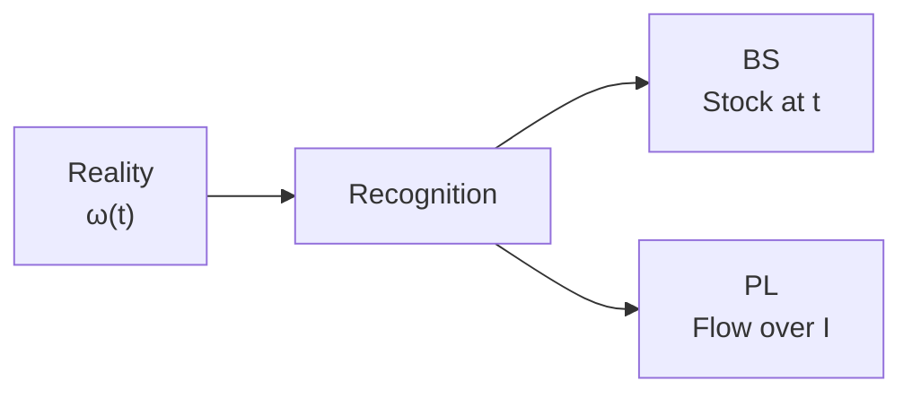

# 第1講 — 簿記とは

> いぬぼき「初めて学ぶ簿記入門講座」第1講を ASM で読む Course Note。

## 1. この講座で学ぶこと

簿記が企業活動を記録し、財政状態と経営成績を報告する仕組みであることを学ぶ。ASM では「企業そのもの」と「企業の会計表現」を分ける。

## 2. 通常の簿記的説明

企業は日々の取引を帳簿へ記録し、一定期間ごとに貸借対照表と損益計算書を作る。貸借対照表はある時点の財政状態、損益計算書はある期間の経営成績を示す。

## 3. 関連するASM

- [01 — Reality and Recognition](../../theory/01-reality-and-recognition.md)
- [02 — State](../../theory/02-state.md)
- [07 — Period and Stock-Flow](../../theory/07-period-stock-flow.md)
- [08 — Aggregation](../../theory/08-aggregation.md)

## 4. ASMによる説明

会社の現実状態 $\omega(t)$ は、会計認識作用を通じて構造化された会計情報になる。BS は Stock 状態 $s(t)$ の集約、PL は期間 $I$ に属する Flow の集約である。

## 5. 数学モデル

$$
\omega(t)\xrightarrow{\mathcal A}\text{Accounting Information}
$$

$$
G_S(s(t))=(A(t),L(t),E(t))^\top
$$

$$
P(I)=R(I)-C(I)
$$

## 6. 具体例

3月31日の現金100、備品50、借入金80、純資産70は Stock の集約として、

$$
A=150,\quad L=80,\quad E=70
$$

を与える。一方、4月1日から翌3月31日までの売上200と費用140は Flow であり、利益は60である。

## 7. 現行ASMで説明できるか

**判定:** Yes

現実と会計表現、BS と PL、Stock と Flow の基本的な違いを既存 Theory で説明できる。

## 8. ASMへの新しい洞察

会計報告は現実の複製ではなく、認識・分類・測定・集約を経た情報表現である。

## 9. Theory更新候補

なし。v0.2 の基礎として反映済み。

## 10. 未解決問題

認識作用 $\mathcal A$ が、会計基準、時点、見積りにどのように依存するか。
