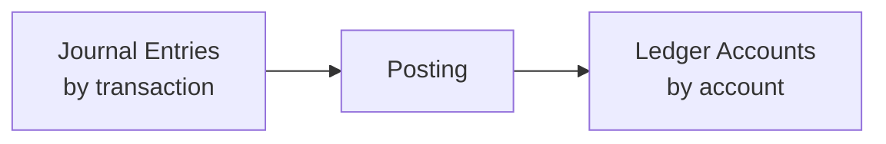

# 第6講 — 転記とは

> いぬぼき「初めて学ぶ簿記入門講座」第6講を ASM で読む Course Note。

## 1. この講座で学ぶこと

取引ごとに作られた仕訳を、各勘定の履歴へ振り分ける転記を学ぶ。

## 2. 通常の簿記的説明

仕訳帳の借方・貸方に記録された内容を、それぞれ対応する総勘定元帳の勘定口座へ移す。これにより勘定別の増減と残高を確認できる。

## 3. 関連するASM

- [03 — Transition](../../theory/03-transition.md)
- [06 — Journal and Ledger](../../theory/06-journal-and-ledger.md)
- [07 — Period and Stock-Flow](../../theory/07-period-stock-flow.md)

## 4. ASMによる説明

転記は transaction-centric な情報を account-centric に再索引化する操作である。新しい経済的事象ではないため、転記自体は状態遷移を生じさせない。

## 5. 数学モデル

$$
\mathcal J\xrightarrow{\mathrm{Posting}}\mathcal L
$$

$$
\pi_i(\Delta x)=\Delta x_i
$$

$$
\Delta s_{\mathrm{posting}}=0
$$

## 6. 具体例

現金の変化が取引順に $+100,-50,+80$ なら、現金勘定の履歴は、

$$
L_{\mathrm{Cash}}=(+100,-50,+80)
$$

となる。期首現金20なら、期末現金は150である。

## 7. 現行ASMで説明できるか

**判定:** Yes

射影と再索引化により、紙帳簿とデータベースの双方に通じる本質を説明できる。

## 8. ASMへの新しい洞察

Posting は representation-preserving transformation であり、転記ミスは意味保存の失敗である。

## 9. Theory更新候補

なし。[06 — Journal and Ledger](../../theory/06-journal-and-ledger.md) に反映済み。

## 10. 未解決問題

実装上、仕訳帳と元帳を別データとして保存する場合と同一データの view とする場合の差を、理論へどこまで含めるか。
