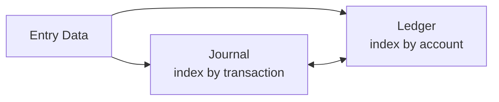

# 第8講 — 仕訳帳と総勘定元帳

> いぬぼき「初めて学ぶ簿記入門講座」第8講を ASM で読む Course Note。

## 1. この講座で学ぶこと

主要簿である仕訳帳と総勘定元帳の役割、記入順序、相互参照を学ぶ。

## 2. 通常の簿記的説明

取引をまず仕訳帳へ日付順に記録し、その内容を総勘定元帳の各勘定へ転記する。元丁・仕丁により転記元と転記先を相互に確認できる。

## 3. 関連するASM

- [06 — Journal and Ledger](../../theory/06-journal-and-ledger.md)
- [09 — Validation](../../theory/09-validation.md)

## 4. ASMによる説明

仕訳帳と元帳は、同じ基礎データに対する異なる索引である。前者は取引・時間、後者は勘定を検索軸とする。相互参照は audit trail を作る。

## 5. 数学モデル

$$
\mathcal J=(J_1,\ldots,J_m)
$$

$$
\mathcal L=\{L_1,\ldots,L_n\}
$$

$$
\mathcal J\leftrightarrow\mathcal L
$$

## 6. 具体例

行列 $M_{ik}$ で $i$ を勘定、$k$ を取引とする。第 $k$ 列は1つの仕訳、第 $i$ 行は1つの勘定履歴を表す。ただし実際の転記は日付や摘要も保持するため、文字どおりの行列転置ではない。

## 7. 現行ASMで説明できるか

**判定:** Yes

transaction-oriented view と account-oriented view、および追跡可能性で説明できる。

## 8. ASMへの新しい洞察

帳簿とは紙の表ではなく、会計イベントを異なる索引で検索・再構成・検証する記録構造である。

## 9. Theory更新候補

なし。[06 — Journal and Ledger](../../theory/06-journal-and-ledger.md) に反映済み。

## 10. 未解決問題

訂正仕訳や取消仕訳を audit trail 上の不可変イベントとしてどう扱うか。
