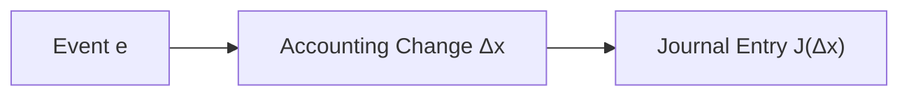

# 第5講 — 仕訳とは

## 1. この講座で学ぶこと

1つの取引による複数の勘定変化を、勘定・借貸方向・金額の組として1つの記録に束ねる方法を学ぶ。

## 2. 通常の簿記的説明

取引を借方と貸方に分け、借方合計と貸方合計が一致するように記録する。複合仕訳では、片側または両側に複数の勘定が現れる。

## 3. 関連するASM

- [01 — Reality and Recognition](../../theory/01-reality-and-recognition.md)
- [05 — Double Entry](../../theory/05-double-entry.md)
- [09 — Validation](../../theory/09-validation.md)

## 4. ASMによる説明

仕訳は取引そのものではなく、認識された会計的変化 $\Delta x$ を D/C 形式へ符号化した表現である。

## 5. 数学モデル

$$
J(\Delta x)
=
\{(i,d_i,|\Delta x_i|)\mid i\in\operatorname{supp}(\Delta x)\}
$$

$$
r_J=D(J)-C(J)=0
$$

## 6. 具体例

備品800を購入し、現金300を支払い、残り500を未払とした場合、

$$
\Delta\mathrm{Equipment}=+800,
\quad
\Delta\mathrm{Cash}=-300,
\quad
\Delta\mathrm{Payable}=+500
$$

となる。仕訳は借方備品800、貸方現金300・未払金500で、3勘定でも貸借は一致する。

## 7. 現行ASMで説明できるか

**判定:** Yes

変化ベクトルの support と D/C encoding によって、単純仕訳と複合仕訳を同じ形式で説明できる。

## 8. ASMへの新しい洞察

仕訳は状態変化の圧縮された記録であり、$D=C$ という局所的な構造検査を内蔵する。

## 9. Theory更新候補

なし。仕訳の集合表現と必要条件としての貸借一致は [05 — Double Entry](../../theory/05-double-entry.md) に反映済み。

## 10. 未解決問題

摘要、証憑、取引時刻など、仕訳の数学的最小定義に含めないメタデータをどう位置づけるか。
