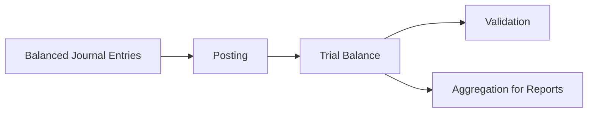

# 第10講 — 試算表

## 1. この講座で学ぶこと

総勘定元帳の各勘定を集計し、借方合計と貸方合計の一致を使って転記の整合性を検査する方法を学ぶ。

## 2. 通常の簿記的説明

合計試算表、残高試算表、合計残高試算表などを作り、借方と貸方の合計が一致することを確認する。試算表は財務諸表作成の基礎にもなる。

## 3. 関連するASM

- [05 — Double Entry](../../theory/05-double-entry.md)
- [06 — Journal and Ledger](../../theory/06-journal-and-ledger.md)
- [08 — Aggregation](../../theory/08-aggregation.md)
- [09 — Validation](../../theory/09-validation.md)

## 4. ASMによる説明

各仕訳で成立していた貸借一致が、転記・集計後にも保存されているかを元帳側で再計算する。試算表は Validation と Aggregation の二役を持つ。

## 5. 数学モデル

$$
b=D-C
$$

$$
r_{\mathrm{TB}}=\mathbf 1^\top(D-C)
$$

$$
r_{\mathrm{TB}}=0
$$

## 6. 具体例

全仕訳の借方合計が1,000、貸方合計が1,000なら、正しい転記後の試算表も両側1,000となる。一方、備品100を建物100へ誤分類しても貸借は一致するため、試算表だけでは検出できない。

## 7. 現行ASMで説明できるか

**判定:** Yes

残差ゼロによる構造検査と、その限界を説明できる。

## 8. ASMへの新しい洞察

簿記は記録システムであると同時に、異なるレイヤーで不変条件を再計算する自己整合性検査システムでもある。

## 9. Theory更新候補

なし。[09 — Validation](../../theory/09-validation.md) に反映済み。

## 10. 未解決問題

試算表で検出できない誤りを、証憑照合、実査、補助簿照合などと組み合わせてどう体系化するか。
