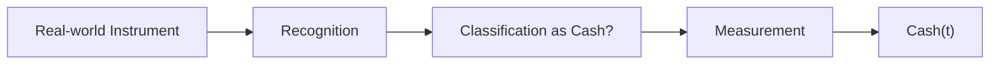

# 簿記3級 第1講 — 現金

> いぬぼき「日商簿記3級無料講座」の現金に関するページを ASM で読む Course Note。

## 1. この講座で学ぶこと

現金勘定の増減記録と、通貨代用証券を含む簿記上の現金の範囲を学ぶ。ASM では Recognition / Classification / Measurement を具体的に検証する。

## 2. 通常の簿記的説明

現金は資産であり、増加を借方、減少を貸方へ記録する。簿記上の現金には通貨だけでなく、他人振出小切手など、すぐに換金できる通貨代用証券も含まれる。

## 3. 関連するASM

- [01 — Reality and Recognition](../../theory/01-reality-and-recognition.md)
- [02 — State](../../theory/02-state.md)
- [04 — Accounts and Classification](../../theory/04-accounts-and-classification.md)
- [05 — Double Entry](../../theory/05-double-entry.md)
- [09 — Validation](../../theory/09-validation.md)

## 4. ASMによる説明

現金は Stock 状態 $s(t)$ の一座標であり、資産に分類される Debit-normal account である。

$$
c(\mathrm{Cash})=A,
\qquad
\sigma_{\mathrm{Cash}}=+1
$$

ただし現実世界の対象が自動的に Cash になるわけではない。対象を認識し、Cash に分類し、金額を測定する過程が必要である。

## 5. 数学モデル

現金残高の変化は、

$$
\Delta\mathrm{Cash}
=
\mathrm{Cash}(t^+)-\mathrm{Cash}(t^-)
$$

である。記録方向は、

$$
d_{\mathrm{Cash}}
=
\operatorname{sgn}(\Delta\mathrm{Cash})
\sigma_{\mathrm{Cash}}
$$

で求める。

## 6. 具体例

商品100を販売し、代金として他人振出小切手を受け取った場合、その証券を Cash に分類する。

$$
\Delta\mathrm{Cash}=+100
$$

なので現金100を借方、売上100を貸方へ記録する。物理的な紙幣を受け取っていなくても、会計上の性質によって Cash へ分類される。

## 7. 現行ASMで説明できるか

**判定:** Partially

現金の状態、分類、D/C、実査残差は説明できる。具体的に何を簿記上の現金へ含めるかは会計ルールに依存し、認識作用 $\mathcal A$ の詳細が必要である。

## 8. ASMへの新しい洞察

現実の対象をどの勘定へ分類するかは、物理的形状ではなく、換金可能性など会計上重視する性質に依存する。

## 9. Theory更新候補

この講座から得られた Recognition → Classification → Measurement の分解は、[01 — Reality and Recognition](../../theory/01-reality-and-recognition.md) に反映済み。

## 10. 未解決問題

- 通貨代用証券の範囲を、会計ルール $\rho$ の入力としてどう表現するか。
- 外貨現金の換算測定を Measurement と状態変化へどう分けるか。
