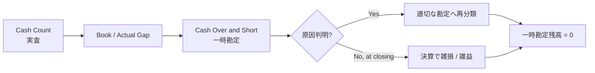

# 簿記3級 第2講 — 現金過不足

> いぬぼき「日商簿記3級無料講座」の現金過不足を ASM で読む Course Note。

## 1. この講座で学ぶこと

現金の帳簿残高と実際有高が一致しないときに、差額を認識し、原因の判明に応じて再分類し、決算までに一時勘定を消去する流れを学ぶ。

## 2. 通常の簿記的説明

現金過不足の処理は、次の3段階に分かれる。

1. 過不足判明時: 帳簿上の現金を実際有高へ合わせ、差額を現金過不足勘定へ記録する。
2. 原因判明時: 判明した金額を現金過不足から適切な勘定へ振り替える。
3. 決算時: 原因不明の残額を雑損または雑益へ振り替え、現金過不足残高をゼロにする。

現金過不足は差額を一時的に保持する特殊な勘定であり、資産・負債・純資産・収益・費用のいずれにも直接分類されない。

## 3. 関連するASM

- [01 — Reality and Recognition](../../theory/01-reality-and-recognition.md)
- [02 — State](../../theory/02-state.md)
- [04 — Accounts and Classification](../../theory/04-accounts-and-classification.md)
- [05 — Double Entry](../../theory/05-double-entry.md)
- [07 — Period and Stock-Flow](../../theory/07-period-stock-flow.md)
- [09 — Validation](../../theory/09-validation.md)

## 4. ASMによる説明

現金実査によって、帳簿表現と観察された現実の間に差が見つかる。最初に Cash 座標を実際有高へ修正するが、原因が分からないため、差額の最終的な意味分類はまだできない。

現金過不足勘定は、この未分類差額を一時的に保持する処理用勘定である。後から証拠が得られると、水道光熱費などの報告要素へ再分類される。決算まで原因が分からなければ、雑損または雑益として期間 Flow へ確定する。

## 5. 数学モデル

帳簿残高と実際有高の残差を、

$$
r_{\mathrm{cash}}
=
\mathrm{Cash}_{\mathrm{book}}
-
\mathrm{Cash}_{\mathrm{actual}}
$$

とする。帳簿を実際有高へ合わせる修正は、

$$
\Delta\mathrm{Cash}=-r_{\mathrm{cash}}
$$

であり、

$$
\mathrm{Cash}_{\mathrm{adjusted}}
=
\mathrm{Cash}_{\mathrm{book}}-r_{\mathrm{cash}}
=
\mathrm{Cash}_{\mathrm{actual}}
$$

となる。

原因が未確定の差額は一時勘定 $q$ に保持する。原因判明額と決算時処理を通じて、会計期間末には、

$$
\boxed{q(t_{\mathrm{close}})=0}
$$

とする。

## 6. 具体例

帳簿上の現金が1,300、実際有高が1,000なら、

$$
r_{\mathrm{cash}}=1{,}300-1{,}000=300
$$

である。現金を300減らすため、最初の仕訳は次になる。

| 借方 | 金額 | 貸方 | 金額 |
| --- | ---: | --- | ---: |
| 現金過不足 | 300 | 現金 | 300 |

その後、300のうち200が水道光熱費の記帳漏れだと判明した場合は、

| 借方 | 金額 | 貸方 | 金額 |
| --- | ---: | --- | ---: |
| 水道光熱費 | 200 | 現金過不足 | 200 |

と再分類する。決算時にも原因不明の100が残れば、

| 借方 | 金額 | 貸方 | 金額 |
| --- | ---: | --- | ---: |
| 雑損 | 100 | 現金過不足 | 100 |

として一時勘定をゼロにする。

## 7. 現行ASMで説明できるか

**判定:** Partially

Empirical Validity、残差、D/C表現、再分類、決算境界は既存ASMで説明できる。一方、従来の「すべての勘定は5要素に分類される」という定義では、5要素に属さない現金過不足勘定を表現できなかった。

## 8. ASMへの新しい洞察

### 帳簿勘定と報告要素は同じ集合ではない

帳簿処理には、資産・負債・純資産・収益・費用へ直ちに分類できない情報を一時的に保持する勘定が存在する。

$$
\boxed{
\text{Bookkeeping Accounts}
\supset
\text{Financial-statement Accounts}}
$$

### 記帳は不確実性を保持できる

原因不明だから記録しないのではなく、差額の存在は記録し、意味分類だけを保留できる。

### 原因判明は再分類である

原因判明時に新たな現金差異が発生したわけではない。新しい証拠によって、既に認識していた差額の意味が確定し、表現が更新される。

## 9. Theory更新候補

[04 — Accounts and Classification](../../theory/04-accounts-and-classification.md) を更新し、報告要素へ分類される勘定と、一時的な処理用勘定を区別した。

次の内容は、今後ほかの訂正・仮勘定でも確認してから昇格を検討する。

- 情報イベントによる過去の認識・分類の更新
- 一時勘定に対する期末残高ゼロ制約
- 不確実性の段階的解消としての再分類

## 10. 未解決問題

- 一時勘定 $q$ を会計状態 $s(t)$ の座標に含めるか、帳簿表現だけに置くか。
- 現金過不足の発見を、経済的事象ではなく情報事象として別に定義すべきか。
- 決算時の雑損・雑益への振替を、意味の確定と便宜的な期間帰属のどちらとして捉えるか。
