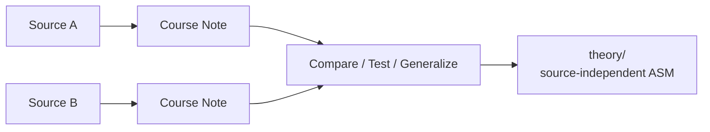

# Course Notes

`courses/` は、外部の教材・講座・文書を ASM で説明できるか検証した記録を管理する領域です。現在のノートはいぬぼきの講座を対象としていますが、ディレクトリ自体はいぬぼき専用ではありません。

## Directory Convention

```text
courses/
├── TEMPLATE.md
├── README.md
├── 0-introduction/
├── 1-grade3/
└── <order>-<course-id>/
```

- ディレクトリ名の先頭番号は、READMEでの表示・学習順を安定させる。
- `<course-id>` は講座、書籍、基準、解説体系などを表す。
- 情報源の識別はディレクトリ名だけに依存せず、各ノートの YAML `source` を正とする。
- 異なる情報源の内容を同じノートへ無条件に混ぜず、YAMLで参照元を追跡できるようにする。

現在の講座:

- `0-introduction/` — いぬぼき「初めて学ぶ簿記入門講座」
- `1-grade3/` — いぬぼき「日商簿記3級無料講座」

将来、別の教科書、会計基準、解説記事、大学講義などを検証するときは、次の番号を持つ別ディレクトリを追加できる。

## YAML Front Matter

すべての Course Note は、原則として次の3項目だけを YAML front matter に持つ。

- `source`: 資料・教材・サイト名
- `course`: 講座・文書体系名
- `url`: 直接参照したページ

複数ページを参照する場合だけ `related_urls` を追加する。URLを持たない書籍等では、`url` の代わりに最小限の書誌情報を追加してよい。

## Theory Promotion

Course Note に書かれた内容は、その情報源の説明を ASM で検証した結果であり、直ちに一般理論にはしない。



特定教材の表現を越えて成立する内容だけを `theory/` へ昇格する。
