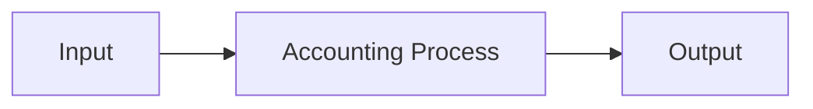

# 講座名

## 1. この講座で学ぶこと

通常の簿記として学ぶ内容と、このノートで検証する問いを書く。

## 2. 通常の簿記的説明

講座内容を、教材固有の説明と自分の理解を区別しながら整理する。

## 3. 関連するASM

- `theory/xx-module.md`（実在するモジュールへの相対リンクに置き換える）

## 4. ASMによる説明

既存 Theory の定義・写像・制約を使って説明する。

## 5. 数学モデル

インライン数式は `$...$`、別行数式は次の形式で書く。

$$
s^+=s^-+\Delta s
$$

構造図は Mermaid を使う。

## 6. 具体例

実際の金額、状態変化、仕訳、帳簿などを使って確認する。

## 7. 現行ASMで説明できるか

**判定:** Yes / Partially / No

判定理由を書く。

## 8. ASMへの新しい洞察

講座を越えて一般化できる可能性がある洞察を書く。なければ「なし」と記す。

## 9. Theory更新候補

更新対象、提案内容、根拠を書く。なければ「なし」と記す。

## 10. 未解決問題

今後の講座や具体例で検証すべき問いを書く。なければ「なし」と記す。
