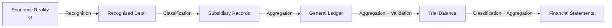
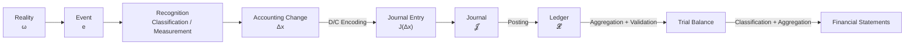

# Accounting State Model (ASM)

## 正本 v0.2 — 入門編完了時点（移行スナップショット）

> この文書は、単一ファイルを正本としていた ASM v0.2 の移行時スナップショットである。
> 現在の正本はリポジトリ直下の `theory/` 全体であり、この文書は更新しない。

## 0. 目的

Accounting State Model (ASM) は、簿記・会計を、状態・変化・認識・制約・記録・集約・検証の数学的構造として理解するためのモデルである。

$$
\mathrm{ASM}
=
\mathrm{Recognition}
+\mathrm{State}
+\mathrm{Transition}
+\mathrm{Constraint}
+\mathrm{Representation}
+\mathrm{Aggregation}
+\mathrm{Validation}
$$

ASM の目的は会計実務を置き換えることではなく、既存の簿記・会計ルールがなぜその構造を持つかを理解することである。

## 1. 現実と会計

時刻 $t$ の現実の経済状態を、

$$
\omega(t)\in\Omega
$$

とする。会計は現実そのものではなく、認識・分類・測定によって現実から構成される情報表現である。

$$
\boxed{
\omega\xrightarrow{\mathcal A}\text{Accounting Information}}
$$

$$
\boxed{\text{Reality}\neq\text{Accounting Representation}}
$$

現実のイベント $e$ により、

$$
\omega^-\xrightarrow{e}\omega^+
$$

となっても、必ず会計上の取引になるとは限らない。

## 2. Stock State

時刻 $t$ の Stock 型会計状態を、

$$
\boxed{s(t)\in\mathcal S}
$$

とする。例えば、

$$
s(t)=
\begin{pmatrix}
\mathrm{Cash}(t)\\
\mathrm{AccountsReceivable}(t)\\
\mathrm{Equipment}(t)\\
\mathrm{AccountsPayable}(t)\\
\mathrm{Debt}(t)\\
\mathrm{Capital}(t)\\
\vdots
\end{pmatrix}
$$

である。Stock 勘定は、状態空間の座標として扱う。

## 3. 集約とBS制約

詳細状態から、資産、負債、純資産を得る Stock 集約写像を、

$$
G_S(s)=
\begin{pmatrix}
A\\L\\E
\end{pmatrix}
$$

とする。有効状態は、

$$
\boxed{A-L-E=0}
$$

を満たす。制約関数を $g(s)=A(s)-L(s)-E(s)$ とすれば、

$$
\mathcal S_{\mathrm{valid}}
=
\{s\mid g(s)=0\}
$$

である。

## 4. 状態遷移

取引直前と直後の状態を $s^-$、$s^+$ とする。

$$
\boxed{\Delta s=s^+-s^-}
$$

$$
\boxed{s^+=s^-+\Delta s}
$$

取引前後で BS 制約が成立するなら、

$$
\boxed{\Delta A-\Delta L-\Delta E=0}
$$

である。複式簿記を、会計制約を保存する状態遷移の記録体系として解釈する。ただし、これを唯一の数学的定義とはしない。

## 5. Flow と会計期間

会計期間を、

$$
I=[t_0,t_1]
$$

とする。収益、費用、利益は、

$$
R(I),\quad C(I),\quad P(I)=R(I)-C(I)
$$

であり、時点ではなく期間に属する Flow である。

期間中の変化を累積すると、

$$
\boxed{
s(t_1)=s(t_0)+\sum_{k=1}^{m}\Delta s^{(k)}}
$$

となる。期末 Stock は次期首へ接続されるが、Flow は新しい期間で再び集計される。

## 6. 勘定科目

勘定 $i$ を、

$$
c(i)\in\{A,L,E,R,C\}
$$

へ分類する。Stock 勘定は状態座標、Flow 勘定は期間 Flow の分類軸である。勘定科目は現実の物体そのものではなく、会計目的に応じたカテゴリーでもある。

## 7. Debit / Credit

借方・貸方は経済的な正負ではなく、記録方向である。

$$
\mathrm{Debit}\neq+,
\qquad
\mathrm{Credit}\neq-
$$

各勘定の normal orientation を、

$$
\sigma_i=
\begin{cases}
+1 & \text{Debit-normal}\\
-1 & \text{Credit-normal}
\end{cases}
$$

とする。記録方向を、

$$
\boxed{d_i=\operatorname{sgn}(\Delta x_i)\sigma_i}
$$

で求める。

## 8. 仕訳

認識された会計的変化を D/C 形式へ変換したものを仕訳とする。

$$
e\longrightarrow\Delta x\longrightarrow J(\Delta x)
$$

$$
J(\Delta x)
=
\{(i,d_i,|\Delta x_i|)\mid i\in\operatorname{supp}(\Delta x)\}
$$

有効な仕訳は、

$$
\boxed{D(J)=C(J)}
$$

を満たす。仕訳残差を、

$$
r_J=D(J)-C(J)
$$

とすれば、形式的整合条件は $r_J=0$ である。ただし、

$$
r_J=0\not\Rightarrow\text{economic correctness}
$$

である。複式簿記は「1取引 = 必ず2勘定」を意味しない。

## 9. 仕訳帳・転記・元帳

期間中の仕訳列を、

$$
\mathcal J=(J_1,J_2,\ldots,J_m)
$$

とする。仕訳帳は transaction-centric event log である。

勘定 $i$ への射影を、

$$
\pi_i(\Delta x)=\Delta x_i
$$

とする。転記は、

$$
\boxed{\mathcal J\xrightarrow{\mathrm{Posting}}\mathcal L}
$$

という再索引化である。新しい状態遷移ではない。

$$
\boxed{\text{Posting is re-indexing, not a new state transition.}}
$$

勘定 $i$ の履歴を、

$$
L_i=(\Delta x_i^{(1)},\Delta x_i^{(2)},\ldots)
$$

とし、総勘定元帳を、

$$
\mathcal L=\{L_1,L_2,\ldots,L_n\}
$$

とする。元丁・仕丁は $\mathcal J\leftrightarrow\mathcal L$ の追跡可能性を与える。

## 10. 情報粒度と補助簿

詳細から要約への集約写像を、

$$
G:X_{\mathrm{detail}}\to X_{\mathrm{summary}}
$$

とする。一般に、

$$
G(y_1)=G(y_2)\not\Rightarrow y_1=y_2
$$

であるため、集約は情報を失う。

補助元帳は、

$$
x_i=\sum_jy_{ij}
$$

という state decomposition、補助記入帳は、

$$
\mathcal J_q=\{J_k\in\mathcal J\mid q(J_k)=1\}
$$

という event filtering として理解する。

## 11. 階層的会計情報モデル

右へ進むほど情報は集約される。

## 12. 試算表

各勘定の借方合計、貸方合計をベクトル $D,C$ とし、残高ベクトルを、

$$
b=D-C
$$

とする。試算表残差を、

$$
r_{\mathrm{TB}}
=
\mathbf 1^\top(D-C)
$$

とすれば、形式的整合条件は、

$$
\boxed{r_{\mathrm{TB}}=0}
$$

である。試算表は Validation と Aggregation の両方を担う。ただし、勘定誤り、取引の完全な記録漏れ、相殺する誤記などは検出できない場合がある。

## 13. 会計に現れる整合条件

$$
A-L-E=0
$$

$$
\Delta A-\Delta L-\Delta E=0
$$

$$
D(J)-C(J)=0
$$

$$
\sum_iD_i-\sum_iC_i=0
$$

これらは同一の式ではないが、会計システムの異なるレイヤーに存在する consistency constraint である。

## 14. 全体構造

帳簿は状態遷移そのものではなく、状態遷移を記録・再構成・検証する情報システムである。

## 15. 入門編終了時点の未解決問題

### 収益・費用の数学的位置

収益・費用は Flow だが、元帳では他の勘定と同様に扱われる。$s(t)$ と Flow accumulator を帳簿上どう統一するかは未解決である。

### 純資産と利益

暫定的に、

$$
E(t_1)-E(t_0)=P(I)+O(I)
$$

という関係を想定するが、所有者取引、配当、決算振替を学習した後に正式化する。

### 認識作用

減価償却、貸倒引当金、見越し・繰延べ、棚卸などを扱うには、

$$
\mathcal A(\omega,t,\text{rules},\text{estimates})
$$

のような拡張が必要になる可能性がある。

### 測定

何を認識するかだけでなく、それをいくらで記録するかという Measurement の形式化が必要である。

## 16. 最小公理系

1. Reality / Accounting Separation: $\omega\neq x$。
2. State: 時点 $t$ の Stock 状態 $s(t)$ が存在する。
3. Transition: $s^+=s^-+\Delta s$。
4. Constraint: 有効状態と遷移は会計制約を満たす。
5. Double-entry Representation: 状態変化は D/C へ符号化され、$D=C$ を満たす。
6. Accumulation: $s(t_1)=s(t_0)+\sum_k\Delta s^{(k)}$。
7. Aggregation: $G:X_{\mathrm{detail}}\to X_{\mathrm{summary}}$ が存在し、一般に情報を失う。
8. Validation: 残差 $r=0$ は形式的整合性を示すが、経済的正しさの十分条件ではない。

## 17. 一文定義

$$
\boxed{
\text{Accounting State Model}
=
\text{会計を、認識された経済的事象による制約付き状態遷移と、
その記録・集約・検証として捉えるモデル}}
$$

---

**Version:** 0.2

**Status:** 移行済み・更新停止

**Successor:** `theory/` の9モジュール
