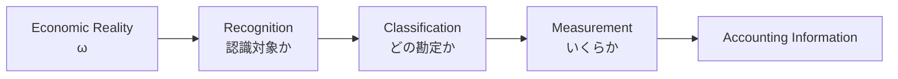

# 01 — Reality and Recognition

## Scope

このモジュールは、経済的現実がどのように会計情報になるかを扱う。ASM の出発点は、現実と会計表現を分離することである。

$$
\boxed{\text{Reality}\neq\text{Accounting Representation}}
$$

## Reality

時刻 $t$ における企業の現実の経済状態を、

$$
\omega(t)\in\Omega
$$

とする。$\Omega$ は、現実に存在しうる経済状態の集合である。現金の保有、契約、借入、商品の注文、火災、従業員の技能などは、まず $\Omega$ に属する事実である。

現実世界で発生する事象を $e$ とすれば、

$$
\omega^-\xrightarrow{e}\omega^+
$$

と書ける。ただし、現実が変化したことと、会計上の取引が発生したことは同じではない。

## Recognition Pipeline

現実から会計情報を構成する過程を、次の三段階に分ける。

- Recognition: 会計上記録する対象かを決める。
- Classification: 対象を勘定科目や会計要素に割り当てる。
- Measurement: 記録する金額を与える。

この複合作用を暫定的に $\mathcal A$ と書く。

$$
\mathcal A(\omega,t,\rho,\eta)
=
\text{recognized accounting information}
$$

ここで $\rho$ は会計ルール、$\eta$ は必要な見積りを表す。ASM v0.2 の単純形は、

$$
\omega\xrightarrow{\mathcal A}\text{Accounting Information}
$$

であるが、減価償却や貸倒見積りなどを扱うと、$\mathcal A$ が時点・規則・見積りに依存することが予想される。

## Accounting Transaction

現実の事象 $e$ が認識された会計状態変化を生じさせるとき、その事象を簿記上の取引として扱う。

$$
e\in\mathcal T
\quad\Longleftrightarrow\quad
\Delta x(e)\neq0
$$

これは入門段階の暫定条件である。注文や契約だけでは $\Delta x=0$ となる場合があり、盗難や火災は日常語の「取引」でなくても $\Delta x\neq0$ なら記録対象になりうる。

## Information Loss

会計は現実の完全な複製ではない。現実 $\omega$ には、仕訳に残らない目的、背景、品質、関係者、時刻の細部などが含まれる。したがって一般に、

$$
\mathcal A(\omega_1)=\mathcal A(\omega_2)
\not\Rightarrow
\omega_1=\omega_2
$$

である。会計認識は、目的に応じた抽象化でもある。

## Relationship to Other Modules

- 認識された Stock 情報は [02 — State](02-state.md) の $s(t)$ になる。
- 認識された変化は [03 — Transition](03-transition.md) の $\Delta s$ になる。
- Classification の一般構造は [04 — Accounts and Classification](04-accounts-and-classification.md) で扱う。
- 認識の正しさは [09 — Validation](09-validation.md) の Semantic / Empirical Validity に関係する。

## Open Questions

- 認識時点をどのように形式化するか。
- 見積りの不確実性を状態や測定値へどう含めるか。
- 取引条件 $\Delta x(e)\neq0$ を、注記や偶発事象まで含む会計へどう拡張するか。
