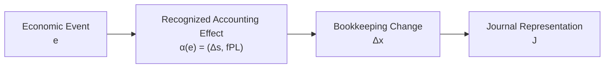

# 01 — Reality and Recognition

## Scope

このモジュールは、経済的現実がどのように会計情報になるかを扱う。

ASM の出発点は、現実と会計表現を分離することである。

$$
\boxed{
\text{Reality}
\neq
\text{Accounting Representation}
}
$$

## Reality

時刻 $t$ における企業の現実の経済状態を、

$$
\boxed{
\omega(t)\in\Omega
}
$$

とする。

$\Omega$ は、現実に存在しうる経済状態の集合である。

例えば、

- 現金の保有
- 契約
- 借入
- 商品の注文
- 火災
- 従業員の技能

などは、まず現実 $\Omega$ に属する事実である。

## Economic Event

現実世界で発生する事象を $e$ とする。

事象によって現実が、

$$
\boxed{
\omega^-
\xrightarrow{e}
\omega^+
}
$$

と変化すると考える。

ただし、

$$
\boxed{
\text{Reality Change}
\neq
\text{Accounting Transaction}
}
$$

である。

現実が変化しても、
その変化が会計上認識されるとは限らない。

## Recognition Pipeline

現実から会計情報を構成する過程を、
次の三段階に分ける。

それぞれ、

- Recognition：会計上記録・表現する対象かを決める
- Classification：対象を会計上のカテゴリーへ割り当てる
- Measurement：記録する金額を与える

という役割を持つ。

## Accounting Action

この複合作用を暫定的に、

$$
\boxed{
\mathcal A(\omega,t,\rho,\eta)
}
$$

と書く。

概念的には、

$$
\mathcal A(\omega,t,\rho,\eta)
=
\text{recognized accounting information}
$$

である。

ここで、

- $\rho$：会計ルール
- $\eta$：必要な見積り

を表す。

単純な場合は、

$$
\omega
\xrightarrow{\mathcal A}
\text{Accounting Information}
$$

と考えられる。

しかし、

- 減価償却
- 貸倒見積り
- 引当
- 決算整理

などを扱う場合、

$$
\mathcal A
$$

は、

- 時点
- 会計規則
- 見積り

に依存する。

## Recognized Accounting Effect

認識された経済的事象 $e$ は、
複数の種類の会計的効果を生じさせうる。

ASMでは現段階で、

1. Stock型会計状態の変化

$$
\Delta s(e)
$$

1. Revenue / Expense のような利益形成Flow

$$
f_{\mathrm{PL}}(e)
$$

を区別する。

したがって、認識された事象の会計的効果を暫定的に、

$$
\boxed{
\alpha(e)
=
\left(
\Delta s(e),
f_{\mathrm{PL}}(e)
\right)
}
$$

と書く。

## Accounting Transaction

現実の事象 $e$ が
非ゼロの認識済み会計効果を生じさせる場合、
その事象を簿記上の取引として扱う。

現在のASMの範囲では暫定的に、

$$
\boxed{
e\in\mathcal T
\quad\Longleftrightarrow\quad
\alpha(e)\neq(0,0)
}
$$

すなわち、

$$
\boxed{
e\in\mathcal T
\quad\Longleftrightarrow\quad
\left(
\Delta s(e),
f_{\mathrm{PL}}(e)
\right)
\neq
(0,0)
}
$$

とする。

例えば注文や契約だけでは、
現実は変化していても、

$$
\alpha(e)=(0,0)
$$

となり、
その時点では仕訳対象にならない場合がある。

一方、

- 盗難
- 火災
- 資産の価値減少

などは、
日常語の「取引」でなくても、

$$
\alpha(e)\neq(0,0)
$$

であれば会計上の記録対象になりうる。

この定義は、
現在扱っている通常の財務会計を対象とした暫定条件である。

## From Accounting Effect to Bookkeeping Representation

$\alpha(e)$ はまだ仕訳そのものではない。

認識された会計的効果は、
後続モジュールで帳簿勘定変化、

$$
\Delta x(e)
$$

へ表現され、

さらにD/C形式の仕訳、

$$
J
$$

へ符号化される。

概念的には、

したがって、

$$
\boxed{
\text{Accounting Effect}
\neq
\text{Bookkeeping Representation}
}
$$

である。

## Information Loss

会計は現実の完全な複製ではない。

現実 $\omega$ には、

- 目的
- 背景
- 品質
- 関係者
- 時刻の細部
- 将来可能性

など、
会計表現に残らない情報が存在する。

したがって一般に、

$$
\boxed{
\mathcal A(\omega_1)
=
\mathcal A(\omega_2)
\not\Rightarrow
\omega_1=\omega_2
}
$$

である。

会計認識は、
現実を目的に応じて圧縮・抽象化する作用でもある。

## Relationship to Other Modules

- Stock型会計状態:
  [02 — State](02-state.md)
- 認識されたStock TransitionとPL Flow:
  [03 — Transition](03-transition.md)
- 勘定分類:
  [04 — Accounts and Classification](04-accounts-and-classification.md)
- 帳簿勘定変化 $\Delta x$ とD/C表現:
  [05 — Double Entry](05-double-entry.md)
- Journal / Ledger:
  [06 — Journal and Ledger](06-journal-and-ledger.md)
- 認識の正しさ:
  [09 — Validation](09-validation.md)

## Open Questions

- 認識時点をどのように形式化するか。
- 見積りの不確実性を状態や測定値へどう含めるか。
- $f_{\mathrm{PL}}$ 以外の期間情報を含む一般的な会計効果 $\alpha(e)$ をどう定義するか。
- 注記・偶発事象など、仕訳を生じない会計情報を $\mathcal A$ にどう含めるか。
