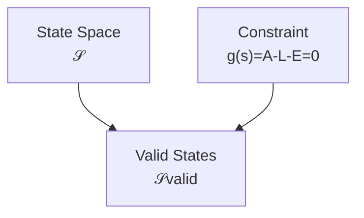

# 02 — State

## Scope

このモジュールは、企業をある時点で表現する Stock 型の会計状態を定義する。

## Stock State

時刻 $t$ の Stock 状態を、

$$
\boxed{s(t)\in\mathcal S}
$$

とする。例えば、

$$
s(t)=
\begin{pmatrix}
\mathrm{Cash}(t)\\
\mathrm{AccountsReceivable}(t)\\
\mathrm{Equipment}(t)\\
\mathrm{AccountsPayable}(t)\\
\mathrm{Debt}(t)\\
\mathrm{Capital}(t)\\
\vdots
\end{pmatrix}
$$

である。各成分は、ある時点に存在する残高を表す。

$$
\boxed{\text{Stock} = \text{時点に属する量}}
$$

収益や費用のような期間量は $s(t)$ に直接混ぜず、[07 — Period and Stock-Flow](07-period-stock-flow.md) で分けて扱う。

## Accounts as Coordinates

Stock 勘定 $i$ の残高を $s_i(t)$ とする。すると Stock 勘定科目は、会計状態空間の座標として解釈できる。

$$
\text{Stock Account}
\approx
\text{a coordinate of }\mathcal S
$$

ただし、座標は現実の物体そのものではない。どの物品を「備品」に含めるかは、認識と分類によって決まる。

## Aggregated Stock

詳細状態 $s$ を会計要素へ集約する写像を $G_S$ とする。

$$
\boxed{
G_S(s)=
\begin{pmatrix}
A(s)\\
L(s)\\
E(s)
\end{pmatrix}}
$$

ここで $A$、$L$、$E$ はそれぞれ資産、負債、純資産の合計である。例えば、

$$
A
=
\mathrm{Cash}
+\mathrm{AccountsReceivable}
+\mathrm{Equipment}
+\cdots
$$

である。したがって $(A,L,E)$ は状態の全詳細ではなく、その集約表現である。

## Balance Sheet Constraint

有効な貸借対照表状態は、

$$
\boxed{A=L+E}
$$

すなわち、

$$
\boxed{A-L-E=0}
$$

を満たす。制約関数を、

$$
g(s)=A(s)-L(s)-E(s)
$$

と定義すれば、有効状態の集合は、

$$
\boxed{
\mathcal S_{\mathrm{valid}}
=
\{s\in\mathcal S\mid g(s)=0\}}
$$

となる。

## State and History

$s(t)$ は現在残高であり、そこへ至る履歴ではない。異なる取引履歴が同じ現在状態に到達しうる。

$$
H_1\neq H_2,
\qquad
\operatorname{fold}(H_1)=\operatorname{fold}(H_2)=s(t)
$$

履歴は [06 — Journal and Ledger](06-journal-and-ledger.md)、履歴から状態への累積は [07 — Period and Stock-Flow](07-period-stock-flow.md) で扱う。

## Boundary

このモジュールは残高の存在と制約を扱う。勘定の増減を借方・貸方へ配置する規約は状態の定義ではなく、[05 — Double Entry](05-double-entry.md) の記録表現である。
