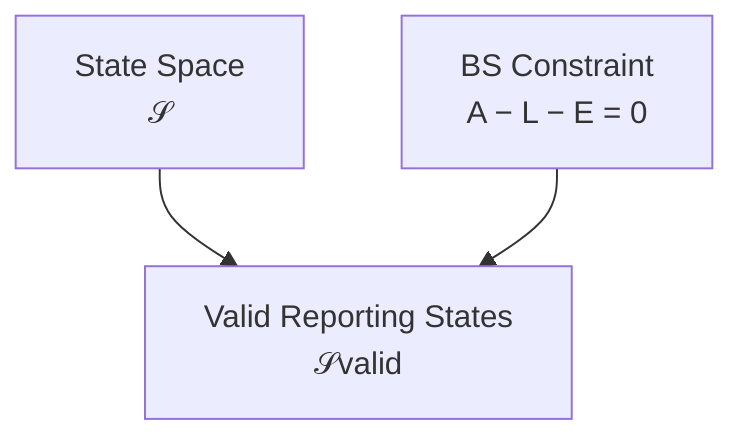

# 02 — State

## Scope

このモジュールは、
企業をある時点で表現する
Stock型の会計状態を定義する。

ASMでは、この状態を、

$$
\boxed{
s(t)\in\mathcal S
}
$$

とし、

> 会計上意味づけられた Reporting / semantic Stock state

として扱う。

これは帳簿の各勘定残高を
そのまま並べたベクトルとは限らない。

## Stock State

時刻 $t$ の Stock 型会計状態を、

$$
\boxed{
s(t)\in\mathcal S
}
$$

とする。

各成分は、

> 時点 $t$ における会計上のStock量

を表す。

概念的には、

$$
s(t)
=
\begin{pmatrix}
s_1(t)\\
s_2(t)\\
\vdots\\
s_n(t)
\end{pmatrix}
$$

と書ける。

例えば、

- Cash
- Accounts Receivable
- Equipment
- Accounts Payable
- Debt
- Equity position

などに対応するReporting Stock dimensionを考えられる。

Stockとは、

$$
\boxed{
\text{Stock}
=
\text{時点に属する量}
}
$$

である。

## Stock State Is Not a Flow Vector

RevenueやExpenseのような期間量は、

$$
s(t)
$$

の独立したStock座標として直接混ぜない。

したがって、

$$
\boxed{
\text{Stock State}
\neq
\text{PL Flow}
}
$$

である。

ただし、
Revenue / Expenseを生じさせる取引の効果は、

$$
\Delta s
$$

としてStock状態にも反映されうる。

例えばRevenueが発生すると、
その利益形成効果は最終的にEquity側のStock状態へ反映される。

この接続は、

[03 — Transition](03-transition.md)

および

[07 — Period and Stock-Flow](07-period-stock-flow.md)

で扱う。

## Reporting State and Book Balance

ASMでは、

$$
s(t)
$$

と帳簿勘定残高を区別する。

Stock-valued account $i$ の帳簿残高を、

$$
b_i(t)
$$

と書く。

多くの勘定では、

$$
b_i(t)
=
s_i(t)
$$

と対応する。

例えば、

- Cash
- Accounts Receivable
- Debt

などでは、
通常この対応を期待できる。

しかし一般には、

$$
\boxed{
b(t)\neq s(t)
}
$$

と区別する。

特に期間中の利益形成については、
利益効果がRevenue / Expense accountへ展開されるため、

$$
\Delta s_E
$$

と、

$$
\Delta x_E
$$

が一致しない場合がある。

したがって、

$$
\boxed{
\text{Book Balance}
\neq
\text{Reporting State}
}
$$

をASMの基本的なレイヤー分離とする。

## Reporting Coordinates

$s_i(t)$ は、
Reporting Stock State $\mathcal S$ の座標である。

$$
\boxed{
s_i(t)
=
\text{coordinate of the semantic Stock state}
}
$$

Stock-valued bookkeeping accountは、
このReporting coordinateと対応する場合が多い。

ただし、

$$
\boxed{
\text{Stock Account}
\not\equiv
\text{State Coordinate}
}
$$

を一般原則とする。

両者の対応は、
帳簿履歴・Flow・Closingなどを考慮した
Reporting Reconstructionによって定まる。

詳細は、

[06 — Journal and Ledger](06-journal-and-ledger.md)

および

[07 — Period and Stock-Flow](07-period-stock-flow.md)

で扱う。

## Aggregated Stock

詳細なReporting Stock State $s$ を、
会計要素へ集約する写像を、

$$
G_S
$$

とする。

$$
\boxed{
G_S(s)
=
\begin{pmatrix}
A(s)\\
L(s)\\
E(s)
\end{pmatrix}
}
$$

ここで、

- $A(s)$：Assets
- $L(s)$：Liabilities
- $E(s)$：Equity

である。

したがって、

$$
(A,L,E)
$$

は詳細状態そのものではなく、
状態の集約表現である。

## Balance Sheet Constraint

有効なReporting Stock Stateは、

$$
\boxed{
A=L+E
}
$$

を満たす。

同値に、

$$
\boxed{
A-L-E=0
}
$$

である。

制約関数を、

$$
\boxed{
g(s)
=
A(s)-L(s)-E(s)
}
$$

と定義する。

すると有効状態集合は、

$$
\boxed{
\mathcal S_{\mathrm{valid}}
=
\{
s\in\mathcal S
\mid
g(s)=0
\}
}
$$

である。

## Degrees of Freedom at the Aggregated Level

集約表現、

$$
(A,L,E)
$$

には3つの変数がある。

しかし、

$$
A-L-E=0
$$

という独立な制約が1つ存在する。

したがって、
集約レベルでの自由度は、

$$
\boxed{
3-1=2
}
$$

である。

例えば、

$$
E=A-L
$$

と計算できる。

ただしこれは、
Equityだけが本質的に従属変数だという意味ではない。

同様に、

$$
A=L+E
$$

$$
L=A-E
$$

とも書ける。

したがって数学的には、

> 3変数が1つの制約面上に存在する

と理解する方が正確である。

## State and History

$s(t)$ は現在のReporting Stateであり、
そこへ至る履歴そのものではない。

異なる履歴が
同じ現在状態へ到達しうる。

$$
H_1\neq H_2
$$

であっても、

$$
\boxed{
\operatorname{fold}(H_1)
=
\operatorname{fold}(H_2)
=
s(t)
}
$$

となりうる。

したがって、

$$
\boxed{
\text{State}
\neq
\text{History}
}
$$

である。

## State as Accumulated Transition

Stockは履歴そのものではないが、
過去の状態変化を累積した結果である。

期間、

$$
I=[t_0,t_1]
$$

を考える。

期間 $I$ に属する取引インデックス集合を、

$$
\boxed{
K(I)
=
\{k\mid t_k\in I\}
}
$$

とする。

期間中のStock Transitionの累積を、

$$
\boxed{
F(I)
=
\sum_{k\in K(I)}
\Delta s^{(k)}
}
$$

とすれば、

$$
\boxed{
s(t_1)
=
s(t_0)
+
F(I)
}
$$

である。

すなわち、

$$
\boxed{
s(t_1)
=
s(t_0)
+
\sum_{k\in K(I)}
\Delta s^{(k)}
}
$$

となる。

## Stock and Accumulated Effects

この意味で、

$$
\boxed{
\text{Ending Stock}
=
\text{Beginning Stock}
+
\text{Accumulated State Changes}
}
$$

である。

したがって、

$$
\boxed{
\text{Stock}\neq\text{Flow}
}
$$

である一方、

$$
\boxed{
\text{Stock is generated by accumulated transitions}
}
$$

でもある。

FlowそのものがStockになるわけではない。

しかしFlowを生じさせた取引の効果は、

$$
\Delta s
$$

を通じてStockへ反映されうる。

## Boundary

本モジュールは、

- Reporting Stock State
- State Constraint
- State / Historyの区別

を扱う。

一方、

- 帳簿勘定残高 $b_i(t)$ の詳細
- 帳簿勘定変化 $\Delta x$
- D/C encoding
- Journal / Ledger
- Reporting Reconstruction

は後続モジュールで扱う。

## Relationship to Other Modules

- Reality / Recognition:
  [01 — Reality and Recognition](01-reality-and-recognition.md)
- Stock Transition:
  [03 — Transition](03-transition.md)
- Accountと帳簿残高:
  [04 — Accounts and Classification](04-accounts-and-classification.md)
- D/C表現:
  [05 — Double Entry](05-double-entry.md)
- Book Balanceと履歴:
  [06 — Journal and Ledger](06-journal-and-ledger.md)
- Stock / Flow / Closing:
  [07 — Period and Stock-Flow](07-period-stock-flow.md)
