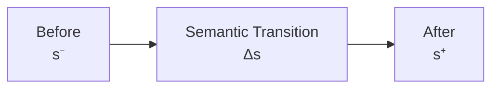

# 03 — Transition

## Scope

このモジュールは、

- Semantic Stock Transition
- Transaction-level PL Flow
- Stock-only Transition
- Profit-forming Transition
- Constraint Preservation
- Transaction accumulation
- Semantic / Book layer separation

を扱う。

ASMでは、

$$
\boxed{
\Delta s
=
\text{semantic change of Reporting Stock State}
}
$$

とする。

重要なのは、

$$
\boxed{
\Delta s
\neq
\Delta x
}
$$

である。

## Basic Transition

取引直前のReporting Stock Stateを、

$$
s^-
$$

取引直後を、

$$
s^+
$$

とする。

Semantic Stock Transitionを、

$$
\boxed{
\Delta s
=
s^+-s^-
}
$$

と定義する。

したがって、

$$
\boxed{
s^+
=
s^-+\Delta s
}
$$

である。

## State Transition Diagram

ここで $\Delta s$ は、
Journal Entryではなく、
会計的意味のStock変化である。

## Discrete Transaction Steps

取引を離散的なstep $k$ で表す。

$$
s_k
$$

を第 $k$ step直前のState、
$\Delta s_k$ をその取引のStock Transitionとする。

すると、

$$
\boxed{
s_{k+1}
=
s_k+\Delta s_k
}
$$

である。

## Real Time and Transaction Index Are Different

実時間を、

$$
t
$$

取引indexを、

$$
k
$$

とする。

両者は異なる。

$$
\boxed{
t
\neq
k
}
$$

である。

取引 $k$ が発生・認識された時刻を、

$$
t_k
$$

とする。

## Transition Is a Semantic Stock Change

$\Delta s$ は、

> Reporting meaning上のStock変化

である。

例えば、

- Cashが100増える
- Debtが100増える
- Equityが100増える

といった意味論的変化を表す。

帳簿上どの勘定をDebit / Creditするかは、
まだこの段階では決めていない。

## Transition and Profit/Loss Flow

認識取引 $e$ は、
Stock Transitionに加え、

$$
f_{\mathrm{PL}}(e)
$$

というProfit/Loss Flow Effectを持ちうる。

したがって、
取引のSemantic Accounting Effectは、

$$
\boxed{
\alpha(e)
=
\left(
\Delta s(e),
f_{\mathrm{PL}}(e)
\right)
}
$$

である。

## Stock and PL Flow Are Different Components

$$
\Delta s(e)
$$

と、

$$
f_{\mathrm{PL}}(e)
$$

は異なる情報である。

$$
\boxed{
\Delta s
\neq
f_{\mathrm{PL}}
}
$$

である。

$\Delta s$ はStock Stateの変化、
$f_{\mathrm{PL}}$ はProfit/Loss形成に関するFlow情報である。

## Stock-only Transition

利益形成Flowを伴わず、
Stockだけが変化する取引がある。

$$
\boxed{
\Delta s\neq0,
\qquad
f_{\mathrm{PL}}=0
}
$$

である。

代表例は、

- 資産交換
- 借入
- 借入返済
- 出資

などである。

## Profit-forming Transition

Revenue / Expenseを生じる取引では、

$$
\boxed{
\Delta s\neq0,
\qquad
f_{\mathrm{PL}}\neq0
}
$$

となりうる。

例えばCredit Saleでは、

- Accounts Receivable増加
- Equity増加
- Revenue Flow発生

が同時に起こる。

## Constraint Preservation

有効なReporting Stateでは、

$$
A-L-E=0
$$

である。

取引前後の両Stateが有効なら、

$$
A^- - L^- - E^-=0
$$

かつ、

$$
A^+ - L^+ - E^+=0
$$

である。

両者の差を取ると、

$$
\boxed{
\Delta A-\Delta L-\Delta E=0
}
$$

となる。

## Semantic Transition Constraint

したがって、
有効なSemantic Stock Transitionは、

$$
\boxed{
\Delta A-\Delta L-\Delta E=0
}
$$

を満たす。

これは、

> Balance Sheet Constraintを保存するTransition

という意味である。

## Example: Asset Exchange

Cash 100でEquipment 100を購入する。

Semantic Transitionは、

$$
\Delta Cash=-100
$$

$$
\Delta Equipment=+100
$$

である。

したがってAggregate Assetsは、

$$
\Delta A=0
$$

Liabilitiesは、

$$
\Delta L=0
$$

Equityは、

$$
\Delta E=0
$$

である。

よって、

$$
0-0-0=0
$$

となる。

この取引では、

$$
f_{\mathrm{PL}}=0
$$

である。

## Example: Borrowing

Cash 100を借り入れる。

$$
\Delta Cash=+100
$$

$$
\Delta Debt=+100
$$

なので、

$$
\Delta A=+100
$$

$$
\Delta L=+100
$$

$$
\Delta E=0
$$

である。

したがって、

$$
100-100-0=0
$$

である。

また、

$$
f_{\mathrm{PL}}=0
$$

である。

## Example: Credit Sale

掛売上100を認識する。

Semantic Stock Transitionは、

$$
\Delta AR=+100
$$

$$
\Delta E=+100
$$

である。

したがって、

$$
\Delta A=+100
$$

$$
\Delta L=0
$$

$$
\Delta E=+100
$$

となり、

$$
100-0-100=0
$$

である。

同時に、

$$
\boxed{
f_{\mathrm{PL}}(e)
=
Revenue\ 100
}
$$

が存在する。

## Example: Expense Paid in Cash

Expense 80をCashで支払う。

Semantic Stock Transitionは、

$$
\Delta Cash=-80
$$

$$
\Delta E=-80
$$

である。

したがって、

$$
\Delta A=-80
$$

$$
\Delta L=0
$$

$$
\Delta E=-80
$$

なので、

$$
-80-0-(-80)=0
$$

である。

同時に、

$$
\boxed{
f_{\mathrm{PL}}(e)
=
Expense\ 80
}
$$

である。

## Accounting Period Assignment

会計期間を、

$$
\boxed{
I=(t_0,t_1]
}
$$

とする。

期間 $I$ に帰属するRecognized Accounting Transactionのindex集合を、

$$
\boxed{
K(I)
=
\{
k
\mid
t_0<t_k\le t_1
\}
}
$$

とする。

この定義により、
隣接する期間へ同じ取引が重複して所属することを避ける。

## What Belongs to K(I)

$K(I)$ は、

> 期間 $I$ にSemantic Accounting Effectを認識する取引

の集合である。

したがって、

- 通常取引
- 必要な期末Adjusting Recognition

は含まれうる。

一方、
Closingは新しいSemantic Accounting Effectを生じさせないため、

$$
\boxed{
\text{Closing}\notin K(I)
}
$$

とする。

Closing EntryのJournal indexは、
06で別に扱う。

## Transition and Accumulation

期間中のStock Transitionの累積を、

$$
\boxed{
F_S(I)
=
\sum_{k\in K(I)}
\Delta s^{(k)}
}
$$

とする。

すると、

$$
\boxed{
s(t_1)
=
s(t_0)
+
F_S(I)
}
$$

である。

## Stock Transition and PL Are Not the Same

$F_S(I)$ は、

> 期間中のSemantic Stock Transitionの累積

である。

一方、

$$
f(I)
$$

は、

> 期間中のProfit/Loss Flow情報の累積

である。

したがって、

$$
\boxed{
F_S(I)
\neq
f(I)
}
$$

である。

また、

$$
\boxed{
F_S(I)
\neq
PL(I)
}
$$

である。

## From Transition to Bookkeeping Representation

Semantic Accounting Effect、

$$
\left(
\Delta s,
f_{\mathrm{PL}}
\right)
$$

は、
まだJournal Entryではない。

帳簿へ記録するために、
Bookkeeping Change、

$$
\Delta x
$$

へRepresentationする。

概念的には、

$$
\boxed{
(\Delta s,f_{\mathrm{PL}})
\longrightarrow
\Delta x
\longrightarrow
J
}
$$

である。

## Semantic Transition and Bookkeeping Change Are Different

例えばCredit Sale 100では、

Semantic layerでは、

$$
\Delta AR=+100
$$

$$
\Delta E=+100
$$

である。

しかしBook layerでは、

$$
\Delta x_{AR}=+100
$$

$$
\Delta x_{Sales}=+100
$$

となり、

$$
\Delta x_E=0
$$

の場合がある。

したがって、

$$
\boxed{
\Delta s
\neq
\Delta x
}
$$

である。

## Transition and Posting

Postingは、
JournalからLedgerへのRe-indexingである。

Postingによって新しいSemantic Stock Transitionは生じない。

$$
\boxed{
\Delta s_{\mathrm{posting}}=0
}
$$

さらに新しいBookkeeping Changeも生じない。

$$
\boxed{
\Delta x_{\mathrm{posting}}=0
}
$$

したがって、

$$
\boxed{
\text{Semantic Transition}
\neq
\text{Posting}
}
$$

である。

## Transition and Closing

Closingも、
新しいSemantic Stock Transitionを生じない。

$$
\boxed{
\Delta s_{\mathrm{closing}}=0
}
$$

しかしClosingは帳簿勘定を振り替えるため、

$$
\Delta x_{\mathrm{closing}}\neq0
$$

である。

したがって、

$$
\boxed{
\text{Posting}
\neq
\text{Closing}
}
$$

である。

## Double-entry Hypothesis

ASMでは現段階で、
複式簿記を、

$$
\boxed{
\text{a recording system for structured accounting changes}
}
$$

として捉える。

完全な定義には、

- Semantic Stock Transition
- Profit/Loss Flow
- Bookkeeping Change
- D/C Encoding
- Journal Balance
- Closing

の関係を含める必要がある。

## Core Equations

**Semantic Stock Transition：**

$$
\boxed{
\Delta s
=
s^+-s^-
}
$$

**State Update：**

$$
\boxed{
s^+
=
s^-+\Delta s
}
$$

**Discrete Evolution：**

$$
\boxed{
s_{k+1}
=
s_k+\Delta s_k
}
$$

**Accounting Effect：**

$$
\boxed{
\alpha(e)
=
\left(
\Delta s(e),
f_{\mathrm{PL}}(e)
\right)
}
$$

**Semantic Transition Constraint：**

$$
\boxed{
\Delta A-\Delta L-\Delta E=0
}
$$

**Period：**

$$
\boxed{
I=(t_0,t_1]
}
$$

**Transaction Index Set：**

$$
\boxed{
K(I)
=
\{
k\mid t_0<t_k\le t_1
\}
}
$$

**Accumulated Stock Transition：**

$$
\boxed{
F_S(I)
=
\sum_{k\in K(I)}
\Delta s^{(k)}
}
$$

**Period State Evolution：**

$$
\boxed{
s(t_1)
=
s(t_0)+F_S(I)
}
$$

**Layer Separation：**

$$
\boxed{
e
\to
(\Delta s,f_{\mathrm{PL}})
\to
\Delta x
\to
J
}
$$

## Relationship to Other Modules

- Reality / Recognition:
  [01 — Reality and Recognition](01-reality-and-recognition.md)
- Reporting Stock State:
  [02 — State](02-state.md)
- Account semantics:
  [04 — Accounts and Classification](04-accounts-and-classification.md)
- Bookkeeping Change / D/C:
  [05 — Double Entry](05-double-entry.md)
- Journal / Posting:
  [06 — Journal and Ledger](06-journal-and-ledger.md)
- Period Flow / Closing:
  [07 — Period and Stock-Flow](07-period-stock-flow.md)
- Validation:
  [09 — Validation](09-validation.md)

## Open Questions

- $f_{\mathrm{PL}}(e)$ の正式なベクトル空間をどう定義するか。
- $\Delta E$ をProfit形成・Owner Transactionなどへどう分解するか。
- Adjusting Recognitionの時刻をどう定義するか。
- $(\Delta s,f_{\mathrm{PL}})\to\Delta x$ の正式なRepresentation map。
- 非線形Measurement changeをTransitionへどう含めるか。
