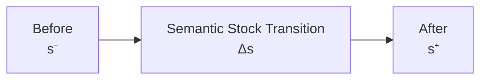
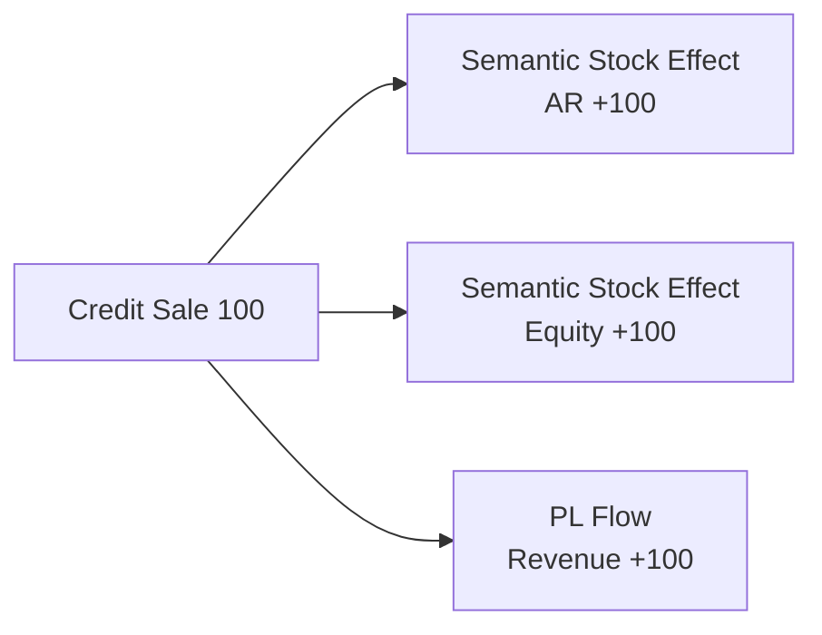
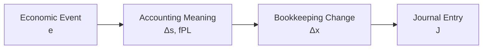

# 03 — Transition

## Scope

このモジュールは、
認識された経済的事象が
Reporting Stock Stateをどのように変化させるかを扱う。

ASMでは、

- Stock状態そのものの変化
- Revenue / Expenseのような期間Flow
- 帳簿勘定上の変化
- Journal / Postingのような記録上の変換

を区別する。

本モジュールの中心対象は、

$$
\boxed{
\Delta s
}
$$

すなわちStock State Transitionである。

## Basic Transition

取引直前のReporting Stock Stateを、

$$
s^-
$$

直後を、

$$
s^+
$$

とする。

状態変化を、

$$
\boxed{
\Delta s
=
s^+-s^-
}
$$

と定義する。

したがって、

$$
\boxed{
s^+
=
s^-+\Delta s
}
$$

である。

## Discrete Transaction Steps

$s_k$ を、
$k$ 件目の認識済み取引処理後の
Reporting Stock Stateとする。

すると、

$$
\boxed{
s_{k+1}
=
s_k+\Delta s_k
}
$$

と書ける。

ここで、

- $t$：実時間
- $k$：取引・状態遷移のインデックス

として区別する。

## Transition Is a Semantic Stock Change

$\Delta s$ は、

> 企業のReporting / semantic Stock Stateそのものの変化

を表す。

これは帳簿勘定変化、

$$
\Delta x
$$

とは異なる。

したがって、

$$
\boxed{
\Delta s
\neq
\Delta x
}
$$

である。

## Transition and Profit/Loss Flow

RevenueやExpenseのような期間量は、
Stock Stateの独立座標ではない。

したがって、

$$
\boxed{
\text{Stock Transition}
\neq
\text{PL Flow}
}
$$

である。

しかし、
同じ経済的事象が両方を生じさせる場合がある。

経済的事象 $e$ のStock Transitionを、

$$
\Delta s(e)
$$

利益形成Flow情報を、

$$
f_{\mathrm{PL}}(e)
$$

とする。

すると認識された事象は概念的に、

$$
\boxed{
e
\longmapsto
\left(
\Delta s(e),
f_{\mathrm{PL}}(e)
\right)
}
$$

と表せる。

ここで、

- $\Delta s(e)$：Stock Stateへの効果
- $f_{\mathrm{PL}}(e)$：利益形成に関する期間情報

である。

すべての取引について、

$$
f_{\mathrm{PL}}(e)\neq0
$$

となるわけではない。

## Stock-only Transition

Stock状態を変化させるが、
利益形成Flowを生じさせない場合、

$$
\boxed{
\Delta s(e)\neq0,
\qquad
f_{\mathrm{PL}}(e)=0
}
$$

とする。

例：

- 借入
- 借入金返済
- 備品購入
- 売掛金回収
- 出資

## Profit-forming Transition

Stock状態を変化させると同時に、
利益形成Flowを生じさせる場合、

$$
\boxed{
\Delta s(e)\neq0,
\qquad
f_{\mathrm{PL}}(e)\neq0
}
$$

となる。

例：

- 売上
- 費用発生
- 減価償却
- 貸倒費用認識

## Constraint Preservation

有効なReporting Stock Stateは、

$$
A-L-E=0
$$

を満たす。

取引前後がともに有効状態なら、

$$
A^- -L^- -E^-=0
$$

かつ、

$$
A^+ -L^+ -E^+=0
$$

である。

両式の差から、

$$
\boxed{
\Delta A-\Delta L-\Delta E=0
}
$$

を得る。

したがって、

$$
s^-\in\mathcal S_{\mathrm{valid}}
$$

なら、

$$
\boxed{
s^-+\Delta s
\in
\mathcal S_{\mathrm{valid}}
}
$$

でなければならない。

## Example: Asset Exchange

現金100を支払い、
備品100を取得する。

$$
\Delta\mathrm{Cash}=-100
$$

$$
\Delta\mathrm{Equipment}=+100
$$

なので、

$$
\Delta A=0
$$

である。

したがって、

$$
\boxed{
\Delta A-\Delta L-\Delta E=0
}
$$

である。

また、

$$
f_{\mathrm{PL}}(e)=0
$$

である。

## Example: Borrowing

現金100を借りる。

$$
\Delta A=+100
$$

$$
\Delta L=+100
$$

$$
\Delta E=0
$$

なので、

$$
100-100-0=0
$$

となる。

したがって、
BS Constraintは保存される。

また、

$$
f_{\mathrm{PL}}(e)=0
$$

である。

## Example: Credit Sale

掛売上100を認識する。

Reporting Stock Stateでは、

$$
\Delta\mathrm{AccountsReceivable}=+100
$$

である。

同時に、
利益形成Flowとして、

$$
f_{\mathrm{PL}}(e)
=
\mathrm{Revenue}\ 100
$$

が発生する。

利益形成効果を含むReporting Stateでは、

$$
\Delta A=+100
$$

$$
\Delta L=0
$$

$$
\Delta E=+100
$$

となる。

したがって、

$$
\boxed{
100-0-100=0
}
$$

である。

ここで、

$$
\boxed{
\mathrm{Revenue}
\neq
\mathrm{Equity}
}
$$

である。

Revenueは期間Flowであるが、
その利益形成効果は
Reporting Stock StateではEquity変化として反映される。

## Example: Expense Paid in Cash

現金80を支払い、
当期費用80を認識する。

$$
\Delta\mathrm{Cash}=-80
$$

利益形成Flowは、

$$
f_{\mathrm{PL}}(e)
=
\mathrm{Expense}\ 80
$$

である。

Reporting Stateでは、

$$
\Delta A=-80
$$

$$
\Delta L=0
$$

$$
\Delta E=-80
$$

なので、

$$
-80-0-(-80)=0
$$

となる。

したがって、

$$
\boxed{
\text{Profit-forming transitions also preserve the BS constraint}
}
$$

である。

## Transition and Accumulation

期間を、

$$
I=[t_0,t_1]
$$

とする。

期間中に発生した取引インデックス集合を、

$$
\boxed{
K(I)
=
\{k\mid t_k\in I\}
}
$$

と定義する。

期間中のStock Transitionの累積を、

$$
\boxed{
F(I)
=
\sum_{k\in K(I)}
\Delta s^{(k)}
}
$$

とする。

すると、

$$
\boxed{
s(t_1)
=
s(t_0)+F(I)
}
$$

である。

したがって、

$$
\boxed{
s(t_1)
=
s(t_0)
+
\sum_{k\in K(I)}
\Delta s^{(k)}
}
$$

となる。

## Stock Transition and PL Are Not the Same

$F(I)$ は、
Stock状態に対する期間中の累積変化である。

一方、PLは
利益形成Flowの分類・集約である。

したがって、

$$
\boxed{
F(I)
\neq
\mathrm{PL}(I)
}
$$

である。

両者の接続は、

[07 — Period and Stock-Flow](07-period-stock-flow.md)

で形式化する。

## From Transition to Bookkeeping Representation

$\Delta s$ と $f_{\mathrm{PL}}$ は、
まだ仕訳そのものではない。

帳簿へ記録するために、

$$
\left(
\Delta s,
f_{\mathrm{PL}}
\right)
$$

を帳簿勘定変化、

$$
\Delta x
$$

へ表現する。

さらに、

$$
\Delta x
$$

をD/Cへ符号化して、
Journal Entry、

$$
J
$$

を得る。

したがって、

$$
\boxed{
e
\longrightarrow
(\Delta s,f_{\mathrm{PL}})
\longrightarrow
\Delta x
\longrightarrow
J
}
$$

である。

## Transition and Posting

Postingは新しい経済的事象ではない。

したがって、

$$
\boxed{
\Delta s_{\mathrm{posting}}=0
}
$$

である。

さらにPostingは、
新しい帳簿勘定変化を生成する処理でもない。

$$
\boxed{
\Delta x_{\mathrm{posting}}=0
}
$$

したがって、

$$
\boxed{
\text{economic-layer transition}
\neq
\text{recording-layer transformation}
}
$$

である。

## Double-entry Hypothesis

ASMでは現段階で、
複式簿記を、

$$
\boxed{
\text{a recording system for structured accounting changes}
}
$$

として捉える。

ただし完全な定義には、

- Stock Transition
- Profit/Loss Flow
- Bookkeeping Change
- D/C Encoding
- Journal Balance
- Closing

の接続が必要である。

## Relationship to Other Modules

- Reality / Recognition:
  [01 — Reality and Recognition](01-reality-and-recognition.md)
- Reporting State:
  [02 — State](02-state.md)
- Account semantics:
  [04 — Accounts and Classification](04-accounts-and-classification.md)
- $\Delta x$ とD/C:
  [05 — Double Entry](05-double-entry.md)
- Journal / Posting:
  [06 — Journal and Ledger](06-journal-and-ledger.md)
- Stock / Flow / Closing:
  [07 — Period and Stock-Flow](07-period-stock-flow.md)

## Open Questions

- $f_{\mathrm{PL}}(e)$ の正式な型。
- $\Delta E$ の利益形成・所有者取引などへの分解。
- 決算整理取引と通常取引の一般的分類。
- $(\Delta s,f_{\mathrm{PL}})\to\Delta x$ の正式な写像。
