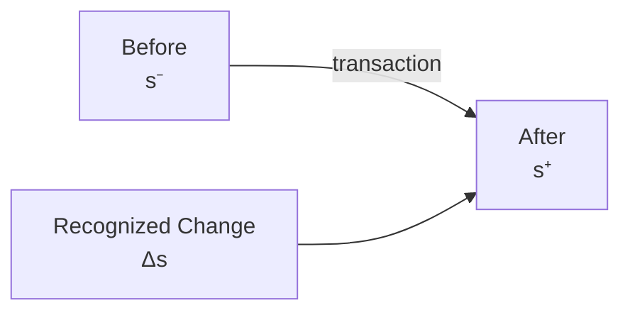

# 03 — Transition

## Scope

このモジュールは、認識された取引が会計状態をどう変化させるかを扱う。

## Basic Transition

取引直前の状態を $s^-$、直後の状態を $s^+$ とする。状態変化を、

$$
\boxed{\Delta s=s^+-s^-}
$$

と定義する。したがって、ASM の基本状態遷移式は、

$$
\boxed{s^+=s^-+\Delta s}
$$

である。

通常の離散的な処理順を明示したい場合は、$s_k$ を $k$ 件目の取引処理後の状態として、

$$
s_{k+1}=s_k+\Delta s_k
$$

と書ける。$t$ は実時間、$k$ は取引ステップとして区別する。

## Constraint Preservation

取引前後がともに有効状態なら、

$$
A^- -L^- -E^-=0
$$

かつ、

$$
A^+ -L^+ -E^+=0
$$

である。両式の差から、

$$
\boxed{\Delta A-\Delta L-\Delta E=0}
$$

を得る。つまり、許容される $\Delta s$ は任意ではない。

$$
s^-\in\mathcal S_{\mathrm{valid}}
\quad\Longrightarrow\quad
s^-+\Delta s\in\mathcal S_{\mathrm{valid}}
$$

を満たす必要がある。

## Examples

### 資産内の交換

現金100を支払い備品100を得る場合、

$$
\Delta\mathrm{Cash}=-100,
\qquad
\Delta\mathrm{Equipment}=+100
$$

なので、$\Delta A=0$ であり制約は保存される。

### 借入

現金100を借りる場合、

$$
\Delta A=+100,
\qquad
\Delta L=+100
$$

なので、

$$
\Delta A-\Delta L-\Delta E=100-100-0=0
$$

である。この例は、取引の二面性が「一方が増え、他方が減る」という意味ではないことを示す。

## Transaction and Posting

経済的事象による $\Delta s$ は状態遷移である。一方、仕訳を元帳へ転記しても企業の状態は変わらない。

$$
\Delta s_{\mathrm{posting}}=0
$$

したがって、経済レイヤーの transition と記録レイヤーの transformation を区別する。

## Double-entry Hypothesis

ASM は複式簿記を、少なくとも次のように解釈する。

$$
\boxed{
\text{Double-entry bookkeeping}
\approx
\text{a recording system for constraint-preserving transitions}}
$$

ただし、これは複式簿記の唯一の定義ではない。Stock と Flow の接続、および D/C 表現との関係は別モジュールで補う。

## Related Modules

- 状態空間: [02 — State](02-state.md)
- 取引の認識: [01 — Reality and Recognition](01-reality-and-recognition.md)
- D/C 表現: [05 — Double Entry](05-double-entry.md)
- 期間累積: [07 — Period and Stock-Flow](07-period-stock-flow.md)
