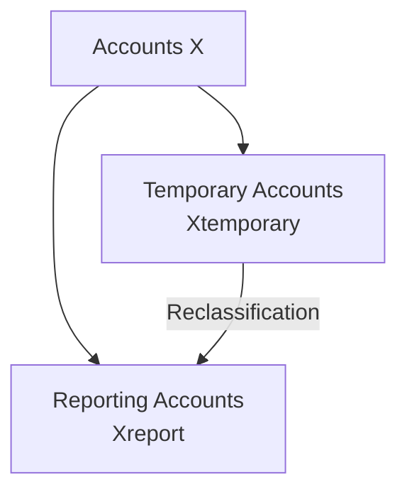
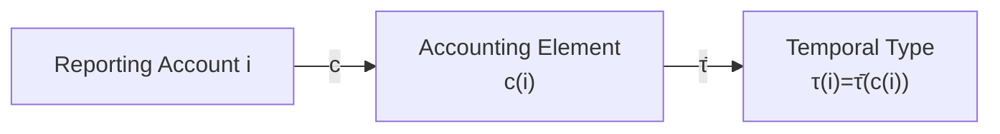
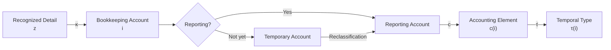

# 04 — Accounts and Classification

## Scope

このモジュールは、勘定科目について、

- 勘定の役割
- 会計5要素
- Stock / Flowという時間型
- 帳簿残高
- 情報粒度
- 一時勘定

を整理する。

ASMでは、

$$
\boxed{
\text{Accounting Element}
\neq
\text{Temporal Type}
}
$$

と考える。

ただし現在の会計5要素では、
Temporal TypeはAccounting Elementから導出できる。

## Account Roles

帳簿で使われる勘定の集合を、

$$
X
$$

とする。

ASMでは、

$$
\boxed{
X
=
X_{\mathrm{report}}
\mathbin{\dot\cup}
X_{\mathrm{temporary}}
}
$$

と分ける。

ここで、

- $X_{\mathrm{report}}$：財務諸表の会計要素へ最終分類される勘定
- $X_{\mathrm{temporary}}$：未分類額・処理途中額などを一時的に保持する勘定

である。

## Accounting Element Classification

報告勘定 $i\in X_{\mathrm{report}}$ に対し、

$$
\boxed{
c:
X_{\mathrm{report}}
\to
\{A,L,E,R,C\}
}
$$

を定義する。

ここで、

- $A$：Asset
- $L$：Liability
- $E$：Equity
- $R$：Revenue
- $C$：Cost / Expense

である。

$c(i)$ は、

> この勘定が何を意味するか

を表す。

## Element-wise Account Sets

任意の、

$$
q\in\{A,L,E,R,C\}
$$

について、

$$
\boxed{
X_q
=
\{
i\in X_{\mathrm{report}}
\mid
c(i)=q
\}
}
$$

とする。

したがって、

$$
\boxed{
X_{\mathrm{report}}
=
X_A
\mathbin{\dot\cup}
X_L
\mathbin{\dot\cup}
X_E
\mathbin{\dot\cup}
X_R
\mathbin{\dot\cup}
X_C
}
$$

である。

## Temporal Type

会計要素から時間型への写像を、

$$
\boxed{
\bar{\tau}:
\{A,L,E,R,C\}
\to
\{\mathrm{Stock},\mathrm{Flow}\}
}
$$

とする。

基本的には、

$$
\boxed{
\bar{\tau}(A)
=
\bar{\tau}(L)
=
\bar{\tau}(E)
=
\mathrm{Stock}
}
$$

かつ、

$$
\boxed{
\bar{\tau}(R)
=
\bar{\tau}(C)
=
\mathrm{Flow}
}
$$

である。

各報告勘定の時間型は、

$$
\boxed{
\tau(i)
=
\bar{\tau}(c(i))
}
$$

である。

したがって、

$$
\boxed{
\tau
=
\bar{\tau}\circ c
}
$$

となる。

## Accounting Element and Temporal Type

Accounting ElementとTemporal Typeは、
概念として同一ではない。

例えばCashは、

$$
c(\mathrm{Cash})=A
$$

であり、

$$
\tau(\mathrm{Cash})
=
\bar{\tau}(A)
=
\mathrm{Stock}
$$

である。

Salesは、

$$
c(\mathrm{Sales})=R
$$

であり、

$$
\tau(\mathrm{Sales})
=
\bar{\tau}(R)
=
\mathrm{Flow}
$$

である。

したがって、

$$
\boxed{
\text{Accounting Element}
\neq
\text{Temporal Type}
}
$$

だが、

$$
\boxed{
\text{Temporal Type is derivable from Accounting Element}
}
$$

である。

## Stock-valued Accounts

Stock-valued account集合を、

$$
\boxed{
X_S
=
\{
i\in X_{\mathrm{report}}
\mid
\tau(i)=\mathrm{Stock}
\}
}
$$

とする。

したがって、

$$
\boxed{
X_S
=
X_A
\mathbin{\dot\cup}
X_L
\mathbin{\dot\cup}
X_E
}
$$

である。

## Book Balance of a Stock-valued Account

Stock-valued bookkeeping account $i$ の
帳簿上の残高を、

$$
\boxed{
b_i(t)
}
$$

と書く。

これは、

> 時点 $t$ で帳簿上その勘定に記録されている残高

である。

例えば、

$$
b_{\mathrm{Cash}}(t)
$$

$$
b_{\mathrm{AccountsReceivable}}(t)
$$

$$
b_{\mathrm{Debt}}(t)
$$

などである。

## Book Balance and Reporting State

重要なのは、

$$
\boxed{
b_i(t)
\neq
s_i(t)
}
$$

を一般には区別することである。

$b_i(t)$ はBook / Ledger layerの値であり、

$$
s_i(t)
$$

はReporting / semantic Stock Stateの座標である。

多くの場合、

$$
b_i(t)=s_i(t)
$$

と対応する。

しかしこれはすべてのStock dimensionについて
常に成立する恒等式ではない。

特に期間中の利益形成では、

- Revenue / ExpenseはFlow accountに蓄積される
- Reporting Stateでは利益効果がEquityへ反映される

ため、

$$
\boxed{
\Delta x_E
\neq
\Delta s_E
}
$$

となる場合がある。

したがって、

$$
\boxed{
\text{Stock-valued Account}
\not\equiv
\text{Reporting State Coordinate}
}
$$

である。

両者の接続は、
Reporting Reconstructionとして07で扱う。

## Stock and Accumulated Effects

Reporting Stock Stateについては、

$$
s(t_1)
=
s(t_0)
+
\sum_{k\in K(I)}
\Delta s^{(k)}
$$

である。

したがって、

$$
\boxed{
\text{Stock}\neq\text{Flow}
}
$$

である一方、

$$
\boxed{
\text{Stock may reflect the accumulated effects of past Flows}
}
$$

でもある。

これはFlow自体がStockになるという意味ではない。

Flowを生じさせた取引の効果が、
Stock Transitionとして累積されるという意味である。

## Flow-valued Accounts

Flow-valued account集合を、

$$
\boxed{
X_F
=
\{
i\in X_{\mathrm{report}}
\mid
\tau(i)=\mathrm{Flow}
\}
}
$$

とする。

したがって、

$$
\boxed{
X_F
=
X_R
\mathbin{\dot\cup}
X_C
}
$$

である。

Flow-valued account $j$ の
期間 $I$ に属する値を、

$$
\boxed{
f_j(I)
}
$$

と書く。

例えば、

$$
\mathrm{Sales}(I)
$$

$$
\mathrm{SalaryExpense}(I)
$$

$$
\mathrm{DepreciationExpense}(I)
$$

などである。

## Stock Quantity and Flow Quantity

Stock-valued bookkeeping accountには、

$$
b_i(t)
$$

という時点帳簿残高がある。

一方、
Flow-valued accountの会計的意味は、

$$
f_j(I)
$$

という期間量である。

したがって、

$$
\boxed{
b_i(t)
\text{ and }
f_j(I)
}
$$

は異なる時間型を持つ。

## Running Ledger Balance of a Flow Account

実際の帳簿上では、
Flow accountにも期間途中のRunning Balanceが存在しうる。

しかしそれは、

> 期間開始から現在時点までのFlowを累積するための帳簿上のAccumulator

であり、
Reporting Stockとはみなさない。

したがって、

$$
\boxed{
\text{Ledger Balance of a Flow Account}
\neq
\text{Stock Quantity}
}
$$

である。

## Flow Space

Flow-valued accountの期間値をまとめて、

$$
f(I)
=
\begin{pmatrix}
f_1(I)\\
f_2(I)\\
\vdots\\
f_m(I)
\end{pmatrix}
$$

と考える。

概念的に、

$$
\boxed{
f(I)\in\mathcal F
}
$$

とする。

ここで、

$$
\mathcal F
$$

はFlow-valued accounting quantitiesの空間である。

正式な構造は07で定義する。

## Classification Maps

認識された詳細対象の集合を、

$$
Z
$$

とする。

認識対象を帳簿勘定へ分類する写像を、

$$
\boxed{
\kappa:Z\to X
}
$$

とする。

Reporting Accountについては、

$$
i
\xrightarrow{c}
c(i)
\xrightarrow{\bar\tau}
\tau(i)
$$

となる。

したがって、

## Temporary Accounts

Temporary Account、

$$
i\in X_{\mathrm{temporary}}
$$

は、

- 未分類額
- 原因未確定額
- 処理途中額

などを保持する。

通常、

$$
c(i)
$$

はまだ確定していない。

したがって、

$$
\tau(i)=\bar\tau(c(i))
$$

も一般には定義できない。

Temporary Accountの時間型やReporting Stateとの対応は、
用途ごとに定義する。

## Temporary Account Lifecycle

一時勘定は、

$$
\text{Unclassified Amount}
\to
X_{\mathrm{temporary}}
\to
X_{\mathrm{report}}
$$

というライフサイクルを持ちうる。

期末までに解消すべき一時勘定 $i$ については、

$$
\boxed{
b_i(t_{\mathrm{close}})=0
}
$$

を終了条件として課すことができる。

これは全Temporary Accountへ
無条件に課す公理ではない。

## Granularity

会計情報には、

$$
\boxed{
\text{Detail}
\to
\text{Account}
\to
\text{Accounting Element}
\to
\text{Financial Statement}
}
$$

という粒度階層がある。

粒度を細かくすると追跡性が高まるが、
記録コストも増える。

粗くすると扱いやすくなるが、
一般に詳細情報を完全には復元できない。

## Classification Is Not Reality

現実の対象が、
自然に特定の勘定科目に属するわけではない。

$$
\boxed{
\text{Reality Object}
\xrightarrow{\text{Recognition / Classification}}
\text{Account}
}
$$

である。

したがって、

$$
\boxed{
\text{Classification}
\neq
\text{Reality itself}
}
$$

である。

## Semantic Errors

貸借が一致していても、
Classificationが誤っている可能性がある。

$$
D(J)=C(J)
$$

であっても、

$$
\boxed{
D(J)=C(J)
\not\Rightarrow
\kappa\text{ is correct}
}
$$

である。

したがって、

$$
\boxed{
\text{Structural Correctness}
\neq
\text{Semantic Correctness}
}
$$

である。

## Relationship to Other Modules

- Reality / Recognition:
  [01 — Reality and Recognition](01-reality-and-recognition.md)
- Reporting State $s(t)$:
  [02 — State](02-state.md)
- Stock Transition:
  [03 — Transition](03-transition.md)
- Bookkeeping Change:
  [05 — Double Entry](05-double-entry.md)
- Ledger / Book Balance:
  [06 — Journal and Ledger](06-journal-and-ledger.md)
- Reporting Reconstruction:
  [07 — Period and Stock-Flow](07-period-stock-flow.md)
- Aggregation:
  [08 — Aggregation](08-aggregation.md)
- Validation:
  [09 — Validation](09-validation.md)

## Open Questions

- Flow空間 $\mathcal F$ の正式な構造。
- $f_j(I)$ と個別取引 $f_{\mathrm{PL}}(e)$ の接続。
- Book Balance $b_i(t)$ とReporting State $s_i(t)$ の一般的対応写像。
- Temporary Accountの時間型。
- 会計基準差による $c$ の変化。
