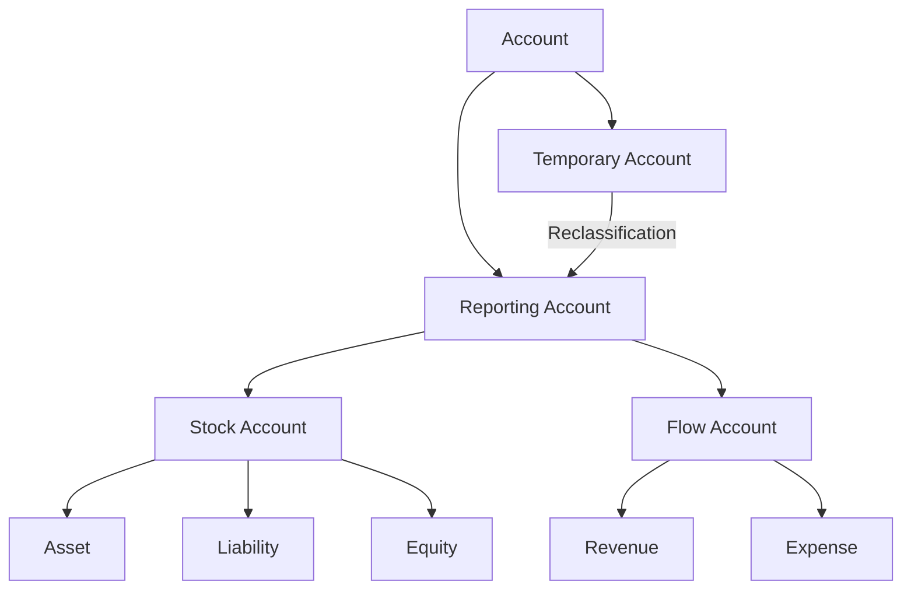
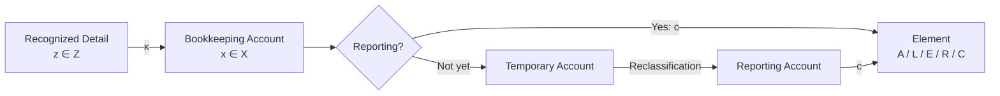

# 04 — Accounts and Classification

## Scope

このモジュールは、勘定科目を会計情報の分類軸として定義し、Stock / Flow、会計5要素、情報粒度を整理する。

## Account Roles

帳簿で使われるすべての勘定の集合を $X$ とする。ASMでは、勘定をまず役割で分ける。

$$
\boxed{
X
=
X_{\mathrm{report}}
\mathbin{\dot\cup}
X_{\mathrm{temporary}}}
$$

ここで、

- $X_{\mathrm{report}}$: 財務諸表の5要素へ分類される報告勘定
- $X_{\mathrm{temporary}}$: 未分類額などを処理途中で保持する一時勘定

である。報告勘定 $i\in X_{\mathrm{report}}$ について、分類を、

$$
\boxed{c(i)\in\{A,L,E,R,C\}}
$$

とする。

- $A$: Asset / 資産
- $L$: Liability / 負債
- $E$: Equity / 純資産
- $R$: Revenue / 収益
- $C$: Cost or Expense / 費用

$A,L,E$ は主として時点残高を持つ Stock account、$R,C$ は期間中に累積される Flow account である。

一時勘定は、記録時点では5要素への最終分類が確定していない。したがって $c(i)$ は未定義のまま保持され、原因判明や決算処理によって報告勘定へ再分類される。

## Accounts as Coordinates and Categories

報告用の Stock 勘定は状態 $s(t)$ の座標として扱える。一方、一時勘定を状態座標に含めるか、帳簿表現レイヤーだけに置くかは、その勘定が表す内容に応じて区別する必要がある。

$$
\boxed{
\text{Reporting Account}
\approx
\text{state coordinate or flow classification axis}}
$$

例えば、パソコン、机、椅子を別々に追跡するか、まとめて「備品」とするかは、会計情報の粒度の選択である。

## Classification Maps

詳細な認識対象の集合を $Z$、帳簿勘定集合を $X$ とすれば、記帳時の分類写像を、

$$
\kappa:Z\to X
$$

と書ける。さらに、報告勘定を5要素へ集約する写像を、

$$
c:X_{\mathrm{report}}\to\{A,L,E,R,C\}
$$

とする。一時勘定は $c$ の定義域に含まれない。一時勘定に保持された金額が $X_{\mathrm{report}}$ に属する勘定へ振り替えられた後、その報告勘定が会計要素へ集約される。

## Temporary Account Lifecycle

一時勘定は、未分類の差額や処理途中の金額を、意味を偽って報告勘定へ入れることなく保持する。

$$
\text{Unclassified Amount}
\longrightarrow
X_{\mathrm{temporary}}
\longrightarrow
X_{\mathrm{report}}
$$

一時勘定には用途ごとの解消条件が必要である。期末までに解消すべき一時勘定 $i$ なら、

$$
\boxed{b_i(t_{\mathrm{close}})=0}
$$

がライフサイクル上の制約となる。これはすべての一時勘定に無条件で課す公理ではなく、その勘定の定義に含める終了条件である。

## Granularity

会計情報には複数の粒度がある。

$$
\text{Detail}
\longrightarrow
\text{Account}
\longrightarrow
\text{Accounting Element}
\longrightarrow
\text{Financial Statement}
$$

粒度を細かくすると追跡可能性が高まるが、記録コストも増える。粗くすると扱いやすいが、内訳を復元できなくなる。集約の数学的性質は [08 — Aggregation](08-aggregation.md) で扱う。

## Classification Is Not Reality

現実の対象が、そのまま特定勘定に属するわけではない。分類は規則と目的に依存する。

$$
\text{Reality Object}
\xrightarrow{\text{Recognition / Classification}}
\text{Account}
$$

同じ「お金のようなもの」でも、会計上の現金に含むか、預金や受取手形など別の勘定へ分類するかは定義に従う。

## Semantic Errors

貸借が一致していても、誤った勘定へ分類されていれば会計的に正しくない。

$$
D(J)=C(J)
\not\Rightarrow
\kappa\text{ is correct}
$$

この区別は [09 — Validation](09-validation.md) で Structural Validity と Semantic Validity に分ける。

## Open Questions

- Flow account を状態ベクトルとは別に、帳簿上でどう統一表現するか。
- 一時勘定を状態 $s(t)$ に含めるか、帳簿表現レイヤーへ限定するか。
- 勘定体系の変更や組織固有の勘定科目をどう写像として扱うか。
- 複数の会計基準による分類差をどうモデル化するか。
