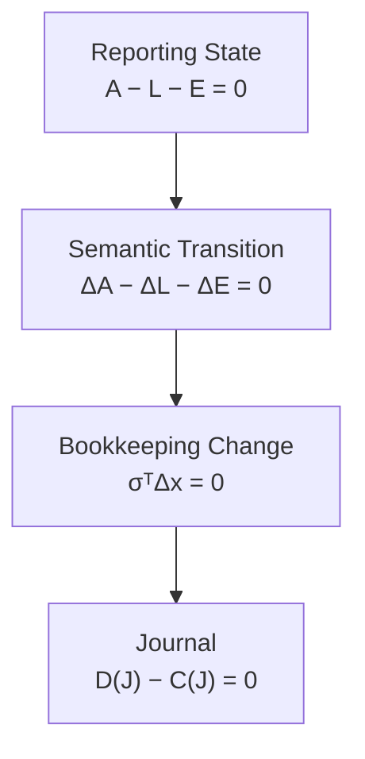

# 05 — Double Entry

## Scope

このモジュールは、
認識された会計的変化を
帳簿勘定変化へ表現し、
それをDebit / Creditへ符号化する構造を扱う。

ASMでは、

$$
\boxed{
\Delta s
\neq
f_{\mathrm{PL}}
\neq
\Delta x
}
$$

とレイヤーを分ける。

概念的には、

$$
\boxed{
(\Delta s,f_{\mathrm{PL}})
\longrightarrow
\Delta x
\longrightarrow
J
}
$$

である。

## Bookkeeping Change

帳簿で使用される全勘定集合を、

$$
X
$$

とする。

取引 $e$ の帳簿勘定変化を、

$$
\boxed{
\Delta x(e)
=
\left(
\Delta x_i(e)
\right)_{i\in X}
}
$$

とする。

ここで、

$$
\Delta x_i
$$

は、

> 勘定 $i$ に記録される意味的な増減

である。

したがって、

$$
\boxed{
\Delta x
\neq
\Delta s
}
$$

である。

## Example: Credit Sale

掛売上100の場合、

Reporting Stock Stateでは、

$$
\Delta AR=+100
$$

$$
\Delta E=+100
$$

となる。

利益形成Flowは、

$$
f_{\mathrm{PL}}
=
Revenue\ 100
$$

である。

しかし帳簿変化は、

$$
\Delta x_{AR}=+100
$$

$$
\Delta x_{Sales}=+100
$$

であり、

$$
\Delta x_E=0
$$

である。

したがって、

$$
\boxed{
\text{Semantic Stock Effect}
\neq
\text{Bookkeeping Representation}
}
$$

である。

## Debit and Credit Are Directions

Debit / Creditは、
数学的な正負そのものではない。

$$
\boxed{
\mathrm{Debit}\neq+
}
$$

$$
\boxed{
\mathrm{Credit}\neq-
}
$$

両者は、

> 帳簿変化を仕訳の左右どちらへ配置するか

を表す記録方向である。

## Normal Orientation for Reporting Accounts

Reporting Account $i$ について、

$$
c(i)\in\{A,L,E,R,C\}
$$

が定義されている。

会計要素からNormal Orientationへの写像を、

$$
\boxed{
\bar\sigma:
\{A,L,E,R,C\}
\to
\{+1,-1\}
}
$$

とする。

$$
\boxed{
\bar\sigma(A)
=
\bar\sigma(C)
=
+1
}
$$

$$
\boxed{
\bar\sigma(L)
=
\bar\sigma(E)
=
\bar\sigma(R)
=
-1
}
$$

である。

Reporting Account $i$ のorientationは、

$$
\boxed{
\sigma_i
=
\bar\sigma(c(i))
}
$$

である。

したがって、

$$
\boxed{
\sigma
=
\bar\sigma\circ c
}
$$

となる。

## Temporary Account Orientation

Temporary Accountについては、
$c(i)$ が未定義の場合がある。

したがって、

$$
\sigma_i
=
\bar\sigma(c(i))
$$

とは定義できない場合がある。

その場合、
Temporary AccountのNormal Orientation、

$$
\boxed{
\sigma_i\in\{+1,-1\}
}
$$

は、
その勘定固有の記帳規則として別途定義する。

したがってJournalへ参加する全勘定について、
$\sigma_i$ が定義されていることを要求する。

## Relation to Temporal Type

Reporting Accountについては、

$$
\tau
=
\bar\tau\circ c
$$

かつ、

$$
\sigma
=
\bar\sigma\circ c
$$

である。

## Encoding a Bookkeeping Change

勘定 $i$ の帳簿変化を、

$$
\Delta x_i
$$

とする。

D/C方向を、

$$
d_i
$$

とする。

$$
\boxed{
d_i
=
\operatorname{sgn}(\Delta x_i)\sigma_i
}
$$

と定義する。

ここで、

$$
d_i
=
\begin{cases}
+1 & \mathrm{Debit}\\
-1 & \mathrm{Credit}
\end{cases}
$$

である。

## Example: Asset Increase

Cashが100増加。

$$
\Delta x_{\mathrm{Cash}}=+100
$$

$$
\sigma_{\mathrm{Cash}}=+1
$$

なので、

$$
d_{\mathrm{Cash}}
=
(+1)(+1)
=
+1
$$

したがってDebitである。

## Example: Liability Increase

Debtが100増加。

$$
\Delta x_{\mathrm{Debt}}=+100
$$

$$
\sigma_{\mathrm{Debt}}=-1
$$

なので、

$$
d_{\mathrm{Debt}}
=
(+1)(-1)
=
-1
$$

したがってCreditである。

## Example: Expense Increase

Expenseが80増加。

$$
\Delta x_C=+80
$$

$$
\sigma_C=+1
$$

なのでDebit。

## Example: Revenue Increase

Revenueが100増加。

$$
\Delta x_R=+100
$$

$$
\sigma_R=-1
$$

なのでCreditである。

## Journal Entry

帳簿変化 $\Delta x$ の非ゼロ成分を、

$$
\boxed{
\operatorname{supp}(\Delta x)
=
\{
i\in X
\mid
\Delta x_i\neq0
\}
}
$$

とする。

Journal Entryを、

$$
\boxed{
J(\Delta x)
=
\{
(i,d_i,|\Delta x_i|)
\mid
i\in\operatorname{supp}(\Delta x)
\}
}
$$

とする。

各組は、

- Account
- D/C direction
- Amount

を保持する。

## Journal Entry Is a Representation

仕訳は経済的事象そのものではない。

$$
\boxed{
\text{Economic Event}
\neq
\text{Accounting Effect}
\neq
\text{Bookkeeping Change}
\neq
\text{Journal Entry}
}
$$

である。

ASMでは、

$$
\boxed{
e
\to
(\Delta s,f_{\mathrm{PL}})
\to
\Delta x
\to
J
}
$$

と分ける。

## Balance of a Journal Entry

仕訳 $J$ のDebit合計を、

$$
D(J)
$$

Credit合計を、

$$
C(J)
$$

とする。

有効な複式仕訳は、

$$
\boxed{
D(J)=C(J)
}
$$

を満たす。

残差を、

$$
\boxed{
r_J
=
D(J)-C(J)
}
$$

とすれば、

$$
\boxed{
r_J=0
}
$$

がRecording LayerのStructural Constraintである。

## Journal Balance as a Linear Constraint

$d_i=+1$ をDebit、
$d_i=-1$ をCreditとしたので、

$$
r_J
=
\sum_i
d_i|\Delta x_i|
$$

と書ける。

一方、

$$
d_i
=
\operatorname{sgn}(\Delta x_i)\sigma_i
$$

なので、

$$
d_i|\Delta x_i|
=
\sigma_i\Delta x_i
$$

である。

したがって、

$$
\boxed{
r_J
=
\sum_{i\in X}
\sigma_i\Delta x_i
}
$$

を得る。

よって、

$$
\boxed{
D(J)=C(J)
\quad\Longleftrightarrow\quad
\sum_{i\in X}
\sigma_i\Delta x_i=0
}
$$

である。

ベクトル表記では、

$$
\boxed{
\sigma^\top\Delta x=0
}
$$

と書ける。

これは複式仕訳のBalanceを、
帳簿変化 $\Delta x$ に対する線形制約として表したものである。

## Reporting Accounts Only

Temporary Accountを含まない場合、

$$
\sigma_A=\sigma_C=+1
$$

$$
\sigma_L=\sigma_E=\sigma_R=-1
$$

なので、
会計要素レベルでは概念的に、

$$
\boxed{
\Delta A
+
\Delta C
-
\Delta L
-
\Delta E
-
\Delta R
=
0
}
$$

というD/C balance structureが現れる。

ただし、ここでの $\Delta A,\Delta L,\ldots$ は
**帳簿勘定変化 $\Delta x$ を会計要素別に集約した量**であり、

03のSemantic Stock Transition、

$$
\Delta A-\Delta L-\Delta E=0
$$

とは別の式である。

## Double-entry Does Not Mean Exactly Two Accounts

複式簿記は、
必ず2勘定だけを使うという意味ではない。

$$
|\operatorname{supp}(\Delta x)|
\neq2
$$

であっても、

$$
\sigma^\top\Delta x=0
$$

を満たしうる。

## Stock–Stock Journal Pattern

両方がStock-valued Reporting Accountである例：

$$
\mathrm{Dr}\ Cash
/
\mathrm{Cr}\ Debt
$$

$$
\mathrm{Dr}\ Equipment
/
\mathrm{Cr}\ Cash
$$

この場合、

$$
f_{\mathrm{PL}}=0
$$

であることが多い。

## Stock–Flow Journal Pattern

Stock-valued accountとFlow-valued accountが対応する例：

$$
\mathrm{Dr}\ AR
/
\mathrm{Cr}\ Sales
$$

$$
\mathrm{Dr}\ Expense
/
\mathrm{Cr}\ Cash
$$

この場合、
利益形成Flowが存在する。

## Formal and Economic Correctness

貸借一致は必要だが、
会計的正しさの十分条件ではない。

$$
\boxed{
r_J=0
\not\Rightarrow
\text{economic correctness}
}
$$

誤った勘定を使用しても、
貸借を一致させることはできる。

## State, Transition, and Journal Constraints

ASMでは次の制約を分離する。

### State Constraint

$$
\boxed{
A-L-E=0
}
$$

### Semantic Transition Constraint

$$
\boxed{
\Delta A-\Delta L-\Delta E=0
}
$$

### Journal Constraint

$$
\boxed{
\sigma^\top\Delta x=0
}
$$

すなわち、

$$
\boxed{
D(J)-C(J)=0
}
$$

である。

これらは同じ式ではない。

## Double-entry Interpretation

ASMでは現段階で、

$$
\boxed{
\text{Double-entry bookkeeping}
\approx
\text{a balanced D/C representation of bookkeeping changes}
}
$$

と解釈する。

より詳細には、

$$
(\Delta s,f_{\mathrm{PL}})
\to
\Delta x
\to
J
$$

という変換において、

$$
\boxed{
\sigma^\top\Delta x=0
}
$$

および、

$$
\boxed{
D(J)=C(J)
}
$$

を満たす記録表現を構成する。

## Relationship to Other Modules

- Recognition:
  [01 — Reality and Recognition](01-reality-and-recognition.md)
- Reporting State:
  [02 — State](02-state.md)
- Semantic Transition:
  [03 — Transition](03-transition.md)
- Account semantics:
  [04 — Accounts and Classification](04-accounts-and-classification.md)
- Journal / Ledger:
  [06 — Journal and Ledger](06-journal-and-ledger.md)
- Closing / BS–PL Bridge:
  [07 — Period and Stock-Flow](07-period-stock-flow.md)
- Validation:
  [09 — Validation](09-validation.md)

## Open Questions

- $(\Delta s,f_{\mathrm{PL}})\to\Delta x$ の正式な写像。
- Flow accountがEquity変化を期間中に展開する構造。
- ClosingによるFlow accountとEquityの接続。
- Temporary Account orientationの一般原則。
- $\sigma^\top\Delta x=0$ とSemantic Stock Constraintのより一般的な代数的関係。
