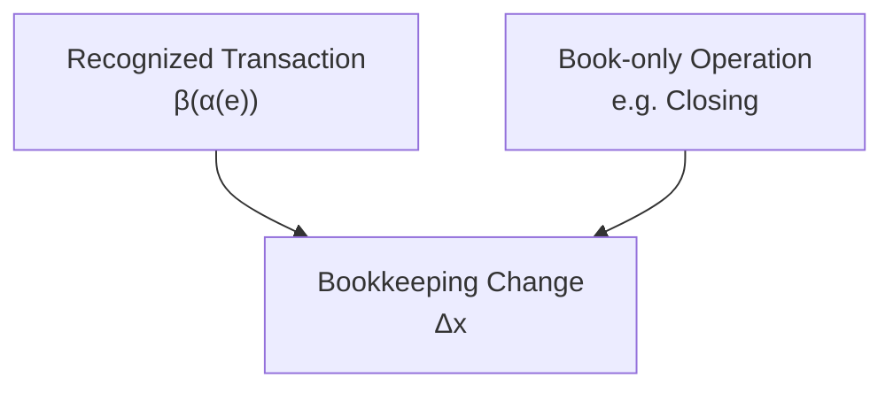
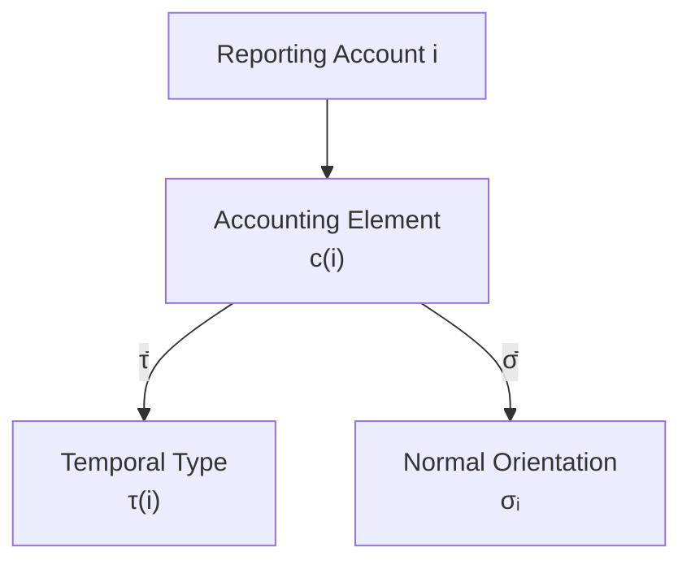

# 05 — Double Entry

## Scope

このモジュールは、

- Bookkeeping Change
- Semantic-to-Book Representation
- Book-only Transformation
- Debit / Credit
- Normal Orientation
- D/C Encoding
- Journal Balance
- Double-entry Constraint

を扱う。

ASMでは、

$$
\boxed{
\Delta s
\neq
f_{\mathrm{PL}}
\neq
\Delta x
}
$$

とレイヤーを分ける。

通常の認識取引では、

$$
\boxed{
(\Delta s,f_{\mathrm{PL}})
\to
\Delta x
\to
J
}
$$

である。

## Bookkeeping Change

帳簿で使用される全Account集合を、

$$
X
$$

とする。

Bookkeeping Changeを、

$$
\boxed{
\Delta x
=
\left(
\Delta x_i
\right)_{i\in X}
}
$$

とする。

$\Delta x_i$ は、

> Account $i$ の自然な意味上の増減として記録されるBook change

である。

## Bookkeeping Change Is Not Semantic Transition

Semantic Stock Transitionは、

$$
\Delta s
$$

Bookkeeping Changeは、

$$
\Delta x
$$

である。

したがって、

$$
\boxed{
\Delta s
\neq
\Delta x
}
$$

である。

## Transaction Representation

Recognized Accounting Effect、

$$
\alpha(e)
=
(\Delta s(e),f_{\mathrm{PL}}(e))
$$

をBookkeeping Changeへ表現する作用を、
概念的に、

$$
\boxed{
\beta
}
$$

とする。

通常取引について、

$$
\boxed{
\Delta x_{\mathrm{tx}}(e)
=
\beta(\alpha(e))
}
$$

とする。

## Representation Is Not Identity

$\beta$ は単なる座標コピーではない。

例えばCredit Saleでは、

Semantic layerで、

$$
\Delta AR=+100
$$

$$
\Delta E=+100
$$

$$
f_{\mathrm{PL}}=Revenue\ 100
$$

である。

しかしBook layerでは、

$$
\Delta x_{AR}=+100
$$

$$
\Delta x_{Sales}=+100
$$

$$
\Delta x_E=0
$$

となりうる。

## Example: Credit Sale

掛売上100の場合、

Semantic Reporting Stateでは、

$$
\Delta AR=+100
$$

$$
\Delta E=+100
$$

である。

Profit/Loss Flowは、

$$
f_{\mathrm{PL}}
=
Revenue\ 100
$$

である。

Bookkeeping Changeは、

$$
\boxed{
\Delta x_{AR}=+100
}
$$

$$
\boxed{
\Delta x_{Sales}=+100
}
$$

である。

## Book-only Transformations

すべてのBookkeeping Changeが、
新しいSemantic Accounting Effectから生じるわけではない。

Closingのように、

$$
\Delta s=0
$$

でありながら、

$$
\Delta x\neq0
$$

となるBook transformationが存在する。

したがって、

$$
\boxed{
\Delta x
}
$$

には少なくとも、

1. Recognized transaction representation
2. Book-only structural transformation

という異なるprovenanceがある。

## General Journal-producing Book Change

Journal Entryを生じるBook changeを一般に、

$$
\Delta x
$$

と書く。

そのsourceは、

と考えられる。

## Debit and Credit Are Directions

Debit / Creditは、
数学的な正負そのものではない。

$$
\boxed{
\mathrm{Debit}\neq+
}
$$

$$
\boxed{
\mathrm{Credit}\neq-
}
$$

両者は、

> Bookkeeping Changeを仕訳の左右どちらへ配置するか

を表す記録方向である。

## Normal Orientation for Reporting Accounts

Reporting Account $i$ について、

$$
c(i)\in\{A,L,E,R,C\}
$$

である。

Accounting ElementからNormal Orientationへの写像を、

$$
\boxed{
\bar\sigma:
\{A,L,E,R,C\}
\to
\{+1,-1\}
}
$$

とする。

$$
\boxed{
\bar\sigma(A)
=
\bar\sigma(C)
=
+1
}
$$

$$
\boxed{
\bar\sigma(L)
=
\bar\sigma(E)
=
\bar\sigma(R)
=
-1
}
$$

とする。

## Meaning of Normal Orientation

$\sigma_i=+1$ は、

> Account $i$ の意味上の増加がDebitで表現される

ことを意味する。

$\sigma_i=-1$ は、

> Account $i$ の意味上の増加がCreditで表現される

ことを意味する。

## Reporting Account Orientation

Reporting Account $i$ のorientationは、

$$
\boxed{
\sigma_i
=
\bar\sigma(c(i))
}
$$

である。

したがって、

$$
\boxed{
\sigma
=
\bar\sigma\circ c
}
$$

である。

## Provisional Account Orientation

Provisional Accountでは、

$$
c(i)
$$

が未定義の場合がある。

その場合、

$$
\sigma_i
=
\bar\sigma(c(i))
$$

とは定義できない。

したがって、
Journalへ参加するすべてのAccountについて、

$$
\boxed{
\sigma_i\in\{+1,-1\}
}
$$

が別途定義されていることを要求する。

## Relation to Temporal Type

Reporting Accountについて、

$$
\tau
=
\bar\tau\circ c
$$

かつ、

$$
\sigma
=
\bar\sigma\circ c
$$

である。

## Encoding a Bookkeeping Change

Account $i$ のBookkeeping Changeを、

$$
\Delta x_i
$$

とする。

D/C directionを、

$$
d_i
$$

とする。

$$
\boxed{
d_i
=
\operatorname{sgn}(\Delta x_i)\sigma_i
}
$$

と定義する。

ここで、

$$
d_i
=
\begin{cases}
+1 & \mathrm{Debit}\\
-1 & \mathrm{Credit}
\end{cases}
$$

である。

## Example: Asset Increase

Cashが100増加。

$$
\Delta x_{\mathrm{Cash}}=+100
$$

$$
\sigma_{\mathrm{Cash}}=+1
$$

なので、

$$
d_{\mathrm{Cash}}
=
(+1)(+1)
=
+1
$$

である。

したがってDebit。

## Example: Liability Increase

Debtが100増加。

$$
\Delta x_{\mathrm{Debt}}=+100
$$

$$
\sigma_{\mathrm{Debt}}=-1
$$

なので、

$$
d_{\mathrm{Debt}}
=
(+1)(-1)
=
-1
$$

となりCredit。

## Example: Expense Increase

Expenseが80増加。

$$
\Delta x_C=+80
$$

$$
\sigma_C=+1
$$

なので、

$$
d_C=+1
$$

となりDebit。

## Example: Revenue Increase

Revenueが100増加。

$$
\Delta x_R=+100
$$

$$
\sigma_R=-1
$$

なので、

$$
d_R=-1
$$

となりCredit。

## Journal Entry

Bookkeeping Change $\Delta x$ の非ゼロ成分集合を、

$$
\boxed{
\operatorname{supp}(\Delta x)
=
\{
i\in X
\mid
\Delta x_i\neq0
\}
}
$$

とする。

Journal Entryを、

$$
\boxed{
J(\Delta x)
=
\{
(i,d_i,|\Delta x_i|)
\mid
i\in\operatorname{supp}(\Delta x)
\}
}
$$

とする。

## Journal Entry Is a Representation

Journal Entryは、
Bookkeeping ChangeのD/C encodingである。

$$
\boxed{
\Delta x
\xrightarrow{\mathrm{D/C\ Encoding}}
J
}
$$

したがって、

$$
\boxed{
J
\neq
\Delta x
}
$$

だが、
$\sigma$ が既知なら相互変換できる。

## Debit and Credit Totals

Journal Entry $J$ のDebit totalを、

$$
D(J)
$$

Credit totalを、

$$
C(J)
$$

とする。

## Balance of a Journal Entry

複式仕訳では、

$$
\boxed{
D(J)=C(J)
}
$$

を要求する。

Journal Residualを、

$$
\boxed{
r_J
=
D(J)-C(J)
}
$$

とすれば、
Balanced Journalでは、

$$
\boxed{
r_J=0
}
$$

である。

## Journal Balance as a Linear Constraint

各Book changeについて、

$$
d_i|\Delta x_i|
=
\sigma_i\Delta x_i
$$

なので、

$$
\boxed{
r_J
=
\sum_{i\in X}
\sigma_i\Delta x_i
}
$$

となる。

したがって、

$$
\boxed{
D(J)=C(J)
\quad\Longleftrightarrow\quad
\sum_{i\in X}
\sigma_i\Delta x_i=0
}
$$

である。

ベクトル表記では、

$$
\boxed{
\sigma^\top\Delta x=0
}
$$

である。

## Reporting Accounts Only

Provisional Accountを含まない場合、

$$
\sigma_A=\sigma_C=+1
$$

$$
\sigma_L=\sigma_E=\sigma_R=-1
$$

なので、
Account-element levelのBook change aggregateについて、

$$
\boxed{
\Delta A_B
+
\Delta C_B
-
\Delta L_B
-
\Delta E_B
-
\Delta R_B
=
0
}
$$

となる。

添字 $B$ は、

> Bookkeeping Change aggregate

であることを示す。

## Book Constraint and Semantic Constraint Are Different

Semantic Stock Transitionでは、

$$
\Delta A-\Delta L-\Delta E=0
$$

である。

一方Book layerでは、

$$
\Delta A_B
+
\Delta C_B
-
\Delta L_B
-
\Delta E_B
-
\Delta R_B
=
0
$$

である。

したがって、

$$
\boxed{
\text{Semantic Transition Constraint}
\neq
\text{Book / Journal Constraint}
}
$$

である。

## Double-entry Does Not Mean Exactly Two Accounts

Double-entry bookkeepingは、

> 1取引に必ず2Accountだけが登場する

という意味ではない。

複数のDebit / Credit linesを持っても、

$$
D(J)=C(J)
$$

ならBalanced Journalを構成できる。

## Stock–Stock Journal Pattern

Asset exchangeでは、
Stock-valued Accounts同士のBook changeが起こる。

例えば、

$$
\mathrm{Dr}\ Equipment\ 100
/
\mathrm{Cr}\ Cash\ 100
$$

である。

## Stock–Flow Journal Pattern

Profit-forming transactionでは、
Stock AccountとFlow Accountが組み合わされる。

例えばCredit Saleなら、

$$
\mathrm{Dr}\ AccountsReceivable\ 100
/
\mathrm{Cr}\ Sales\ 100
$$

である。

## Formal and Economic Correctness

Balanced Journalであっても、
Classificationが正しいとは限らない。

$$
\boxed{
r_J=0
\not\Rightarrow
\text{economic correctness}
}
$$

である。

## State, Transition, and Journal Constraints

ASMでは三種類の制約を分離する。

**State Constraint：**

$$
\boxed{
A-L-E=0
}
$$

**Semantic Transition Constraint：**

$$
\boxed{
\Delta A-\Delta L-\Delta E=0
}
$$

**Book / Journal Constraint：**

$$
\boxed{
\sigma^\top\Delta x=0
}
$$

すなわち、

$$
\boxed{
D(J)-C(J)=0
}
$$

である。

## Double-entry Interpretation

ASMでは、

$$
\boxed{
\text{Double-entry bookkeeping}
\approx
\text{a balanced D/C representation of bookkeeping changes}
}
$$

と解釈する。

これは、

- Recognized transaction representation
- ClosingなどのBook transformation

の双方に対して適用できる。

## Core Equations

**Transaction Representation：**

$$
\boxed{
\Delta x_{\mathrm{tx}}(e)
=
\beta(\alpha(e))
}
$$

**Normal Orientation：**

$$
\boxed{
\sigma_i
=
\bar\sigma(c(i))
}
$$

**D/C Encoding：**

$$
\boxed{
d_i
=
\operatorname{sgn}(\Delta x_i)\sigma_i
}
$$

**Journal Representation：**

$$
\boxed{
J(\Delta x)
=
\{
(i,d_i,|\Delta x_i|)
\mid
i\in\operatorname{supp}(\Delta x)
\}
}
$$

**Journal Residual：**

$$
\boxed{
r_J
=
D(J)-C(J)
}
$$

**Linear Journal Constraint：**

$$
\boxed{
r_J
=
\sigma^\top\Delta x
}
$$

**Balanced Double-entry：**

$$
\boxed{
D(J)=C(J)
\quad\Longleftrightarrow\quad
\sigma^\top\Delta x=0
}
$$

## Relationship to Other Modules

- Recognition:
  [01 — Reality and Recognition](01-reality-and-recognition.md)
- Reporting State:
  [02 — State](02-state.md)
- Semantic Transition:
  [03 — Transition](03-transition.md)
- Account semantics:
  [04 — Accounts and Classification](04-accounts-and-classification.md)
- Journal / Ledger:
  [06 — Journal and Ledger](06-journal-and-ledger.md)
- Closing / BS–PL Bridge:
  [07 — Period and Stock-Flow](07-period-stock-flow.md)
- Validation:
  [09 — Validation](09-validation.md)

## Open Questions

- Representation map $\beta$ の正式な定義。
- Accounting standardによる $\beta$ の変化。
- Provisional Account orientationの一般原則。
- Semantic Stock ConstraintとJournal Constraintの一般的代数関係。
- Book-only transformationを一般的にどう分類するか。
