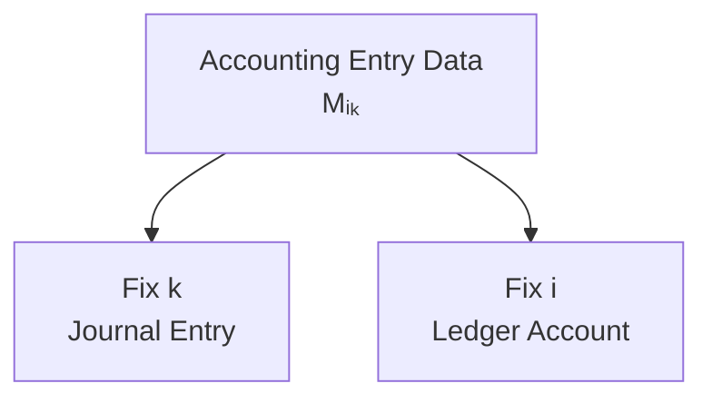

# 06 — Journal and Ledger

## Scope

このモジュールは、仕訳を時間順に蓄積する仕訳帳、勘定別に再編成する転記、総勘定元帳、追跡可能性を扱う。

## Journal

期間中の仕訳列を、

$$
\boxed{\mathcal J=(J_1,J_2,\ldots,J_m)}
$$

とする。仕訳帳は、取引を発生順に見る transaction-centric event log である。

$$
\boxed{\text{Journal}=\text{transaction-oriented view}}
$$

仕訳 $J_k$ は、日付、摘要、勘定、D/C、金額、参照情報などを持つレコードと考えられる。

## Ledger Account

勘定 $i$ への射影を、

$$
\boxed{\pi_i(\Delta x)=\Delta x_i}
$$

とする。すべての取引から勘定 $i$ に関係する変化を時系列に集めた履歴を、

$$
\boxed{L_i=(\Delta x_i^{(1)},\Delta x_i^{(2)},\ldots,\Delta x_i^{(m)})}
$$

とする。ゼロ成分を省略してもよい。

総勘定元帳は、

$$
\boxed{\mathcal L=\{L_1,L_2,\ldots,L_n\}}
$$

である。

$$
\boxed{\text{Ledger}=\text{account-oriented view}}
$$

## Posting

転記は、仕訳帳の transaction index を account index へ組み替える情報変換である。

$$
\boxed{\mathcal J\xrightarrow{\mathrm{Posting}}\mathcal L}
$$

転記は新しい経済的事象ではない。

$$
\boxed{\Delta s_{\mathrm{posting}}=0}
$$

したがって、

$$
\boxed{\text{Posting is re-indexing, not a new state transition.}}
$$

## Matrix View

勘定を行、取引を列に並べた行列を、

$$
M=
\begin{pmatrix}
\Delta x_1^{(1)} & \cdots & \Delta x_1^{(m)}\\
\vdots & \ddots & \vdots\\
\Delta x_n^{(1)} & \cdots & \Delta x_n^{(m)}
\end{pmatrix}
$$

とする。列 $M_{:,k}$ は取引 $k$、行 $M_{i,:}$ は勘定 $i$ の履歴を表す。

ただし Posting を文字どおり $M\mapsto M^\top$ と定義しない。実際の帳簿は日付、摘要、参照なども保持するため、行列転置は構造を理解するための類推である。

## Traceability

仕訳帳から元帳への参照と、元帳から仕訳帳への逆参照により、記録を相互に追跡できる。

$$
\boxed{\mathcal J\leftrightarrow\mathcal L}
$$

この双方向性は audit trail の基礎である。

## Representation Preservation

理想的な転記作用を $P$ とすると、

$$
P(\mathcal J)=\mathcal L
$$

であり、並び方が変わっても経済的意味は保存されるべきである。

$$
\operatorname{Meaning}(\mathcal J)
=
\operatorname{Meaning}(P(\mathcal J))
$$

転記ミスは、この表現保存変換の失敗として捉えられる。

## State Reconstruction

期首残高と元帳履歴があれば、期末残高を再構成できる。

$$
s_i(t_1)=s_i(t_0)+\sum_k\Delta s_i^{(k)}
$$

ただし、現在状態だけから元の履歴を一意に復元することはできない。
