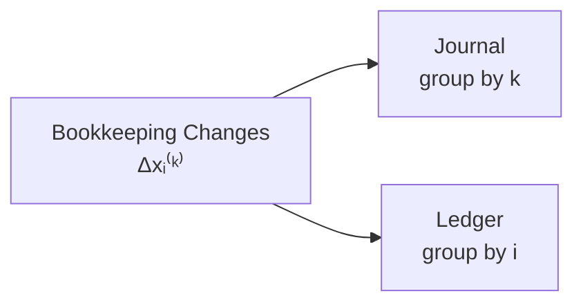
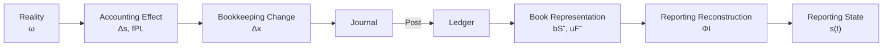

# 06 — Journal and Ledger

## Scope

このモジュールは、

- Journal
- Journal Index
- Ledger
- Posting
- Matrix Representation
- Traceability
- Book Balance Reconstruction
- Flow Book Accumulator
- Pre-closing / Post-closing Book Representation

を扱う。

ASMでは、
JournalとLedgerは異なる経済情報ではない。

両者は、

$$
\boxed{
\Delta x
}
$$

という同じBookkeeping Change dataを、
異なるindexで整理した記録表現である。

## Journal

期間中のJournal Entry列を、

$$
\boxed{
\mathcal J
=
(J_k)_{k\in K_J(I)}
}
$$

とする。

各 $J_k$ は、

$$
\Delta x^{(k)}
$$

をD/C形式へEncodingした記録である。

## Semantic Transaction Set and Journal Set

03で、
Semantic Accounting Effectを認識する取引index集合を、

$$
K(I)
$$

とした。

Closing Entryのindex集合を、

$$
\boxed{
K_{\mathrm{close}}(I)
}
$$

とする。

期間Journal全体のindex集合を、

$$
\boxed{
K_J(I)
=
K(I)
\mathbin{\dot\cup}
K_{\mathrm{close}}(I)
}
$$

とする。

## Meaning of K(I) and K_J(I)

$$
K(I)
$$

は、

> Semantic Accounting Effectを持つRecognized transaction

のindex集合である。

一方、

$$
K_J(I)
$$

は、

> Journalへ記録されるBookkeeping Change

のindex集合である。

Closingは、

$$
\Delta s_{\mathrm{closing}}=0
$$

だが、

$$
\Delta x_{\mathrm{closing}}\neq0
$$

なので、

$$
K_{\mathrm{close}}(I)
\subset
K_J(I)
$$

に属する。

## Journal Is Not Economic Event History

Journalは、
Reality eventそのものの列ではない。

さらにClosingのようなBook-only operationも、
Journal Entryを生成しうる。

## Journal Entry and Signed Account Change

仕訳 $J_k$ におけるAccount $i$ のlineを、

$$
(i,d_i^{(k)},a_i^{(k)})
$$

とする。

ここで、

- $d_i^{(k)}\in\{+1,-1\}$：D/C direction
- $a_i^{(k)}\ge0$：Amount

である。

05より、

$$
\boxed{
\Delta x_i^{(k)}
=
d_i^{(k)}
\sigma_i
a_i^{(k)}
}
$$

である。

## Example: Cash Debit 100

Cashについて、

$$
\sigma_{\mathrm{Cash}}=+1
$$

Debitなので、

$$
d_{\mathrm{Cash}}=+1
$$

したがって、

$$
\Delta x_{\mathrm{Cash}}
=
(+1)(+1)(100)
=
+100
$$

である。

## Example: Debt Credit 100

Debtについて、

$$
\sigma_{\mathrm{Debt}}=-1
$$

Creditなので、

$$
d_{\mathrm{Debt}}=-1
$$

したがって、

$$
\Delta x_{\mathrm{Debt}}
=
(-1)(-1)(100)
=
+100
$$

である。

## Account Projection

Bookkeeping Change vectorから、
Account $i$ を取り出すprojectionを、

$$
\boxed{
\pi_i(\Delta x)
=
\Delta x_i
}
$$

とする。

## Journal Decoder

Journal Entry $J_k$ から、
Account $i$ のBook changeを復号する作用を、

$$
\delta_i
$$

とする。

$$
\boxed{
\delta_i(J_k)
=
d_i^{(k)}
\sigma_i
a_i^{(k)}
}
$$

である。

したがって、

$$
\boxed{
\delta_i(J_k)
=
\Delta x_i^{(k)}
}
$$

である。

Account $i$ が仕訳に存在しない場合、

$$
\delta_i(J_k)=0
$$

とする。

## Ledger Account

すべてのJournal Entryから、
Account $i$ に関するBook changeを集める。

$$
\boxed{
L_i
=
\left(
\Delta x_i^{(k)}
\right)_{k\in K_J(I)}
}
$$

同値に、

$$
\boxed{
L_i
=
\left(
\delta_i(J_k)
\right)_{k\in K_J(I)}
}
$$

である。

## General Ledger

General Ledgerを、

$$
\boxed{
\mathcal L
=
\{
L_i
\mid
i\in X
\}
}
$$

とする。

ここで $X$ は、

- Reporting Accounts
- Provisional Accounts

を含む全Bookkeeping Account集合である。

## Journal and Ledger

Journalは、

$$
\boxed{
\text{transaction / entry-indexed view}
}
$$

Ledgerは、

$$
\boxed{
\text{account-indexed view}
}
$$

である。

## Posting

Posting作用を、

$$
\boxed{
\operatorname{Post}
}
$$

とする。

$$
\boxed{
\operatorname{Post}(\mathcal J)
=
\mathcal L
}
$$

である。

Postingは、

> entry indexからaccount indexへの再編成

である。

## Posting Is Not a New Transition

Postingは新しいSemantic transitionではない。

$$
\boxed{
\Delta s_{\mathrm{posting}}=0
}
$$

また、
新しいBookkeeping Changeも生成しない。

$$
\boxed{
\Delta x_{\mathrm{posting}}=0
}
$$

したがって、

$$
\boxed{
\text{Posting}
=
\text{re-indexing}
}
$$

である。

## Matrix View

Account数を $n$、
Journal Entry数を $m$ とする。

Bookkeeping Change matrixを、

$$
\boxed{
M_{ik}
=
\Delta x_i^{(k)}
}
$$

とする。

$$
M
=
\begin{pmatrix}
\Delta x_1^{(1)} & \cdots & \Delta x_1^{(m)}\\
\vdots & \ddots & \vdots\\
\Delta x_n^{(1)} & \cdots & \Delta x_n^{(m)}
\end{pmatrix}
$$

である。

## Journal and Ledger as Matrix Views

Journalは、

> Matrix $M$ をcolumn方向に読む表現

である。

Ledgerは、

> Matrix $M$ をrow方向に読む表現

である。

## Posting Is Not Matrix Transposition

Postingによって、
別の数学的データ、

$$
M^\top
$$

を生成するわけではない。

同じ、

$$
M_{ik}
$$

を異なるindexで参照する。

したがって、

$$
\boxed{
\text{Posting}
\neq
\text{matrix transposition}
}
$$

である。

## Journal Decode Matrix and Ledger Matrix

Journalから復号したMatrixを、

$$
M^{J}
$$

Ledgerから復元したMatrixを、

$$
M^{L}
$$

とする。

正しいPostingでは、

$$
\boxed{
M^{J}=M^{L}
}
$$

である。

この関係は09でPosting Validationに使用する。

## Traceability

Journalからは、

> この取引で何が変わったか

を追跡しやすい。

Ledgerからは、

> このAccountがどの取引によって変化したか

を追跡しやすい。

したがって、

$$
\boxed{
\text{Journal / Ledger dual indexing improves traceability}
}
$$

である。

## Representation Preservation

正しいPostingでは、

$$
\boxed{
\operatorname{RecordedContent}(\mathcal J)
=
\operatorname{RecordedContent}(\mathcal L)
}
$$

である。

Matrix表現では、

$$
\boxed{
M^J=M^L
}
$$

である。

## Posting Error

元Journalが誤っていても、
その誤りを正確にLedgerへ移せば、
Postingそのものは正しい。

逆に元Journalが正しくても、
転記を誤れば、

$$
M^J\neq M^L
$$

となる。

したがって、

$$
\boxed{
\text{Posting Correctness}
\neq
\text{Semantic Correctness}
}
$$

である。

## Pre-closing Stock Book Balance

Stock-valued Reporting Account $i$ の期首Book Balanceを、

$$
b_i(t_0)
$$

とする。

Closingを除く期間取引、

$$
k\in K(I)
$$

を累積すると、
Pre-closing Book Balanceは、

$$
\boxed{
b_i^-(t_1)
=
b_i(t_0)
+
\sum_{k\in K(I)}
\Delta x_i^{(k)}
}
$$

である。

## Post-closing Stock Book Balance

Closing Entryを含めると、

$$
\boxed{
b_i^+(t_1)
=
b_i^-(t_1)
+
\sum_{k\in K_{\mathrm{close}}(I)}
\Delta x_i^{(k)}
}
$$

となる。

Equity AccountなどはClosingによって変化しうる。

## Flow Account Book Accumulation

Flow-valued Account $j$ について、
Pre-closing Book Accumulatorを、

$$
\boxed{
u_j^-(I)
=
\sum_{k\in K(I)}
\Delta x_j^{(k)}
}
$$

とする。

Journal decoderを使えば、

$$
\boxed{
u_j^-(I)
=
\sum_{k\in K(I)}
\delta_j(J_k)
}
$$

である。

## Semantic Flow Is Not Defined by the Ledger

重要なのは、

$$
\boxed{
u_j^-(I)
\neq
f_j(I)
\quad\text{by definition}
}
$$

である。

- $u_j^-(I)$：Book / Ledger accumulator
- $f_j(I)$：Semantic / Reporting Flow

である。

正しいBook representationでは、
両者がReporting interpretationを通じて一致することが要求される。

この接続は07で扱う。

## Closing of Flow Account Accumulators

Closing後、
Revenue / Expense AccountのBook Accumulatorは、
通常、

$$
\boxed{
u_j^+(I)=0
}
$$

となる。

しかしSemantic Period Flow、

$$
f_j(I)
$$

そのものは消えない。

## Book Balance Is Not Reporting State

Book layerの、

$$
b(t)
$$

と、

Reporting layerの、

$$
s(t)
$$

は区別する。

$$
\boxed{
b(t)\neq s(t)
}
$$

である。

## Example: Revenue and Equity

掛売上100では、
Semantic layerで、

$$
\Delta AR=+100
$$

$$
\Delta E=+100
$$

である。

一方Book layerでは、

$$
\Delta x_{AR}=+100
$$

$$
\Delta x_{Sales}=+100
$$

であり、

$$
\Delta x_E=0
$$

となる。

したがって、

$$
\boxed{
\Delta s_E
\neq
\Delta x_E
}
$$

である。

## Preliminary Book Representation at Period End

Pre-closing Book representationを概念的に、

$$
\boxed{
B_I^-
=
\left(
b_S^-(t_1),
u_F^-(I)
\right)
}
$$

とする。

ここで、

- $b_S^-$：Stock-account Book Balances
- $u_F^-$：Flow-account Book Accumulators

である。

## Reporting Reconstruction

Book representationからReporting Stateを再構成する作用を、

$$
\Phi_I
$$

とする。

Book routeによるReporting State estimateを、

$$
\boxed{
\hat s_B(t_1)
=
\Phi_I(B_I^-)
}
$$

とする。

$\Phi_I$ の正式な構造は07で扱う。

## Closing

ClosingはPostingではない。

Postingは、

$$
\Delta x=0
$$

のRe-indexingである。

Closingは、

$$
\Delta x_{\mathrm{closing}}\neq0
$$

のBook transformationである。

## Current Balance Does Not Determine History

履歴からCurrent Balanceを構成できる。

しかし逆方向は一般に一意でない。

$$
H_1\neq H_2
$$

でも、

$$
\operatorname{fold}(H_1)
=
\operatorname{fold}(H_2)
$$

となりうる。

したがって、

$$
\boxed{
\text{Current Balance}
\not\Rightarrow
\text{Unique History}
}
$$

である。

## Layer Summary

## Core Equations

**Journal：**

$$
\boxed{
\mathcal J
=
(J_k)_{k\in K_J(I)}
}
$$

**Journal Index Set：**

$$
\boxed{
K_J(I)
=
K(I)
\mathbin{\dot\cup}
K_{\mathrm{close}}(I)
}
$$

**Journal Decoder：**

$$
\boxed{
\delta_i(J_k)
=
\Delta x_i^{(k)}
}
$$

**Ledger Account：**

$$
\boxed{
L_i
=
\left(
\Delta x_i^{(k)}
\right)_{k\in K_J(I)}
}
$$

**General Ledger：**

$$
\boxed{
\mathcal L
=
\{
L_i\mid i\in X
\}
}
$$

**Posting：**

$$
\boxed{
\operatorname{Post}(\mathcal J)
=
\mathcal L
}
$$

**Bookkeeping Matrix：**

$$
\boxed{
M_{ik}
=
\Delta x_i^{(k)}
}
$$

**Posting Preservation：**

$$
\boxed{
M^J=M^L
}
$$

**Pre-closing Stock Book Balance：**

$$
\boxed{
b_i^-(t_1)
=
b_i(t_0)
+
\sum_{k\in K(I)}
\Delta x_i^{(k)}
}
$$

**Post-closing Stock Book Balance：**

$$
\boxed{
b_i^+(t_1)
=
b_i^-(t_1)
+
\sum_{k\in K_{\mathrm{close}}(I)}
\Delta x_i^{(k)}
}
$$

**Pre-closing Flow Book Accumulator：**

$$
\boxed{
u_j^-(I)
=
\sum_{k\in K(I)}
\Delta x_j^{(k)}
}
$$

**Pre-closing Book Representation：**

$$
\boxed{
B_I^-
=
\left(
b_S^-(t_1),
u_F^-(I)
\right)
}
$$

## Relationship to Other Modules

- Reality / Recognition:
  [01 — Reality and Recognition](01-reality-and-recognition.md)
- Reporting State:
  [02 — State](02-state.md)
- Semantic Transition:
  [03 — Transition](03-transition.md)
- Account semantics:
  [04 — Accounts and Classification](04-accounts-and-classification.md)
- D/C Encoding:
  [05 — Double Entry](05-double-entry.md)
- Reporting Reconstruction / Closing:
  [07 — Period and Stock-Flow](07-period-stock-flow.md)
- Aggregation:
  [08 — Aggregation](08-aggregation.md)
- Validation:
  [09 — Validation](09-validation.md)

## Open Questions

- Journal / Ledgerの正式なデータ型。
- $\operatorname{Post}$ をpermutation / re-indexing operatorとしてどう形式化するか。
- Provisional Accountを含むBook representationの型。
- Flow book accumulatorからSemantic Flowへのinterpretation map。
- Correcting EntryやReversing Entryを $K_J(I)$ 内でどう分類するか。
