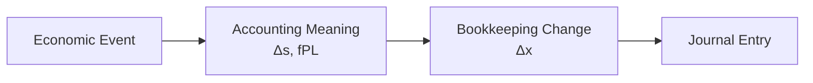
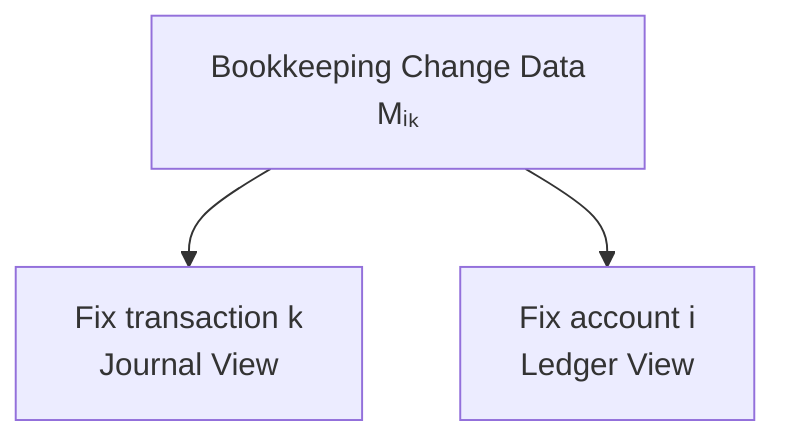
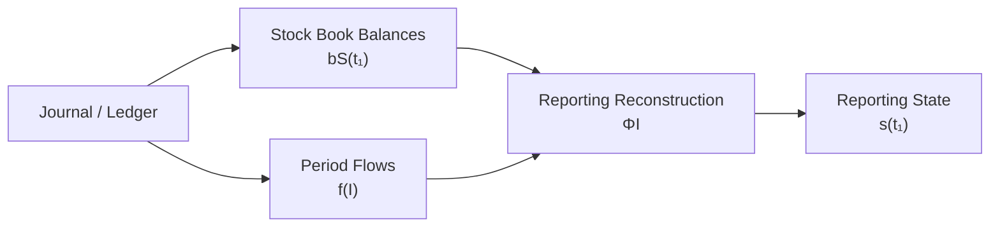
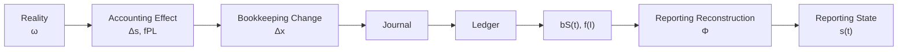

# 06 — Journal and Ledger

## Scope

このモジュールは、

- Journal
- Posting
- General Ledger
- Traceability
- Book Balance Reconstruction
- Flow Accumulation

を扱う。

ASMでは、
JournalとLedgerは異なる経済情報ではない。

両者は、

$$
\boxed{
\Delta x
}
$$

という同じ帳簿勘定変化データを、
異なるインデックスで整理した記録表現である。

$$
\boxed{
\text{Journal}
\leftrightarrow
\text{Ledger}
}
$$

は、

$$
\boxed{
\text{transaction-oriented}
\leftrightarrow
\text{account-oriented}
}
$$

という関係である。

## Journal

期間中の仕訳列を、

$$
\boxed{
\mathcal J
=
(J_1,J_2,\ldots,J_m)
}
$$

とする。

各 $J_k$ は、
帳簿勘定変化、

$$
\Delta x^{(k)}
$$

をD/Cへ符号化した記録である。

したがって、

$$
\boxed{
\text{Journal}
=
\text{transaction-indexed accounting-record view}
}
$$

である。

Journalは経済事象そのものの列ではない。

## Journal Entry and Signed Account Change

仕訳 $J_k$ の勘定 $i$ に関する行を、

$$
(i,d_i^{(k)},a_i^{(k)})
$$

とする。

ここで、

- $i$：Account
- $d_i^{(k)}\in\{+1,-1\}$：D/C direction
- $a_i^{(k)}\ge0$：Amount

である。

05より、

$$
d_i
=
\operatorname{sgn}(\Delta x_i)\sigma_i
$$

である。

$\sigma_i^2=1$ なので、

$$
\operatorname{sgn}(\Delta x_i)
=
d_i\sigma_i
$$

となる。

したがって、

$$
\boxed{
\Delta x_i
=
d_i\sigma_i a_i
}
$$

である。

## Example: Cash Debit 100

Cashについて、

$$
\sigma_{\mathrm{Cash}}=+1
$$

Debitなので、

$$
d_{\mathrm{Cash}}=+1
$$

したがって、

$$
\Delta x_{\mathrm{Cash}}
=
(+1)(+1)(100)
=
+100
$$

となる。

## Example: Debt Credit 100

Debtについて、

$$
\sigma_{\mathrm{Debt}}=-1
$$

Creditなので、

$$
d_{\mathrm{Debt}}=-1
$$

したがって、

$$
\Delta x_{\mathrm{Debt}}
=
(-1)(-1)(100)
=
+100
$$

となる。

## Account Projection

帳簿変化ベクトルから、
勘定 $i$ を取り出す射影を、

$$
\boxed{
\pi_i(\Delta x)
=
\Delta x_i
}
$$

とする。

仕訳 $J_k$ から
signed account changeを復号する作用を、

$$
\delta_i(J_k)
$$

とする。

$$
\boxed{
\delta_i(J_k)
=
d_i^{(k)}
\sigma_i
a_i^{(k)}
}
$$

したがって、

$$
\boxed{
\delta_i(J_k)
=
\Delta x_i^{(k)}
}
$$

である。

勘定 $i$ が仕訳に存在しない場合、

$$
\delta_i(J_k)=0
$$

とする。

## Ledger Account

すべての仕訳から、
勘定 $i$ の帳簿変化を時系列に集める。

$$
\boxed{
L_i
=
\left(
\Delta x_i^{(1)},
\ldots,
\Delta x_i^{(m)}
\right)
}
$$

同値に、

$$
\boxed{
L_i
=
\left(
\delta_i(J_1),
\ldots,
\delta_i(J_m)
\right)
}
$$

である。

Ledger Accountは、

$$
\boxed{
\text{account-indexed history of bookkeeping changes}
}
$$

である。

## General Ledger

General Ledgerを、

$$
\boxed{
\mathcal L
=
\{
L_i
\mid
i\in X
\}
}
$$

とする。

ここで $X$ は、

- Reporting Accounts
- Temporary Accounts

を含む、
帳簿で使用される全勘定集合である。

## Journal and Ledger

Journalは、

$$
\boxed{
\text{transaction-oriented view}
}
$$

Ledgerは、

$$
\boxed{
\text{account-oriented view}
}
$$

である。

## Posting

Postingは、

> transaction indexからaccount indexへの再編成

である。

$$
\boxed{
\mathcal J
\xrightarrow{\mathrm{Posting}}
\mathcal L
}
$$

Postingは新しい経済事象ではない。

$$
\boxed{
\Delta s_{\mathrm{posting}}=0
}
$$

また新しい帳簿変化でもない。

$$
\boxed{
\Delta x_{\mathrm{posting}}=0
}
$$

したがって、

$$
\boxed{
\text{Posting is re-indexing, not a new accounting transition}
}
$$

である。

## Matrix View

期間中に、

- $m$件の取引
- $n$個の勘定

があるとする。

帳簿変化を、

$$
M=
\begin{pmatrix}
\Delta x_1^{(1)}
&
\cdots
&
\Delta x_1^{(m)}
\\
\vdots
&
\ddots
&
\vdots
\\
\Delta x_n^{(1)}
&
\cdots
&
\Delta x_n^{(m)}
\end{pmatrix}
$$

と表す。

列を固定すると、

$$
\boxed{
M_{:,k}
=
\text{transaction }k
}
$$

である。

行を固定すると、

$$
\boxed{
M_{i,:}
=
\text{account }i\text{ history}
}
$$

である。

したがって、

$$
\boxed{
\text{Journal and Ledger}
=
\text{two indexings of the same }\Delta x\text{ data}
}
$$

である。

## Posting Is Not Matrix Transposition

Postingを文字通り、

$$
M\mapsto M^\top
$$

と定義するわけではない。

実際の帳簿には、

- 日付
- 摘要
- 参照番号
- 伝票番号
- 相手勘定

などのメタデータが存在する。

行列表現は、
Journal / Ledger構造を理解するための抽象化である。

## Traceability

JournalからLedgerへ、
LedgerからJournalへ参照可能である。

$$
\boxed{
\mathcal J
\leftrightarrow
\mathcal L
}
$$

この双方向性が
Audit Trailの基礎となる。

## Representation Preservation

理想的Posting作用を、

$$
P
$$

とする。

$$
\boxed{
P(\mathcal J)
=
\mathcal L
}
$$

Postingでは、
並び方が変わっても、
記録内容は保存されなければならない。

$$
\boxed{
\operatorname{RecordedContent}(\mathcal J)
=
\operatorname{RecordedContent}(\mathcal L)
}
$$

あるいは、

$$
\boxed{
\operatorname{Decode}(\mathcal J)
=
\operatorname{Decode}(\mathcal L)
}
$$

と考えられる。

Postingが保存するのは、

$$
\boxed{
\text{recorded accounting content}
}
$$

であり、

$$
\boxed{
\text{economic correctness}
}
$$

そのものではない。

## Posting Error

元仕訳が誤っていても、
その誤った内容を正確に転記すればPosting自体は成功している。

逆に元仕訳が正しくても、
転記を誤れば、

$$
\operatorname{Decode}(\mathcal J)
\neq
\operatorname{Decode}(\mathcal L)
$$

となる。

したがって、

$$
\boxed{
\text{Posting Correctness}
\neq
\text{Economic Correctness}
}
$$

である。

## Book Balance Reconstruction

Stock-valued Reporting Account $i$ の
期首帳簿残高を、

$$
b_i(t_0)
$$

とする。

期間中のLedger changeを累積すれば、

$$
\boxed{
b_i(t_1)
=
b_i(t_0)
+
\sum_{k\in K(I)}
\Delta x_i^{(k)}
}
$$

となる。

Journalから書けば、

$$
\boxed{
b_i(t_1)
=
b_i(t_0)
+
\sum_{k\in K(I)}
\delta_i(J_k)
}
$$

である。

## Flow Account Accumulation

Flow-valued Reporting Account $j$ の
期間値は、

$$
\boxed{
f_j(I)
=
\sum_{k\in K(I)}
\Delta x_j^{(k)}
}
$$

と構成できる。

Journalから書けば、

$$
\boxed{
f_j(I)
=
\sum_{k\in K(I)}
\delta_j(J_k)
}
$$

である。

したがって、
04のFlow quantity、

$$
f_j(I)
$$

は、
個々の帳簿勘定変化を期間中に累積した量として表現できる。

## Book Balance Is Not Reporting State

重要なのは、

$$
\boxed{
b(t)\neq s(t)
}
$$

を一般に区別することである。

$b(t)$ はBook / Ledger layer、

$$
s(t)
$$

はReporting / semantic layerである。

Cashなどについては、

$$
b_{\mathrm{Cash}}(t)
=
s_{\mathrm{Cash}}(t)
$$

と対応することが期待される。

しかし利益形成取引では
単純な恒等関係にならない場合がある。

## Example: Revenue and Equity

掛売上100を考える。

Reporting Stateでは、

$$
\Delta AR=+100
$$

$$
\Delta E=+100
$$

である。

しかし帳簿では、

$$
\mathrm{Dr}\ AR\ 100
/
\mathrm{Cr}\ Sales\ 100
$$

なので、

$$
\Delta x_{AR}=+100
$$

$$
\Delta x_{Sales}=+100
$$

$$
\Delta x_E=0
$$

である。

したがって期間中、

$$
\boxed{
\Delta s_E
\neq
\Delta x_E
}
$$

となりうる。

Revenue accountが、
利益形成Equity効果を
期間Flowとして展開しているからである。

## Reporting Reconstruction

Journal / LedgerからReporting Stateを得るには、

単純なStock account balanceだけでは不十分である。

必要なのは少なくとも、

- Stock account book balances
- Flow account accumulation
- Profit aggregation
- Equity bridge
- Closing

である。

Stock-valued account balancesをまとめて、

$$
b_S(t)
$$

Flow account valuesを、

$$
f(I)
$$

とする。

Reporting Reconstructionを暫定的に、

$$
\boxed{
\Phi_I
}
$$

と書けば、

$$
\boxed{
s(t_1)
=
\Phi_I
\left(
b_S(t_1),
f(I)
\right)
}
$$

という構造を考えられる。

$\Phi_I$ の具体的な構造は、

[07 — Period and Stock-Flow](07-period-stock-flow.md)

で定義する。

## Closing

Closingは単なるPostingではない。

Flow accountの期間累積を整理し、
Reporting Equityとの接続を
帳簿上確定させる処理を含む。

Closingの詳細は、
07で扱う。

## Current State Does Not Determine History

履歴から現在残高を構成することはできる。

しかし逆方向は一般に一意ではない。

$$
H_1\neq H_2
$$

でも、

$$
\operatorname{fold}(H_1)
=
\operatorname{fold}(H_2)
$$

となりうる。

したがって、

$$
\boxed{
\text{Current State}
\not\Rightarrow
\text{Unique History}
}
$$

である。

## Layer Summary

## Relationship to Other Modules

- Reality / Recognition:
  [01 — Reality and Recognition](01-reality-and-recognition.md)
- Reporting State:
  [02 — State](02-state.md)
- Semantic Transition:
  [03 — Transition](03-transition.md)
- Account semantics:
  [04 — Accounts and Classification](04-accounts-and-classification.md)
- D/C Encoding:
  [05 — Double Entry](05-double-entry.md)
- Reporting Reconstruction / Closing:
  [07 — Period and Stock-Flow](07-period-stock-flow.md)
- Aggregation:
  [08 — Aggregation](08-aggregation.md)
- Validation:
  [09 — Validation](09-validation.md)

## Open Questions

- Posting作用 $P$ の正式なデータ構造。
- Journal / Ledger同値性の正式な定義。
- Reporting Reconstruction $\Phi_I$ の定義。
- Closing前後の $b(t)$ と $s(t)$ の関係。
- Temporary Accountを含むReporting Reconstruction。
