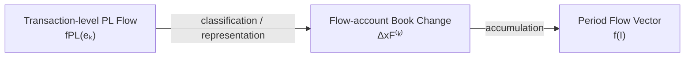
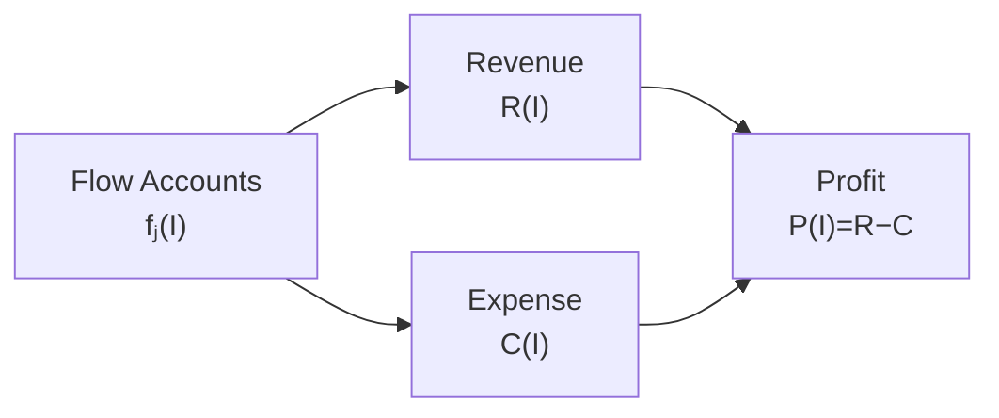
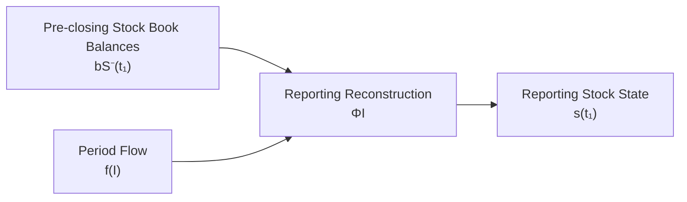
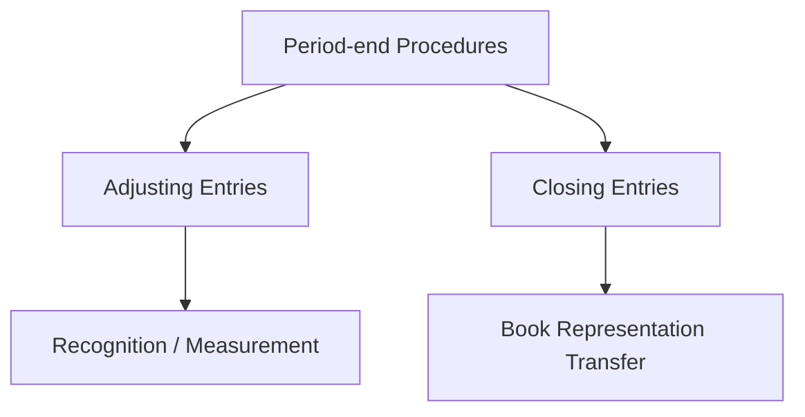
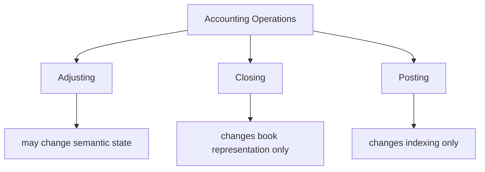
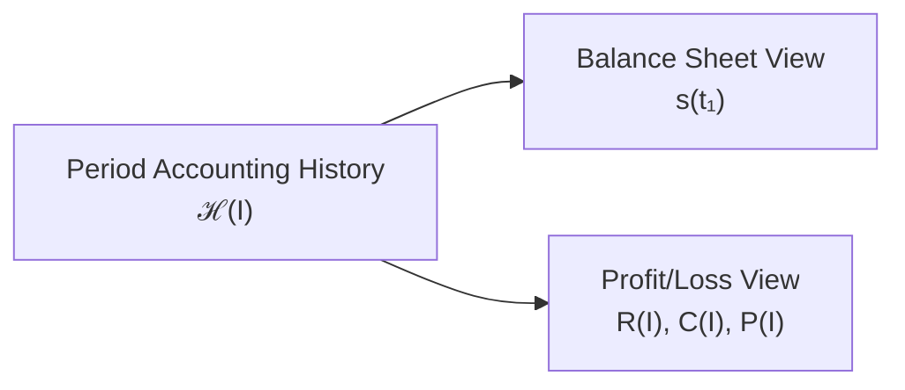
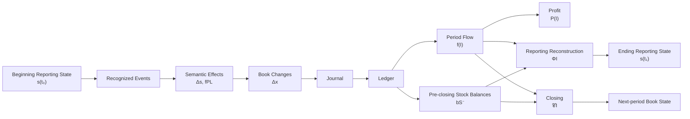

# 07 — Period and Stock-Flow

## Scope

このモジュールは、

- Accounting Period
- Stock / Flow
- Flow account の期間累積
- Revenue / Expense の集約
- Profit
- Equity Bridge
- Carry-forward
- Adjusting Entry
- Closing
- Reporting Reconstruction

を扱う。

ASMでは、

$$
\boxed{
\text{Stock}
\neq
\text{Flow}
}
$$

と両者を区別する。

しかし同時に、

$$
\boxed{
\text{Stock / Flow distinction}
\neq
\text{Stock / Flow independence}
}
$$

である。

期間Flowの利益形成効果は、
Reporting Stock Stateへ反映される。

本モジュールの中心課題は、

> 期間中に帳簿上Revenue / Expenseとして蓄積されたFlowが、
> Reporting Stock State、とくにEquityとどのように接続されるか

を形式化することである。

## Accounting Period

1つの会計期間を、

$$
\boxed{
I=[t_0,t_1]
}
$$

とする。

ここで、

- $t_0$：期首境界
- $t_1$：期末境界

である。

企業活動そのものは継続していても、
会計報告のために人為的な期間境界を設定する。

したがって、

$$
\boxed{
\text{Accounting Period}
=
\text{a reporting partition of continuing activity}
}
$$

と考えられる。

## Transaction Set of a Period

取引インデックス $k$ と実時間 $t_k$ を区別する。

期間 $I=[t_0,t_1]$ に属する取引集合を、

$$
\boxed{
K(I)
=
\{k\mid t_0<t_k\le t_1\}
}
$$

とする。

このように半開区間的な所属規則を用いることで、
境界 $t_1$ の取引が隣接する2つの期間へ
重複して所属することを避ける。

重要なのは、

$$
\boxed{
\text{each recognized transaction belongs to exactly one reporting period}
}
$$

となるように期間所属規則を定めることである。

## Stock and Flow

Reporting Stock Stateは時点に属する。

$$
\boxed{
s(t_0),
\qquad
s(t_1)
}
$$

一方、Flowは期間に属する。

$$
\boxed{
f(I)
}
$$

したがって、

$$
\boxed{
\text{Stock}
=
\text{時点量}
}
$$

$$
\boxed{
\text{Flow}
=
\text{期間量}
}
$$

である。

ただし、この図はFlowそのものをStockへ加算することを意味しない。

Stock状態を変えるのは、
各取引のSemantic Stock Transition、

$$
\Delta s
$$

である。

## Semantic Stock Accumulation

期間中の各取引 $k\in K(I)$ が、

$$
\Delta s^{(k)}
$$

というStock Transitionを生じさせるとする。

期間中の累積Stock Transitionを、

$$
\boxed{
F_S(I)
=
\sum_{k\in K(I)}
\Delta s^{(k)}
}
$$

と定義する。

すると、

$$
\boxed{
s(t_1)
=
s(t_0)
+
F_S(I)
}
$$

である。

すなわち、

$$
\boxed{
s(t_1)
=
s(t_0)
+
\sum_{k\in K(I)}
\Delta s^{(k)}
}
$$

となる。

ここで $F_S(I)$ は、

> 期間中のSemantic Stock Transitionの累積

である。

## Stock Accumulation Is Not PL

重要なのは、

$$
\boxed{
F_S(I)
\neq
\mathrm{PL}(I)
}
$$

である。

$F_S(I)$ はStock Stateに対する変化の総体である。

一方、PLは期間中の利益形成Flowを
Revenue / Expenseとして分類・集約した表現である。

例えば借入は、

$$
\Delta s\neq0
$$

であるが、

$$
f_{\mathrm{PL}}=0
$$

である。

したがって、
期間中のStock変化のすべてが
Profit / Lossを構成するわけではない。

## Flow-valued Accounts

[04 — Accounts and Classification](04-accounts-and-classification.md)
では、Flow-valued account集合を、

$$
X_F
=
X_R
\mathbin{\dot\cup}
X_C
$$

とした。

ここで、

- $X_R$：Revenue accounts
- $X_C$：Expense accounts

である。

Flow-valued account $j$ の期間値を、

$$
f_j(I)
$$

とする。

## Flow Accumulation from Bookkeeping Changes

[06 — Journal and Ledger](06-journal-and-ledger.md)
では、個々の帳簿勘定変化を、

$$
\Delta x_j^{(k)}
$$

とした。

Flow-valued account $j$ の期間値は、

$$
\boxed{
f_j(I)
=
\sum_{k\in K(I)}
\Delta x_j^{(k)}
}
$$

として構成できる。

Journalから直接書けば、

$$
\boxed{
f_j(I)
=
\sum_{k\in K(I)}
\delta_j(J_k)
}
$$

である。

したがって、

となる。

## Flow Vector

すべてのFlow-valued accountの期間値をまとめて、

$$
\boxed{
f(I)
=
\begin{pmatrix}
f_1(I)\\
f_2(I)\\
\vdots\\
f_m(I)
\end{pmatrix}
\in\mathcal F
}
$$

とする。

$\mathcal F$ は、
Flow-valued accounting quantitiesの空間である。

したがって、

$$
\boxed{
\mathcal S
=
\text{Stock-state space}
}
$$

$$
\boxed{
\mathcal F
=
\text{period-flow space}
}
$$

と区別できる。

## Transaction-level PL Flow and Account-level Flow

[03 — Transition](03-transition.md)
では、個別取引 $e_k$ の利益形成Flowを、

$$
f_{\mathrm{PL}}(e_k)
$$

と書いた。

本モジュールでは、
その取引レベルのFlow情報が
Flow-valued bookkeeping accountsへ分類されることで、

$$
\Delta x_j^{(k)}
$$

となり、
さらに期間中に累積されて、

$$
f_j(I)
$$

になると考える。

概念的には、

$$
\boxed{
f_{\mathrm{PL}}(e_k)
\longrightarrow
\Delta x_F^{(k)}
\longrightarrow
f(I)
}
$$

である。

## Revenue Aggregation

Revenue accountの期間値を集約して、

$$
\boxed{
R(I)
=
\sum_{j\in X_R}
f_j(I)
}
$$

と定義する。

したがって、

$$
R(I)
$$

は期間 $I$ に認識されたRevenueの総量である。

## Expense Aggregation

Expense accountの期間値を集約して、

$$
\boxed{
C(I)
=
\sum_{j\in X_C}
f_j(I)
}
$$

と定義する。

ここで $C$ はCost / Expenseを表す。

## Profit

期間利益を、

$$
\boxed{
P(I)
=
R(I)-C(I)
}
$$

と定義する。

したがって、

$$
\boxed{
f(I)
\longrightarrow
(R(I),C(I))
\longrightarrow
P(I)
}
$$

という集約構造を持つ。

## Profit Is a Flow

Profitも期間に属する。

$$
\boxed{
P=P(I)
}
$$

であり、

$$
P(t)
$$

という単一時点Stockではない。

したがって、

$$
\boxed{
\text{Profit}
=
\text{derived Flow quantity}
}
$$

である。

## Equity Bridge

利益形成Flowの効果は、
Reporting Stock StateのEquityへ反映される。

期間中のRevenue / Expense以外にも、
Equityを変化させる取引が存在しうる。

そこで、

$$
N_E(I)
$$

を、

> PLを経由しない期間中のNet Equity Change

とする。

例えば、

- 出資
- 所有者への分配
- その他の直接Equity変動

などが含まれうる。

すると一般的には、

$$
\boxed{
E(t_1)
=
E(t_0)
+
P(I)
+
N_E(I)
}
$$

と表せる。

すなわち、

$$
\boxed{
E(t_1)
=
E(t_0)
+
R(I)
-
C(I)
+
N_E(I)
}
$$

である。

## Profit Does Not Wait for Closing

重要なのは、

> Profitの経済的・意味論的効果がClosing時に初めて発生するわけではない

ということである。

例えば掛売上100が発生した時点で、

$$
\Delta E=+100
$$

というSemantic Stock Effectは既に存在する。

しかし帳簿上は、

$$
\Delta x_{\mathrm{Sales}}=+100
$$

としてRevenue accountへ記録され、

$$
\Delta x_E=0
$$

の場合がある。

したがって、

$$
\boxed{
\text{Semantic Equity Effect}
\neq
\text{Book Equity Change during the period}
}
$$

である。

## Pre-closing Book State

期末直前、Closing前の
Stock-valued account book balancesを、

$$
\boxed{
b_S^-(t_1)
}
$$

とする。

そのうちBook Equity balanceを、

$$
b_E^-(t_1)
$$

とする。

期間中にPLを経由しないEquity変化が
帳簿へ直接記録されている場合、
それらは既に、

$$
b_E^-(t_1)
$$

に含まれている。

## Semantic Equity from Pre-closing Books

単純化した通常のProfit / Loss構造では、

$$
\boxed{
E(t_1)
=
b_E^-(t_1)
+
P(I)
}
$$

と考えられる。

すなわち、

$$
\boxed{
\text{Reporting Equity}
=
\text{Pre-closing Book Equity}
+
\text{Unclosed Profit}
}
$$

である。

この式は、

> Revenue / Expense accountに展開されている利益形成効果を、
> Reporting State上では既にEquityへ反映する

ことを表す。

ただし、
Equityのより複雑な構成要素を扱う場合は
追加のBridge項が必要になる可能性がある。

## Reporting Reconstruction

Closing前の帳簿情報から
Reporting Stock Stateを構成する作用を、

$$
\boxed{
\Phi_I
}
$$

とする。

Closing前のBook representationを、

$$
\boxed{
B_I^-
=
\left(
b_S^-(t_1),
f(I)
\right)
}
$$

とする。

すると、

$$
\boxed{
s(t_1)
=
\Phi_I(B_I^-)
}
$$

すなわち、

$$
\boxed{
s(t_1)
=
\Phi_I
\left(
b_S^-(t_1),
f(I)
\right)
}
$$

と表せる。

これがASMにおける
Stock / Flow接続の中心写像である。

## Reporting Reconstruction Is Not Simple Copying

多くのStock-valued accountについては、

$$
s_i(t_1)
=
b_i^-(t_1)
$$

と対応する。

例えば、

- Cash
- Accounts Receivable
- Debt

などである。

しかしEquityについては、
Closing前にはRevenue / Expense側へ
利益形成効果が展開されているため、

$$
\boxed{
s_E(t_1)
\neq
b_E^-(t_1)
}
$$

となりうる。

単純な場合、

$$
\boxed{
s_E(t_1)
=
b_E^-(t_1)
+
P(I)
}
$$

である。

## Example: Credit Sale

期首Equityを100とする。

期間中に掛売上20だけが発生したとする。

帳簿上、

$$
\Delta x_{AR}=+20
$$

$$
\Delta x_{Sales}=+20
$$

である。

Closing前には、

$$
b_E^-=100
$$

$$
R(I)=20
$$

$$
C(I)=0
$$

なので、

$$
P(I)=20
$$

である。

したがってReporting Equityは、

$$
E(t_1)
=
100+20
=
120
$$

となる。

つまり、

$$
\boxed{
b_E^-=100
\neq
E(t_1)=120
}
$$

である。

## Carry-forward of Stock

Reporting Stock Stateは、
次期へ接続される。

第 $n$ 期の期末状態を、

$$
s_{\mathrm{end}}^{(n)}
$$

次期の期首状態を、

$$
s_{\mathrm{begin}}^{(n+1)}
$$

とすれば、

$$
\boxed{
s_{\mathrm{end}}^{(n)}
=
s_{\mathrm{begin}}^{(n+1)}
}
$$

である。

これはStockが時点状態として
期間境界を越えて接続されることを表す。

## Flow Does Not Literally Reset

数学的なFlow quantity、

$$
f_j(I)
$$

はそもそも期間を引数に持つ。

したがって、

$$
f_j(I_n)
$$

と、

$$
f_j(I_{n+1})
$$

は別の期間に対応する異なる値である。

この意味では、

$$
\boxed{
\text{Flow quantity itself does not need a reset operation}
}
$$

とも言える。

新しい期間では、
新しい期間引数に対するFlowを測定するだけである。

## Flow-account Book Accumulator Resets

一方、帳簿上のRevenue / Expense accountsは、
期間中のFlowを累積するAccumulatorとして動作する。

Closingによって、
次期の累積を開始できるように、
これらの帳簿残高はゼロ化される。

したがって、

$$
\boxed{
\text{Flow quantity}
\neq
\text{Flow-account running balance}
}
$$

である。

より正確には、

$$
\boxed{
\text{the Flow quantity changes with the period argument}
}
$$

一方、

$$
\boxed{
\text{the Flow-account book accumulator is reset by Closing}
}
$$

である。

## Period-end Procedures

期末処理には、
少なくとも異なる二種類の処理を区別する必要がある。

1. Adjusting Entry
2. Closing Entry

両者は同じものではない。

## Adjusting Entry

Adjusting Entryは、
期末時点で必要な、

- Recognition
- Measurement
- Period Allocation

を行う。

例えば、

- 減価償却
- 未払費用
- 前払費用の費用化
- 未収収益
- 貸倒見積り

などである。

これらは会計的意味を新たに認識・測定するため、

一般に、

$$
\boxed{
\Delta s_{\mathrm{adjusting}}
\neq0
}
$$

となりうる。

また、

$$
\boxed{
f_{\mathrm{PL,adjusting}}
\neq0
}
$$

となりうる。

したがって、

$$
\boxed{
\text{Adjusting Entry}
=
\text{semantic accounting operation}
}
$$

である。

## Example: Depreciation Adjustment

減価償却費10を認識する。

Semantic Stock Stateでは、

$$
\Delta A=-10
$$

$$
\Delta E=-10
$$

となる。

利益形成Flowとして、

$$
f_{\mathrm{PL}}
=
Expense\ 10
$$

が発生する。

帳簿では例えば、

$$
\mathrm{Dr}\ DepreciationExpense\ 10
/
\mathrm{Cr}\ AccumulatedDepreciation\ 10
$$

と表現される。

これは単なる帳簿の並べ替えではなく、
会計的認識・測定である。

## Closing Entry

Closing Entryは、
既に認識された期間Flowを
帳簿表現上でEquityへ集約する処理である。

したがってClosingは、

$$
\boxed{
\text{a book-representation transformation}
}
$$

であり、

新しい利益を生じさせる経済的事象ではない。

## Closing Does Not Change Semantic Stock State

利益効果はClosing以前から
Semantic Reporting Stateへ反映されている。

したがってClosingそのものについて、

$$
\boxed{
\Delta s_{\mathrm{closing}}=0
}
$$

とする。

一方、
帳簿勘定は振り替えられるので、

$$
\boxed{
\Delta x_{\mathrm{closing}}\neq0
}
$$

である。

これは、

$$
\boxed{
\text{semantic state change}
\neq
\text{book representation change}
}
$$

を示す重要な例である。

## Closing as a Book Transformation

Closing作用を、

$$
\boxed{
\mathcal C_I
}
$$

とする。

Closing前のBook representationを、

$$
B_I^-
=
\left(
b_S^-(t_1),
f(I)
\right)
$$

とする。

Closing後を、

$$
B_I^+
$$

とする。

すると、

$$
\boxed{
\mathcal C_I:
B_I^-
\longmapsto
B_I^+
}
$$

である。

## Closing of Flow Accounts

Closing後、
Revenue / Expense accountの
期間Accumulatorはゼロになる。

概念的には、

$$
\boxed{
f_{\mathrm{book}}^+=0
}
$$

である。

単純な場合、
期間ProfitはBook Equityへ振り替えられるので、

$$
\boxed{
b_E^+
=
b_E^-+P(I)
}
$$

となる。

## Example of Closing

Closing前に、

$$
b_E^-=100
$$

$$
R(I)=100
$$

$$
C(I)=80
$$

とする。

利益は、

$$
P(I)=100-80=20
$$

である。

Reporting Stateでは既に、

$$
E(t_1)=120
$$

である。

Closing後は、

$$
b_E^+=120
$$

となり、

Revenue / Expense accountのAccumulatorは、

$$
0
$$

となる。

したがって、

### Before Closing

$$
b_E^-=100,
\qquad
R=100,
\qquad
C=80
$$

### Reporting Meaning

$$
E=120
$$

### After Closing

$$
b_E^+=120,
\qquad
R=0,
\qquad
C=0
$$

となる。

## Closing Preserves Reporting Meaning

Closing前後で
帳簿表現は変化する。

しかしReporting Stateは変わらない。

したがって、

$$
\boxed{
\Phi_I(B_I^-)
=
\Phi_I(B_I^+)
}
$$

である。

さらに、

$$
\boxed{
\Phi_I(B_I^-)
=
\Phi_I(B_I^+)
=
s(t_1)
}
$$

となる。

これは、

$$
\boxed{
\text{Closing preserves reporting meaning while changing book representation}
}
$$

ことを表す。

## Closing and Posting Are Different

PostingもClosingも
新しい経済的事象を生じさせない。

しかし両者は異なる。

### Posting

$$
\boxed{
\Delta s_{\mathrm{posting}}=0
}
$$

かつ、

$$
\boxed{
\Delta x_{\mathrm{posting}}=0
}
$$

である。

Postingは既存記録のRe-indexingである。

### Closing

$$
\boxed{
\Delta s_{\mathrm{closing}}=0
}
$$

だが、

$$
\boxed{
\Delta x_{\mathrm{closing}}\neq0
}
$$

である。

Closingは帳簿勘定間の振替を伴う。

したがって、

$$
\boxed{
\text{Posting}
\neq
\text{Closing}
}
$$

である。

## Adjusting, Closing, and Posting

三者を整理すると、

| Operation | $\Delta s$ | $\Delta x$ | Meaning |
| --- | ---: | ---: | --- |
| Adjusting | may be nonzero | nonzero | Recognition / Measurement |
| Closing | $0$ | nonzero | Book representation transfer |
| Posting | $0$ | $0$ | Re-indexing |

したがって、

## One Ledger, Different Temporal Types

CashはStock-valued accountであり、
帳簿残高として、

$$
b_{\mathrm{Cash}}(t)
$$

を持つ。

SalesはFlow-valued accountであり、
期間値として、

$$
f_{\mathrm{Sales}}(I)
$$

を持つ。

しかし両者は同じ、

- Journal
- Ledger
- D/C system

の中へ記録される。

したがって、

$$
\boxed{
\text{Unified bookkeeping representation}
\neq
\text{identical temporal type}
}
$$

である。

これが、

> 同じ元帳体系の中にStock accountとFlow accountが共存できる

理由である。

## BS and PL as Two Views of the Same Accounting History

期間中の会計履歴を、

$$
\mathcal H(I)
$$

とする。

この履歴には、
各取引の、

$$
\left(
\Delta s^{(k)},
f_{\mathrm{PL}}^{(k)}
\right)
$$

が含まれる。

BSは、
その履歴から得られる期末Stock Stateである。

$$
\boxed{
BS(t_1)
=
\text{Stock-state view of }\mathcal H(I)
}
$$

PLは、
同じ期間履歴から利益形成Flowを抽出・集約したものである。

$$
\boxed{
PL(I)
=
\text{profit-flow view of }\mathcal H(I)
}
$$

したがって、

$$
\boxed{
BS
\neq
PL
}
$$

だが、

$$
\boxed{
BS\text{ and }PL
\text{ are derived from the same accounting history}
}
$$

である。

## Does the BS Contain Flow?

厳密には、

$$
\boxed{
\text{BS does not contain Flow quantities as Stock coordinates}
}
$$

である。

Revenue / Expenseそのものは、
BSのStock coordinateではない。

しかし、

$$
\boxed{
\text{the effects of profit-forming Flows are reflected in the ending Stock state}
}
$$

である。

したがって、

$$
\boxed{
\text{Ending Stock}
=
\text{Beginning Stock}
+
\text{Accumulated Semantic Stock Effects}
}
$$

であり、
そのSemantic Stock Effectsの一部が
利益形成Flowと対応している。

よって、

> BSにFlowそのものが入っている

ではなく、

> BSには過去のFlowを生じさせた取引の効果が、
> Stockとして反映されている

と表現する方が正確である。

## Period Boundary

期末処理が完了すると、
Closing後のStock account balancesが
次期へ繰り越される。

概念的には、

$$
\boxed{
b_S^{+,(n)}(t_1)
=
b_S^{-,(n+1)}(t_1)
}
$$

と考えられる。

Reporting Stateについても、

$$
\boxed{
s_{\mathrm{end}}^{(n)}
=
s_{\mathrm{begin}}^{(n+1)}
}
$$

である。

一方、
新しい期間のFlowは、

$$
f(I_{n+1})
$$

として新たに測定される。

## Full Period Pipeline

1期間の会計処理をまとめると、

これにより、

$$
\boxed{
\text{Reality}
\to
\text{Accounting Meaning}
\to
\text{Bookkeeping}
\to
\text{Period Aggregation}
\to
\text{Reporting}
}
$$

というASMの全体構造が接続される。

## Core Equations

本モジュールの中心式をまとめる。

**Transaction Set：**

$$
\boxed{
K(I)
=
\{k\mid t_0<t_k\le t_1\}
}
$$

**Stock Accumulation：**

$$
\boxed{
s(t_1)
=
s(t_0)
+
\sum_{k\in K(I)}
\Delta s^{(k)}
}
$$

**Flow-account Accumulation：**

$$
\boxed{
f_j(I)
=
\sum_{k\in K(I)}
\Delta x_j^{(k)}
}
$$

**Revenue：**

$$
\boxed{
R(I)
=
\sum_{j\in X_R}
f_j(I)
}
$$

**Expense：**

$$
\boxed{
C(I)
=
\sum_{j\in X_C}
f_j(I)
}
$$

**Profit：**

$$
\boxed{
P(I)
=
R(I)-C(I)
}
$$

**Equity Bridge：**

$$
\boxed{
E(t_1)
=
E(t_0)
+
P(I)
+
N_E(I)
}
$$

**Pre-closing Equity Bridge：**

単純な場合、

$$
\boxed{
E(t_1)
=
b_E^-(t_1)
+
P(I)
}
$$

**Reporting Reconstruction：**

$$
\boxed{
s(t_1)
=
\Phi_I
\left(
b_S^-(t_1),
f(I)
\right)
}
$$

**Closing：**

$$
\boxed{
\mathcal C_I:
B_I^-
\longmapsto
B_I^+
}
$$

**Closing Does Not Change Reporting State：**

$$
\boxed{
\Delta s_{\mathrm{closing}}=0
}
$$

**Closing Changes Book Representation：**

$$
\boxed{
\Delta x_{\mathrm{closing}}\neq0
}
$$

**Reporting Meaning Preservation：**

$$
\boxed{
\Phi_I(B_I^-)
=
\Phi_I(B_I^+)
=
s(t_1)
}
$$

## Relationship to Other Modules

- Reality / Recognition:
  [01 — Reality and Recognition](01-reality-and-recognition.md)
- Reporting Stock State:
  [02 — State](02-state.md)
- Semantic Stock Transition / PL Flow:
  [03 — Transition](03-transition.md)
- Stock / Flow account classification:
  [04 — Accounts and Classification](04-accounts-and-classification.md)
- Bookkeeping Change / D/C:
  [05 — Double Entry](05-double-entry.md)
- Journal / Ledger / Book Balance:
  [06 — Journal and Ledger](06-journal-and-ledger.md)
- Aggregation:
  [08 — Aggregation](08-aggregation.md)
- Validation:
  [09 — Validation](09-validation.md)

## Open Questions

- $\mathcal F$ を正式なベクトル空間としてどこまで構造化するか。
- $f_{\mathrm{PL}}(e)$ からFlow account変化 $\Delta x_F$ への写像をどう形式化するか。
- Reporting Reconstruction $\Phi_I$ の一般形をどう定義するか。
- $N_E(I)$ を、出資・分配・その他Equity変動へどう分解するか。
- Closing作用 $\mathcal C_I$ を帳簿ベクトル上の線形写像として定義できるか。
- Adjusting EntryをRecognition作用 $\mathcal A$ とどう接続するか。
- Accrual / DeferralをStock–Flow間の期間配分としてどう一般化するか。
- Closing後のBook StateとReporting Stateが一致する条件をどう定義するか。
- Revenue / Expense以外の期間型会計情報を$\mathcal F$へどう含めるか。
