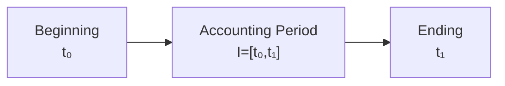
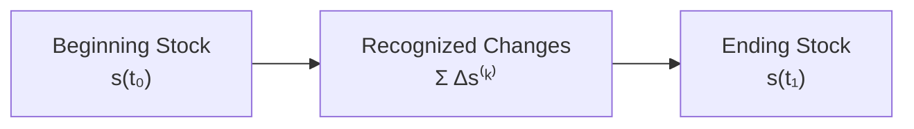
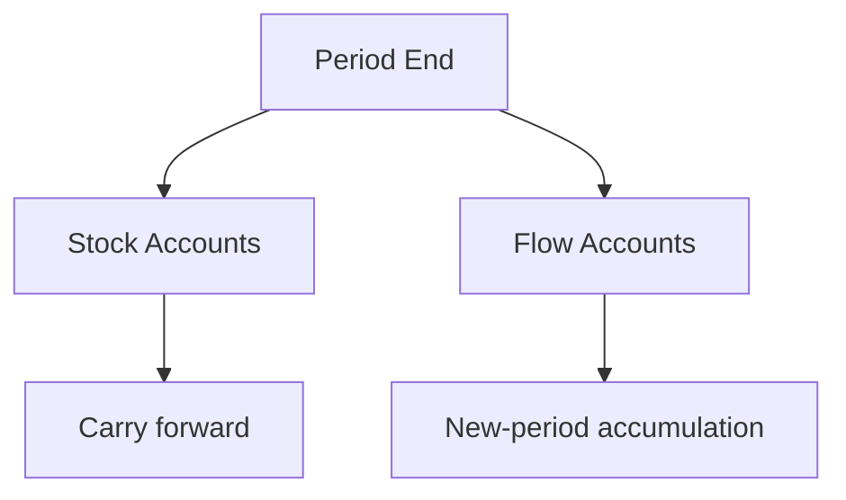

# 07 — Period and Stock-Flow

## Scope

このモジュールは、会計期間、時点量としての Stock、期間量としての Flow、累積、決算を扱う。

## Accounting Period

1つの会計期間を、

$$
\boxed{I=[t_0,t_1]}
$$

とする。$t_0$ は期首、$t_1$ は期末である。

企業活動自体は連続していても、成果と状態を報告するために人為的な境界を設ける。

## Stock and Flow

期首・期末の状態は Stock である。

$$
s(t_0),\quad s(t_1)
$$

期間 $I$ に属する収益、費用、利益は Flow である。

$$
R(I),\quad C(I),\quad P(I)
$$

利益を、

$$
\boxed{P(I)=R(I)-C(I)}
$$

と定義する。

$$
\boxed{\text{Stock}=\text{時点量}}
$$

$$
\boxed{\text{Flow}=\text{期間量}}
$$

## Accumulation

期間中に $m$ 件の状態変化があるとする。

$$
\Delta s^{(1)},\Delta s^{(2)},\ldots,\Delta s^{(m)}
$$

すると、

$$
\boxed{
s(t_1)
=
s(t_0)+\sum_{k=1}^{m}\Delta s^{(k)}}
$$

である。これは取引ごとの離散的変化と期末 Stock を結ぶ。

## Carry-forward and Reset

Stock は期をまたいで接続される。

$$
\boxed{s_{\mathrm{end}}^{(n)}=s_{\mathrm{begin}}^{(n+1)}}
$$

Flow は期間ごとに新たに集計される。

$$
R(I_{n+1}),C(I_{n+1})
$$

は、$R(I_n),C(I_n)$ の残高をそのまま繰り越すものではない。

## Closing as a Boundary Operation

決算は、期間 $I=[t_0,t_1]$ の右端で、期間 Flow と期末 Stock を確定し、次期へ状態を接続する境界処理である。

$$
\boxed{
\text{Closing}
=
\text{a boundary operation connecting periods}}
$$

## Equity Bridge

収益・費用による利益と純資産の変化には、所有者取引などを含む接続項 $O(I)$ を用いて、暫定的に、

$$
E(t_1)
=
E(t_0)+R(I)-C(I)+O(I)
$$

という形を想定する。この式の符号と構成要素は、資本取引・決算振替・配当等を扱った後に正式化する。

## One Ledger, Different Temporal Types

現金は $\mathrm{Cash}(t)$ という Stock、売上は $\mathrm{Sales}(I)$ という Flow だが、同一の仕訳・元帳体系に現れる。これは帳簿上の統一表現と、数学的な時間型の違いを区別すべきことを示す。

## Open Questions

- Flow accumulator を帳簿状態としてどう形式化するか。
- 決算振替後の状態と報告前の状態をどう区別するか。
- 期間配分、見越し・繰延べを認識作用とどう接続するか。
