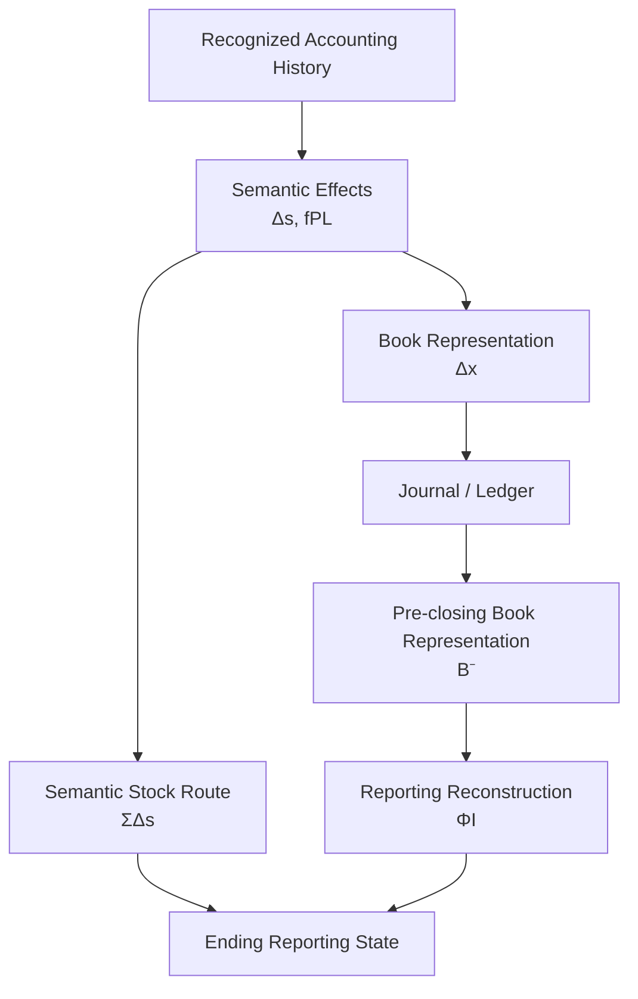
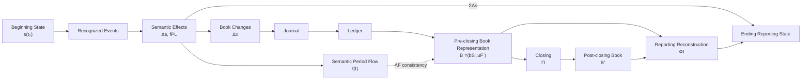

# 07 — Period and Stock-Flow

## Scope

このモジュールは、

- Accounting Period
- Semantic Stock Accumulation
- Semantic Period Flow
- Book Flow Accumulator
- Revenue / Expense
- Profit
- Equity Bridge
- Semantic Route
- Book Reconstruction Route
- Reporting Reconstruction
- Adjusting Entry
- Closing
- Carry-forward

を扱う。

このモジュールは、
ASMにおける、

$$
\boxed{
\text{Balance Sheet}
\leftrightarrow
\text{Profit / Loss}
}
$$

の接続を形式化する。

## Accounting Period

会計期間を、

$$
\boxed{
I=(t_0,t_1]
}
$$

とする。

ここで、

- $t_0$：期首境界
- $t_1$：期末境界

である。

## Period as Reporting Partition

企業活動そのものは連続していても、
会計報告のために期間へ分割する。

したがって、

$$
\boxed{
\text{Accounting Period}
=
\text{a reporting partition of continuing activity}
}
$$

である。

## Semantic Transaction Set

期間 $I$ にSemantic Accounting Effectを帰属させる取引index集合を、

$$
\boxed{
K(I)
=
\{
k\mid t_0<t_k\le t_1
\}
}
$$

とする。

Closingは新しいSemantic Accounting Effectを生じないため、

$$
\boxed{
\text{Closing}\notin K(I)
}
$$

である。

## Stock and Flow

Reporting Stock Stateは時点に属する。

$$
\boxed{
s(t_0),
\qquad
s(t_1)
}
$$

一方Flowは期間に属する。

$$
\boxed{
f(I)
}
$$

したがって、

$$
\boxed{
\text{Stock}
=
\text{point-in-time quantity}
}
$$

$$
\boxed{
\text{Flow}
=
\text{period quantity}
}
$$

である。

## Stock and Flow Are Distinct but Related

$$
\boxed{
\text{Stock}
\neq
\text{Flow}
}
$$

である。

しかし、

$$
\boxed{
\text{Stock / Flow distinction}
\neq
\text{Stock / Flow independence}
}
$$

でもある。

Profit-forming Flowを生じさせる取引は、
同時にStock Stateを変化させる。

## Semantic Stock Accumulation

期間中の各認識取引 $k$ が、

$$
\Delta s^{(k)}
$$

というSemantic Stock Transitionを持つ。

その累積を、

$$
\boxed{
F_S(I)
=
\sum_{k\in K(I)}
\Delta s^{(k)}
}
$$

とする。

すると、

$$
\boxed{
s_{\mathrm{sem}}(t_1)
=
s(t_0)
+
F_S(I)
}
$$

である。

## Semantic Route

期間末Reporting StateへのSemantic routeは、

$$
\boxed{
s_{\mathrm{sem}}(t_1)
=
s(t_0)
+
\sum_{k\in K(I)}
\Delta s^{(k)}
}
$$

である。

## Stock Accumulation Is Not PL

$F_S(I)$ は、
期間中の全Semantic Stock changesを含む。

一方PLは、
Profit-forming Flowのみを扱う。

したがって、

$$
\boxed{
F_S(I)
\neq
PL(I)
}
$$

である。

借入のように、

$$
\Delta s\neq0
$$

だが、

$$
f_{\mathrm{PL}}=0
$$

となる取引が存在する。

## Transaction-level PL Flow

各認識取引 $e_k$ のProfit/Loss Flow Effectを、

$$
\boxed{
f_{\mathrm{PL}}(e_k)
}
$$

とする。

## Semantic Period Flow

期間全体のSemantic PL Flowを、

$$
\boxed{
f(I)
=
\sum_{k\in K(I)}
f_{\mathrm{PL}}(e_k)
}
$$

と定義する。

したがって、

$$
\boxed{
f(I)\in\mathcal F
}
$$

である。

## Flow Coordinates

Flow-valued account coordinate $j\in X_F$ に対応する期間値を、

$$
f_j(I)
$$

とする。

したがって、

$$
\boxed{
f(I)
=
\left(
f_j(I)
\right)_{j\in X_F}
}
$$

と書ける。

## Book Flow Accumulator

Book / Ledger側では、
期間FlowをFlow-valued Accountsへ記録する。

Pre-closing Book Accumulatorを、

$$
\boxed{
u_j^-(I)
=
\sum_{k\in K(I)}
\Delta x_j^{(k)}
}
$$

とする。

Flow Accounts全体について、

$$
\boxed{
u_F^-(I)
=
\left(
u_j^-(I)
\right)_{j\in X_F}
}
$$

とする。

## Semantic Flow and Book Accumulator Are Different

重要なのは、

$$
\boxed{
f(I)
\neq
u_F^-(I)
\quad\text{by definition}
}
$$

である。

$f(I)$ はSemantic / Reporting quantity、
$u_F^-(I)$ はBook representationである。

## Flow Interpretation Map

Flow-account Book Accumulatorを、
Semantic / Reporting Flowへ解釈する作用を、

$$
\boxed{
\Lambda_F
}
$$

とする。

$$
\boxed{
\Lambda_F:
\mathcal U_F
\to
\mathcal F
}
$$

とする。

正しいFlow representationでは、

$$
\boxed{
\Lambda_F(u_F^-(I))
=
f(I)
}
$$

を要求する。

## Direct-coordinate Case

Book Flow AccountsとSemantic Flow coordinatesが
完全に対応している単純なモデルでは、

$$
\Lambda_F
=
\mathrm{id}
$$

とみなせる。

この場合、

$$
u_F^-(I)=f(I)
$$

という数値的一致が得られる。

ただし概念的なlayer区別は残る。

## Revenue Aggregation

Revenueを、

$$
\boxed{
R(I)
=
\sum_{j\in X_R}
f_j(I)
}
$$

とする。

## Expense Aggregation

Expenseを、

$$
\boxed{
C(I)
=
\sum_{j\in X_C}
f_j(I)
}
$$

とする。

## Profit Functional

Flow space上のProfit functionalを、

$$
\boxed{
p:
\mathcal F
\to
\mathbb R
}
$$

とする。

$$
\boxed{
p(f)
=
\sum_{j\in X_R}f_j
-
\sum_{j\in X_C}f_j
}
$$

と定義する。

したがって期間Profitは、

$$
\boxed{
P(I)
=
p(f(I))
}
$$

である。

## Profit

同値に、

$$
\boxed{
P(I)
=
R(I)-C(I)
}
$$

である。

ProfitはStockではなく、
derived Flow quantityである。

$$
\boxed{
P=P(I)
}
$$

## Equity Bridge

PLを経由しないNet Equity Changeを、

$$
\boxed{
N_E(I)
}
$$

とする。

例えば、

- Owner contribution
- Distribution
- Other direct Equity changes

などが含まれうる。

すると、

$$
\boxed{
E(t_1)
=
E(t_0)
+
P(I)
+
N_E(I)
}
$$

である。

## Profit Does Not Wait for Closing

Profit effectは、
Closingで初めて発生するわけではない。

例えばCredit Sale 100では、
取引時点でSemantic layerに、

$$
\Delta E=+100
$$

が存在する。

一方、
Book layerではRevenue Accountに記録され、

$$
\Delta x_E=0
$$

である場合がある。

したがって、

$$
\boxed{
\text{Semantic Equity Effect}
\neq
\text{Book Equity Change during the period}
}
$$

である。

## Pre-closing Stock Book State

Closing直前のStock-account Book Balancesを、

$$
\boxed{
b_S^-(t_1)
}
$$

とする。

Equity部分を、

$$
b_E^-(t_1)
$$

とする。

## Pre-closing Book Representation

Closing前のBook representationを、

$$
\boxed{
B_I^-
=
\left(
b_S^-(t_1),
u_F^-(I)
\right)
}
$$

とする。

これは、

> 期末時点でLedgerが保持しているBook representation

である。

## Reporting Reconstruction

Book representationからReporting Stock Stateを構成する作用を、

$$
\boxed{
\Phi_I
}
$$

とする。

Book routeによるState reconstructionを、

$$
\boxed{
\hat s_B(t_1)
=
\Phi_I(B_I^-)
}
$$

とする。

## Two Routes to the Same Reporting State

期間末Stateには2つのrouteがある。

**Semantic Route：**

$$
s_{\mathrm{sem}}(t_1)
=
s(t_0)
+
F_S(I)
$$

**Book Route：**

$$
\hat s_B(t_1)
=
\Phi_I(B_I^-)
$$

正しい会計システムでは、

$$
\boxed{
s_{\mathrm{sem}}(t_1)
=
\hat s_B(t_1)
}
$$

である。

## Commuting Accounting Diagram

ASMでは、

$$
\boxed{
\text{the accounting diagram should commute}
}
$$

という形でSemantic / Book consistencyを捉えられる。

## Reporting Reconstruction Is Not Simple Copying

多くのStock Accountでは、

$$
b_i^-(t_1)
=
s_i(t_1)
$$

となることがある。

しかしEquityでは、
Revenue / Expense AccountにProfit effectが展開されているため、

$$
b_E^-(t_1)
\neq
s_E(t_1)
$$

となりうる。

## Simplified Pre-closing Equity Bridge

単純な場合、

$$
\boxed{
E(t_1)
=
b_E^-(t_1)
+
P(I)
}
$$

と表せる。

すなわち、

$$
\boxed{
\text{Reporting Equity}
=
\text{Pre-closing Book Equity}
+
\text{Unclosed Profit}
}
$$

である。

## Example: Credit Sale

期首Book Equityが100とする。

Credit Sale 20を認識した。

Bookkeeping Changeは、

$$
\Delta x_{AR}=+20
$$

$$
\Delta x_{Sales}=+20
$$

である。

したがってClosing前、

$$
b_E^-=100
$$

$$
u_{\mathrm{Sales}}^-=20
$$

である。

Semantic Flowは、

$$
R(I)=20
$$

$$
C(I)=0
$$

なので、

$$
P(I)=20
$$

である。

Reporting Equityは、

$$
E(t_1)=120
$$

となる。

## Carry-forward of Stock

第 $n$ 期末Reporting Stateと、
次期Beginning Stateは、

介在するeventがなければ、

$$
\boxed{
s_{\mathrm{end}}^{(n)}
=
s_{\mathrm{begin}}^{(n+1)}
}
$$

である。

## Semantic Flow Does Not Reset

Semantic Flow、

$$
f_j(I)
$$

は期間をargumentに持つ。

したがって、

$$
f_j(I_n)
$$

と、

$$
f_j(I_{n+1})
$$

は別のperiod quantityである。

この意味で、

$$
\boxed{
\text{Semantic Flow does not need a reset operation}
}
$$

である。

## Flow Book Accumulator Resets

一方、

$$
u_j^-(I)
$$

はBook accumulatorである。

Closingによって次期累積を開始できるように、

$$
\boxed{
u_j^+(I)=0
}
$$

となる。

## Semantic Flow Survives Closing

Closing後も、

$$
\boxed{
f_j(I)
}
$$

はその期間のReporting informationとして存在する。

したがって、

$$
\boxed{
f_j(I)
\neq
u_j^+(I)
}
$$

である。

## Period-end Procedures

Period-end operationには、
少なくとも、

1. Adjusting Entry
2. Closing Entry

を区別する必要がある。

## Adjusting Entry

Adjusting Entryは、

- Recognition
- Measurement
- Period Allocation

を行う。

例えば、

- Depreciation
- Accrued Expense
- Prepaid Expense allocation
- Accrued Revenue

などである。

一般に、

$$
\Delta s_{\mathrm{adjusting}}\neq0
$$

および、

$$
f_{\mathrm{PL,adjusting}}\neq0
$$

となりうる。

したがって、

$$
\boxed{
\text{Adjusting Entry}
=
\text{semantic accounting operation}
}
$$

である。

## Example: Depreciation Adjustment

Depreciation Expense 10を認識する。

Semantic layerでは、

$$
\Delta A=-10
$$

$$
\Delta E=-10
$$

$$
f_{\mathrm{PL}}
=
Expense\ 10
$$

である。

Book layerでは例えば、

$$
\mathrm{Dr}\ DepreciationExpense\ 10
/
\mathrm{Cr}\ AccumulatedDepreciation\ 10
$$

となる。

## Closing Entry

Closingは、
既に認識されたperiod Flowを、
Book representation上でEquityへ振り替える。

したがって、

$$
\boxed{
\text{Closing}
=
\text{Book representation transformation}
}
$$

である。

## Closing Does Not Change Semantic State

Closingそのものについて、

$$
\boxed{
\Delta s_{\mathrm{closing}}=0
}
$$

である。

一方、

$$
\boxed{
\Delta x_{\mathrm{closing}}\neq0
}
$$

である。

## Closing Operator

Closing operatorを、

$$
\boxed{
\Gamma_I
}
$$

とする。

Closing後のBook representationを、

$$
\boxed{
B_I^+
=
\left(
b_S^+(t_1),
0
\right)
}
$$

とする。

すると、

$$
\boxed{
\Gamma_I:
B_I^-
\longmapsto
B_I^+
}
$$

である。

## Closing of Equity

単純なaggregate modelでは、

$$
\boxed{
b_E^+
=
b_E^-+P(I)
}
$$

となる。

同時に、

$$
u_F^+=0
$$

となる。

## Example of Closing

Closing前、

$$
b_E^-=100
$$

$$
R(I)=100
$$

$$
C(I)=80
$$

とする。

Profitは、

$$
P(I)=20
$$

である。

Semantic Reporting Equityはすでに、

$$
E(t_1)=120
$$

である。

Closing後は、

$$
b_E^+=120
$$

$$
u_F^+=0
$$

となる。

しかし、

$$
P(I)=20
$$

というperiod Flow informationは消えない。

## Closing Preserves Reporting Meaning

Closing前後でBook representationは変わる。

しかしReporting meaningは変化しない。

したがって、

$$
\boxed{
\Phi_I(B_I^-)
=
\Phi_I(B_I^+)
}
$$

である。

正しいAccounting Systemではさらに、

$$
\boxed{
s_{\mathrm{sem}}(t_1)
=
\Phi_I(B_I^-)
=
\Phi_I(B_I^+)
}
$$

となる。

## Closing and Posting Are Different

Postingは、

$$
\Delta s=0,
\qquad
\Delta x=0
$$

である。

Closingは、

$$
\Delta s=0,
\qquad
\Delta x\neq0
$$

である。

したがって、

$$
\boxed{
\text{Posting}
\neq
\text{Closing}
}
$$

である。

## Adjusting, Closing, and Posting

| Operation | $\Delta s$ | $\Delta x$ | Meaning |
| --- | ---: | ---: | --- |
| Adjusting | may be nonzero | nonzero | Recognition / Measurement |
| Closing | $0$ | nonzero | Book representation transformation |
| Posting | $0$ | $0$ | Re-indexing |

## One Ledger, Different Temporal Types

CashはStock-valued Accountであり、

$$
b_{\mathrm{Cash}}(t)
$$

というBook Balanceを持つ。

SalesはFlow-valued Accountであり、
Semantic meaningは、

$$
f_{\mathrm{Sales}}(I)
$$

というperiod quantityである。

Book layerでは、

$$
u_{\mathrm{Sales}}(t;I)
$$

というAccumulatorを持つ。

これらは同じJournal / Ledger system内に共存する。

## BS and PL as Two Views of the Same Accounting History

Period Accounting Historyを、

$$
\mathcal H(I)
=
\{
(\Delta s^{(k)},f_{\mathrm{PL}}^{(k)})
\}_{k\in K(I)}
$$

とする。

BSは、

$$
\boxed{
\text{Stock-state view of }\mathcal H(I)
}
$$

PLは、

$$
\boxed{
\text{Profit-flow view of }\mathcal H(I)
}
$$

である。

## Does the BS Contain Flow?

厳密には、

$$
\boxed{
\text{BS does not contain Flow as Stock coordinates}
}
$$

である。

しかしFlow-forming transactionのStock effectsは、

$$
\Delta s
$$

を通じてEnding BSへ反映される。

## Period Boundary

Closing後のStock Book Balancesは、
次期へ繰り越される。

概念的には、

$$
\boxed{
b_S^{+,(n)}(t_n)
=
b_S^{-,(n+1)}(t_n)
}
$$

である。

一方、
次期Flowは新しい、

$$
f(I_{n+1})
$$

として測定される。

## Full Period Pipeline

## Core Equations

**Accounting Period：**

$$
\boxed{
I=(t_0,t_1]
}
$$

**Semantic Transaction Set：**

$$
\boxed{
K(I)
=
\{
k\mid t_0<t_k\le t_1
\}
}
$$

**Semantic Stock Accumulation：**

$$
\boxed{
F_S(I)
=
\sum_{k\in K(I)}
\Delta s^{(k)}
}
$$

**Semantic State Route：**

$$
\boxed{
s_{\mathrm{sem}}(t_1)
=
s(t_0)+F_S(I)
}
$$

**Semantic Period Flow：**

$$
\boxed{
f(I)
=
\sum_{k\in K(I)}
f_{\mathrm{PL}}(e_k)
}
$$

**Pre-closing Flow Book Accumulator：**

$$
\boxed{
u_j^-(I)
=
\sum_{k\in K(I)}
\Delta x_j^{(k)}
}
$$

**Flow Representation Consistency：**

$$
\boxed{
\Lambda_F(u_F^-(I))
=
f(I)
}
$$

**Revenue：**

$$
\boxed{
R(I)
=
\sum_{j\in X_R}
f_j(I)
}
$$

**Expense：**

$$
\boxed{
C(I)
=
\sum_{j\in X_C}
f_j(I)
}
$$

**Profit Functional：**

$$
\boxed{
P(I)
=
p(f(I))
=
R(I)-C(I)
}
$$

**Equity Bridge：**

$$
\boxed{
E(t_1)
=
E(t_0)
+
P(I)
+
N_E(I)
}
$$

**Pre-closing Book Representation：**

$$
\boxed{
B_I^-
=
\left(
b_S^-(t_1),
u_F^-(I)
\right)
}
$$

**Book Reconstruction Route：**

$$
\boxed{
\hat s_B(t_1)
=
\Phi_I(B_I^-)
}
$$

**Semantic / Book Consistency：**

$$
\boxed{
s_{\mathrm{sem}}(t_1)
=
\Phi_I(B_I^-)
}
$$

**Closing Operator：**

$$
\boxed{
\Gamma_I:
B_I^-
\to
B_I^+
}
$$

**Closing Semantic Invariance：**

$$
\boxed{
\Delta s_{\mathrm{closing}}=0
}
$$

**Closing Book Change：**

$$
\boxed{
\Delta x_{\mathrm{closing}}\neq0
}
$$

**Closing Meaning Preservation：**

$$
\boxed{
\Phi_I(B_I^-)
=
\Phi_I(B_I^+)
}
$$

## Relationship to Other Modules

- Reality / Recognition:
  [01 — Reality and Recognition](01-reality-and-recognition.md)
- Reporting Stock State:
  [02 — State](02-state.md)
- Semantic Stock Transition:
  [03 — Transition](03-transition.md)
- Stock / Flow Account Classification:
  [04 — Accounts and Classification](04-accounts-and-classification.md)
- Bookkeeping Change / D/C:
  [05 — Double Entry](05-double-entry.md)
- Journal / Ledger / Book Accumulators:
  [06 — Journal and Ledger](06-journal-and-ledger.md)
- Aggregation:
  [08 — Aggregation](08-aggregation.md)
- Validation:
  [09 — Validation](09-validation.md)

## Open Questions

- $\mathcal F$ の正式な構造。
- $\Lambda_F$ をAccount classificationからどう構成するか。
- $\Phi_I$ の一般形。
- $N_E(I)$ の正式な分解。
- $\Gamma_I$ を線形作用として表現できる条件。
- Accrual / DeferralをStock–Flow allocationとしてどう一般化するか。
- OCIなどPLを経由しないFlow-like informationの扱い。
- Tax / Consolidation adjustmentをどのlayerへ配置するか。
