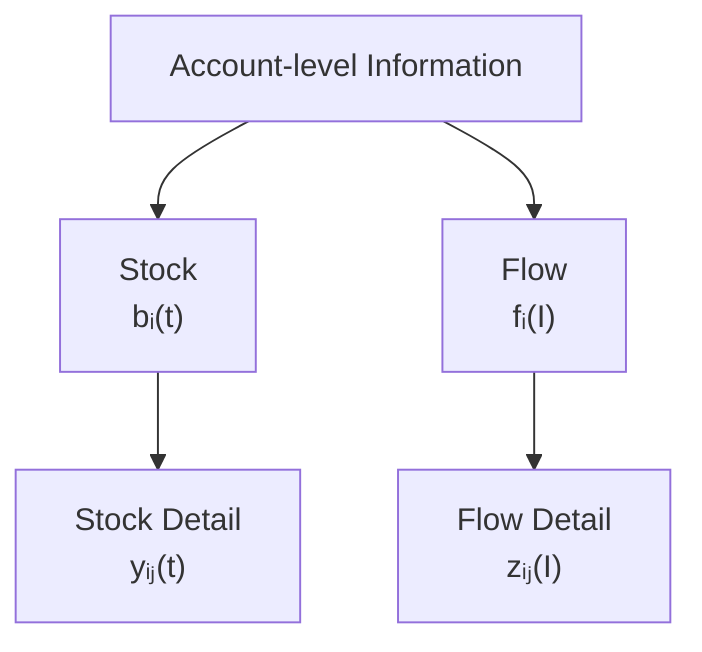
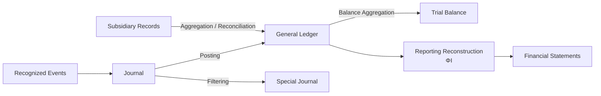
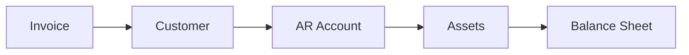

# 08 — Aggregation

## Scope

このモジュールは、

- Information Resolution
- Detail / Summary
- Aggregation
- Linear Aggregation
- Information Loss
- Kernel
- Stock / Flow Detail
- Subsidiary Ledger
- Special Journal
- Reconciliation
- Information Processing Operations

を扱う。

ASMでは、

$$
\boxed{
\text{Accounting Information Processing}
\neq
\text{Aggregation Only}
}
$$

と考える。

## Information Resolution

会計情報には異なる解像度が存在する。

例えば売掛金300だけを知る場合と、

- A社：100
- B社：150
- C社：50

という内訳を知る場合では、
情報量が異なる。

したがって、

$$
\boxed{
\text{same total}
\neq
\text{same information}
}
$$

である。

## Aggregation Map

Detail information spaceを、

$$
\mathcal V_{\mathrm{detail}}
$$

Summary information spaceを、

$$
\mathcal V_{\mathrm{summary}}
$$

とする。

Aggregation mapを、

$$
\boxed{
G:
\mathcal V_{\mathrm{detail}}
\to
\mathcal V_{\mathrm{summary}}
}
$$

とする。

## Example

$$
y
=
\begin{pmatrix}
100\\
150\\
50
\end{pmatrix}
$$

について、

$$
G(y)
=
100+150+50
=
300
$$

である。

## Aggregation Is Usually Information-losing

異なるdetail、

$$
y_1\neq y_2
$$

が、

$$
G(y_1)=G(y_2)
$$

となりうる。

したがって、

$$
\boxed{
G(y_1)=G(y_2)
\not\Rightarrow
y_1=y_2
}
$$

である。

つまり一般に、

$$
\boxed{
G
\text{ is not injective}
}
$$

である。

## Aggregation as Compression

Aggregationは、

> Detail informationを低いresolutionへ圧縮する操作

と考えられる。

$$
\boxed{
\text{Aggregation}
\approx
\text{information compression}
}
$$

## Additive Aggregation

Account $i$ のdetail index集合を、

$$
\boxed{
\mathcal D_i
}
$$

とする。

Detail valueを、

$$
y_{ij},
\qquad
j\in\mathcal D_i
$$

とすれば、

$$
\boxed{
G_i(y)
=
\sum_{j\in\mathcal D_i}
y_{ij}
}
$$

と書ける。

## Matrix Representation of Aggregation

加算型Aggregationは、
線形写像として、

$$
\boxed{
x
=
A_Gy
}
$$

と表せる場合が多い。

例えば、

$$
y
=
\begin{pmatrix}
100\\
150\\
50
\end{pmatrix}
$$

を1つへ集約するなら、

$$
A_G
=
\begin{pmatrix}
1&1&1
\end{pmatrix}
$$

で、

$$
A_Gy=300
$$

となる。

## Aggregation Matrix and Classification

$A_G$ は、

> どのdetailがどのsummary categoryへ属するか

を表す。

例えば、

$$
A_G
=
\begin{pmatrix}
1&1&0\\
0&0&1
\end{pmatrix}
$$

なら、

- detail 1,2 → summary 1
- detail 3 → summary 2

である。

## Information Loss and Kernel

$$
G(y)=A_Gy
$$

とする。

もし、

$$
G(y_1)=G(y_2)
$$

なら、

$$
A_G(y_1-y_2)=0
$$

である。

したがって、

$$
\boxed{
y_1-y_2
\in
\ker A_G
}
$$

である。

## Meaning of the Kernel

$$
\boxed{
\ker A_G
=
\text{directions invisible after aggregation}
}
$$

と解釈できる。

## Example of an Invisible Direction

$$
y_1
=
\begin{pmatrix}
100\\
150\\
50
\end{pmatrix}
$$

$$
y_2
=
\begin{pmatrix}
120\\
130\\
50
\end{pmatrix}
$$

なら、

$$
y_2-y_1
=
\begin{pmatrix}
20\\
-20\\
0
\end{pmatrix}
$$

である。

総額集約では、

$$
20-20+0=0
$$

なので、
この差は見えない。

## Aggregation and Degrees of Freedom

Rank-nullity theoremより、

$$
\boxed{
\dim\mathcal V_{\mathrm{detail}}
=
\operatorname{rank}(A_G)
+
\dim\ker A_G
}
$$

である。

したがって、

$$
\dim\ker A_G
$$

は、
Aggregationで失われるdetail自由度の大きさと解釈できる。

## Temporal Type Must Be Preserved

Aggregationでは、
Temporal Typeを混同しない。

$$
\boxed{
\text{Stock detail}
\to
\text{Stock summary}
}
$$

$$
\boxed{
\text{Flow detail}
\to
\text{Flow summary}
}
$$

を基本とする。

## Stock Detail Aggregation

Stock-valued Account $i$ のdetail balanceを、

$$
y_{ij}(t)
$$

とする。

すると、

$$
\boxed{
b_i(t)
=
\sum_{j\in\mathcal D_i}
y_{ij}(t)
}
$$

である。

## Example: Accounts Receivable

得意先別売掛金なら、

$$
b_{\mathrm{AR}}(t)
=
\sum_{j\in\mathcal D_{\mathrm{AR}}}
y_{\mathrm{AR},j}(t)
$$

である。

## Flow Detail Aggregation

Flow coordinate $i$ のdetail Flowを、

$$
z_{ij}(I)
$$

とする。

すると、

$$
\boxed{
f_i(I)
=
\sum_{j\in\mathcal D_i}
z_{ij}(I)
}
$$

である。

## Same Structure, Different Temporal Meaning

Stock / Flowともに加算型Aggregationを使える。

しかし、

$$
y_{ij}(t)
$$

はpoint-in-time quantity、

$$
z_{ij}(I)
$$

はperiod quantityである。

したがって、

$$
\boxed{
\text{same aggregation form}
\neq
\text{same temporal meaning}
}
$$

である。

## Account-detail Decomposition

Aggregation $G$ は一般に非単射なので、
SummaryからDetailを一意に復元できない。

したがって、
Subsidiary Recordは、

> SummaryからDetailを逆算するもの

ではなく、

> Detailを別途保持するもの

である。

## Subsidiary Ledger

Subsidiary Ledgerは、
Account-level quantityの内部構造を保持する。

Stock Accountなら、

$$
\boxed{
b_i(t)
=
\sum_{j\in\mathcal D_i}
y_{ij}(t)
}
$$

である。

## Subsidiary Ledger as Detail Preservation

General Ledgerに、

$$
b_{\mathrm{AR}}=300
$$

だけがあっても、

Subsidiary Ledgerに、

$$
(100,150,50)
$$

が残っていればdetailは保持されている。

したがって、

$$
\boxed{
\text{Summary + Subsidiary Detail}
}
$$

によってResolutionを維持できる。

## Stock and Flow Detail Decomposition

## Special Journal

Journal全体から、
特定条件を満たすEntryを抽出する。

条件predicateを、

$$
\boxed{
\chi
}
$$

とする。

$$
\chi(J_k)
=
\begin{cases}
1 & \text{selected}\\
0 & \text{otherwise}
\end{cases}
$$

とする。

Special Journalを、

$$
\boxed{
\mathcal J_\chi
=
\{
J_k\in\mathcal J
\mid
\chi(J_k)=1
\}
}
$$

とする。

## Filtering Is Not Aggregation

Special JournalはRecord selectionであり、
Aggregationではない。

$$
\boxed{
\text{Filtering}
\neq
\text{Aggregation}
}
$$

である。

## Subsidiary Books Use Different Operations

補助簿には異なるinformation operationが存在する。

- Subsidiary Ledger → Detail preservation / reconciliation
- Special Journal → Filtering

である。

## Stock Reconciliation

Stock Account $i$ について、

$$
\boxed{
r_i^S(t)
=
b_i(t)
-
\sum_{j\in\mathcal D_i}
y_{ij}(t)
}
$$

とする。

正常なら、

$$
\boxed{
r_i^S(t)=0
}
$$

である。

## Flow Reconciliation

Flow coordinate $i$ について、

$$
\boxed{
r_i^F(I)
=
f_i(I)
-
\sum_{j\in\mathcal D_i}
z_{ij}(I)
}
$$

とする。

正常なら、

$$
\boxed{
r_i^F(I)=0
}
$$

である。

## Reconciliation Does Not Guarantee Semantic Correctness

Detailを誤分類しても、
総額が一致する場合がある。

したがって、

$$
\boxed{
r_i=0
\not\Rightarrow
\text{semantic correctness}
}
$$

である。

## Reconciliation as Structural Validation

Reconciliation Residualは、

> DetailとSummaryの構造的一致

を検査する。

Recognition / Classification / Measurementそのものは保証しない。

## Accounting Information Processing Graph

## Aggregation Is Not Posting

PostingはRe-indexingである。

$$
\boxed{
\text{Posting}
\neq
\text{Aggregation}
}
$$

## Aggregation Is Not Filtering

FilteringはRecord selectionである。

$$
\boxed{
\text{Filtering}
\neq
\text{Aggregation}
}
$$

## Aggregation Is Not Reporting Reconstruction

Reporting Reconstructionは、

$$
\Phi_I
$$

によってBook representationからReporting Stateを構成する。

これは単純なDetail summationではない。

$$
\boxed{
G
\neq
\Phi_I
}
$$

## Aggregation Is Not Classification

Classificationは、

> Detailをcategoryへ割り当てる

作用である。

Aggregationは、

> 同じcategoryに属する情報をまとめる

作用である。

したがって、

$$
\boxed{
\text{Classification}
\neq
\text{Aggregation}
}
$$

## Major Information Operations in ASM

| Operation | Main Meaning |
| --- | --- |
| Recognition | Accounting対象の決定 |
| Classification | Accounting categoryへの割当 |
| Representation | Semantic effect → Book change |
| D/C Encoding | Book change → Journal |
| Posting | Journal → Ledger re-indexing |
| Filtering | Entry selection |
| Aggregation | Detail → Summary |
| Reporting Reconstruction | Book representation → Reporting State |
| Closing | Book representation transformation |

## Aggregation Hierarchies

Detailは複数段階でAggregationされうる。

## Multiple Aggregation Levels

$$
\mathcal V_0
\xrightarrow{G_1}
\mathcal V_1
\xrightarrow{G_2}
\mathcal V_2
$$

なら、

$$
\boxed{
G_{\mathrm{total}}
=
G_2\circ G_1
}
$$

である。

## Information Loss Accumulates

各Aggregationが非単射なら、
上位Summaryから元Detailを復元することはさらに困難になる。

$$
\boxed{
\text{higher summary level}
\Rightarrow
\text{less recoverable detail}
}
$$

である。

## Traceability and Resolution

高resolution informationは、

- Cause tracing
- Error detection
- Customer analysis
- Product analysis
- Audit trail

に有利である。

$$
\boxed{
\text{more detail}
\Rightarrow
\text{more traceability}
}
$$

## Recording Cost

一方、
Detail保持には、

- Entry cost
- Storage cost
- Maintenance cost
- Reconciliation cost
- Validation cost

がかかる。

したがって、

$$
\boxed{
\text{more detail}
\Longleftrightarrow
\text{more traceability and more cost}
}
$$

である。

## Subsidiary Records as Selective Resolution

会計システムは必要な領域だけDetailを保持できる。

例えば、

- AR → Customer
- AP → Supplier
- Fixed Asset → Asset item
- Inventory → SKU

である。

## Summary Does Not Replace Detail

$$
\boxed{
\text{Summary}
\neq
\text{Detail}
}
$$

である。

300という総額から、

$$
(100,150,50)
$$

を一意に復元することはできない。

## Relationship to Financial Reporting

Financial Reportingは、
Aggregationを含む。

しかし、

$$
\boxed{
\text{Financial Reporting}
\neq
\text{simple aggregation}
}
$$

である。

そこには、

- Classification
- Aggregation
- Netting
- Presentation
- Reporting Reconstruction

などが含まれうる。

## Relationship to Trial Balance

Trial Balanceは、

- Account-level Aggregation
- Structural Validation

の両方を持つ。

$$
\boxed{
\text{Trial Balance}
=
\text{Aggregation}
+
\text{Validation}
}
$$

と捉えられる。

## Core Equations

**Aggregation Map：**

$$
\boxed{
G:
\mathcal V_{\mathrm{detail}}
\to
\mathcal V_{\mathrm{summary}}
}
$$

**Information Loss：**

$$
\boxed{
G(y_1)=G(y_2)
\not\Rightarrow
y_1=y_2
}
$$

**Linear Aggregation：**

$$
\boxed{
G(y)=A_Gy
}
$$

**Invisible Detail Directions：**

$$
\boxed{
\ker A_G
=
\text{aggregation-invisible directions}
}
$$

**Stock Detail Aggregation：**

$$
\boxed{
b_i(t)
=
\sum_{j\in\mathcal D_i}
y_{ij}(t)
}
$$

**Flow Detail Aggregation：**

$$
\boxed{
f_i(I)
=
\sum_{j\in\mathcal D_i}
z_{ij}(I)
}
$$

**Stock Reconciliation：**

$$
\boxed{
r_i^S(t)
=
b_i(t)
-
\sum_{j\in\mathcal D_i}
y_{ij}(t)
}
$$

**Flow Reconciliation：**

$$
\boxed{
r_i^F(I)
=
f_i(I)
-
\sum_{j\in\mathcal D_i}
z_{ij}(I)
}
$$

**Special Journal Filtering：**

$$
\boxed{
\mathcal J_\chi
=
\{
J_k\in\mathcal J
\mid
\chi(J_k)=1
\}
}
$$

**Transformation Separation：**

$$
\boxed{
\text{Aggregation}
\neq
\text{Posting}
\neq
\text{Filtering}
\neq
\text{Reporting Reconstruction}
}
$$

## Relationship to Other Modules

- Reality / Recognition:
  [01 — Reality and Recognition](01-reality-and-recognition.md)
- Reporting State:
  [02 — State](02-state.md)
- Semantic Transition:
  [03 — Transition](03-transition.md)
- Account Classification / Temporal Type:
  [04 — Accounts and Classification](04-accounts-and-classification.md)
- Bookkeeping Change:
  [05 — Double Entry](05-double-entry.md)
- Journal / Ledger / Posting:
  [06 — Journal and Ledger](06-journal-and-ledger.md)
- Period Flow / Reporting Reconstruction:
  [07 — Period and Stock-Flow](07-period-stock-flow.md)
- Structural / Semantic Validation:
  [09 — Validation](09-validation.md)

## Open Questions

- Aggregation matrix $A_G$ をAccount hierarchy全体でどう定義するか。
- Account hierarchyをtree / DAGとしてどう表現するか。
- 多通貨・数量情報のAggregation。
- Netting / Eliminationを別作用としてどう形式化するか。
- $\ker A_G$ とAudit Traceabilityの関係。
- Detail resolutionの最適化をcost functionとして表現できるか。
