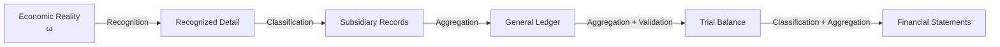
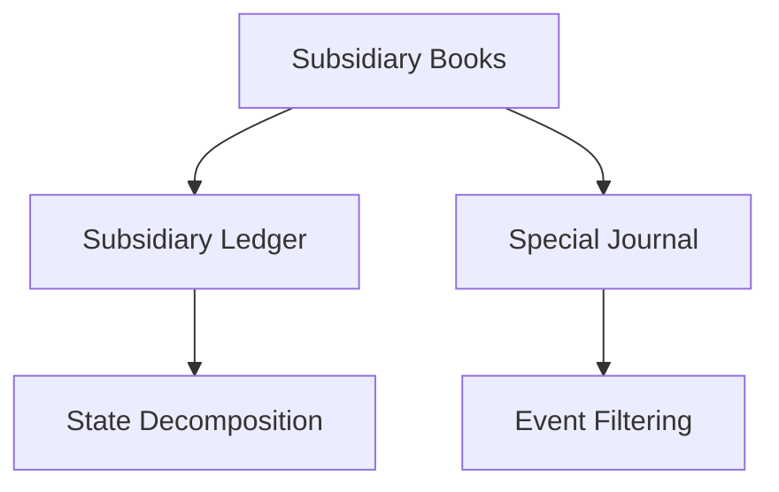

# 08 — Aggregation

## Scope

このモジュールは、会計情報の解像度、詳細から要約への集約、情報損失、補助簿を扱う。

## Aggregation Map

詳細情報空間から要約情報空間への写像を、

$$
\boxed{G:X_{\mathrm{detail}}\to X_{\mathrm{summary}}}
$$

とする。例えば、得意先別売掛金を、

$$
y=
\begin{pmatrix}
100\\
150\\
50
\end{pmatrix}
$$

とすれば、総勘定元帳上の売掛金は、

$$
G(y)=100+150+50=300
$$

となる。

## Aggregation Is Information-losing

異なる詳細が同じ要約を持ちうる。

$$
G(y_1)=G(y_2)
\not\Rightarrow
y_1=y_2
$$

したがって一般に $G$ は単射ではなく、要約値から詳細を一意に復元できない。

$$
\boxed{\text{Aggregation is generally information-losing.}}
$$

## Hierarchy of Accounting Information

会計情報は1つの解像度だけではない。

右へ進むほど要約度が高まり、通常は詳細情報が失われる。

## Subsidiary Ledger

補助元帳は、総勘定元帳の1つの勘定 $x_i$ の内部構造を保持する。

$$
\boxed{x_i=\sum_jy_{ij}}
$$

したがって、

$$
\boxed{
\text{Subsidiary Ledger}
\approx
\text{State Decomposition}}
$$

と解釈できる。

## Special Journal

補助記入帳は、仕訳集合から特定条件を満たす取引を抽出する。条件述語を $q$ とすれば、

$$
\boxed{
\mathcal J_q
=
\{J_k\in\mathcal J\mid q(J_k)=1\}}
$$

である。したがって、

$$
\boxed{
\text{Special Journal}
\approx
\text{Event Filtering}}
$$

と解釈できる。

## Reconciliation Across Levels

詳細と要約には整合条件がある。

$$
r_i=x_i-\sum_jy_{ij}
$$

正常な場合、

$$
\boxed{r_i=0}
$$

である。ただし合計が一致しても、個々の明細分類まで正しいとは限らない。

## Design Trade-off

情報粒度の選択には、情報量と記録コストのトレードオフがある。

$$
\text{more detail}
\Longleftrightarrow
\text{more traceability and more recording cost}
$$

補助簿は、必要な領域だけ解像度を上げる仕組みと理解できる。

## Relationship to Reporting

財務諸表は集約の終点の1つだが、単なる合計ではない。分類、相殺、表示、期間区分なども含むため、将来的には集約写像 $G$ を複数の変換に分解する必要がある。
