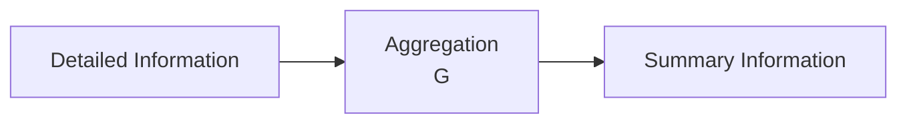
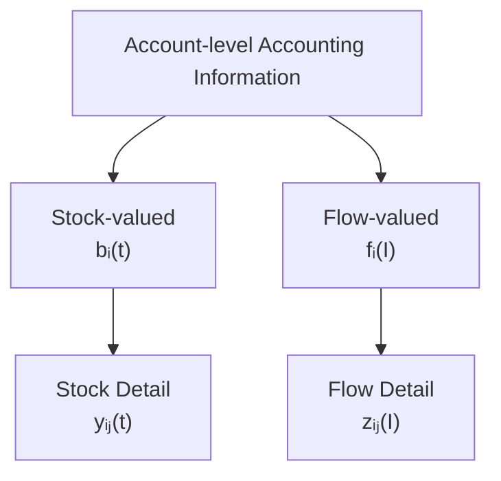
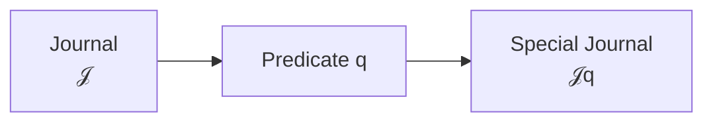
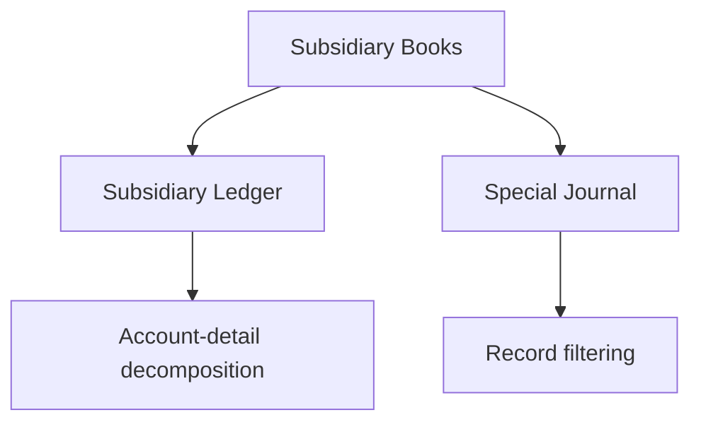
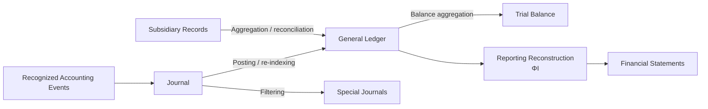

# 08 — Aggregation

## Scope

このモジュールは、

- 会計情報の解像度
- 詳細情報と要約情報
- Aggregation
- Decomposition
- 情報損失
- Subsidiary Ledger
- Special Journal
- Reconciliation
- 会計情報処理における異なる変換

を扱う。

ASMでは、

$$
\boxed{
\text{Accounting Information Processing}
\neq
\text{Aggregation Only}
}
$$

と考える。

会計情報には少なくとも、

- Recognition
- Classification
- Bookkeeping Representation
- D/C Encoding
- Posting
- Filtering
- Aggregation
- Reporting Reconstruction

という異なる情報変換が存在する。

本モジュールでは、その中でも特に、

$$
\boxed{
\text{Aggregation / Decomposition / Resolution}
}
$$

を扱う。

## Information Resolution

会計情報には複数の解像度が存在する。

例えば売掛金300という総額だけを知る場合と、

- A社：100
- B社：150
- C社：50

という明細を知る場合では、
情報量が異なる。

したがって、

$$
\boxed{
\text{same total}
\neq
\text{same information}
}
$$

である。

ASMでは、

> 詳細をどの程度区別して保持するか

を会計情報の **resolution / granularity** として捉える。

## Aggregation Map

詳細情報空間を、

$$
X_{\mathrm{detail}}
$$

要約情報空間を、

$$
X_{\mathrm{summary}}
$$

とする。

詳細から要約への集約写像を、

$$
\boxed{
G:
X_{\mathrm{detail}}
\to
X_{\mathrm{summary}}
}
$$

とする。

例えば、得意先別売掛金残高が、

$$
y=
\begin{pmatrix}
100\\
150\\
50
\end{pmatrix}
$$

であれば、

$$
G(y)
=
100+150+50
=
300
$$

となる。

したがって、

$$
\boxed{
\text{Detail}
\xrightarrow{G}
\text{Summary}
}
$$

である。

## Aggregation Is Usually Information-losing

異なる詳細情報が、
同じ要約情報を持つことがある。

例えば、

$$
y_1=
\begin{pmatrix}
100\\
150\\
50
\end{pmatrix}
$$

と、

$$
y_2=
\begin{pmatrix}
120\\
130\\
50
\end{pmatrix}
$$

では、

$$
y_1\neq y_2
$$

だが、

$$
G(y_1)=300
$$

かつ、

$$
G(y_2)=300
$$

である。

したがって、

$$
\boxed{
G(y_1)=G(y_2)
\not\Rightarrow
y_1=y_2
}
$$

である。

つまり一般に、

$$
\boxed{
G
\text{ is not injective}
}
$$

である。

したがって、

$$
\boxed{
\text{Aggregation is generally information-losing}
}
$$

である。

## Aggregation as Compression

Aggregationは、
詳細情報をより低い解像度へ圧縮する操作と捉えられる。

したがって、

$$
\boxed{
\text{Aggregation}
\approx
\text{information compression}
}
$$

である。

ただし、
Aggregationの目的は単に情報を捨てることではない。

必要な目的に対して、
扱いやすい解像度へ情報を変換することである。

## Additive Aggregation

会計情報では、
多くの集約が加算によって表される。

勘定 $i$ の詳細インデックス集合を、

$$
D_i
$$

とする。

詳細値を、

$$
y_{ij}
\qquad
j\in D_i
$$

とすれば、

$$
\boxed{
G_i(y)
=
\sum_{j\in D_i}
y_{ij}
}
$$

と書ける。

例えば、

$$
D_{\mathrm{AR}}
=
\{
A社,B社,C社
\}
$$

なら、

$$
b_{\mathrm{AR}}(t)
=
\sum_{j\in D_{\mathrm{AR}}}
y_{\mathrm{AR},j}(t)
$$

となる。

## Matrix Representation of Aggregation

加算型Aggregationは、
多くの場合、線形写像として表現できる。

詳細ベクトルを、

$$
y\in\mathbb R^n
$$

要約ベクトルを、

$$
x\in\mathbb R^m
$$

とする。

集約行列を、

$$
A_G
$$

とすれば、

$$
\boxed{
x
=
A_Gy
}
$$

と書ける。

例えば、

$$
y=
\begin{pmatrix}
100\\
150\\
50
\end{pmatrix}
$$

をすべて1つへ集約するなら、

$$
A_G
=
\begin{pmatrix}
1&1&1
\end{pmatrix}
$$

として、

$$
A_Gy
=
300
$$

となる。

## Aggregation Matrix and Classification

集約行列 $A_G$ は、

> どの詳細項目が、どの要約項目へ属するか

を表している。

例えば、

$$
y=
\begin{pmatrix}
y_1\\
y_2\\
y_3
\end{pmatrix}
$$

を、

- $y_1,y_2$ → Group 1
- $y_3$ → Group 2

へ集約するなら、

$$
A_G
=
\begin{pmatrix}
1&1&0\\
0&0&1
\end{pmatrix}
$$

となる。

したがってAggregationは、
Classification結果を利用した加算として表現できる場合が多い。

## Information Loss and Kernel

Aggregationを線形写像、

$$
G(y)=A_Gy
$$

として考える。

もし、

$$
G(y_1)=G(y_2)
$$

なら、

$$
A_Gy_1=A_Gy_2
$$

なので、

$$
A_G(y_1-y_2)=0
$$

である。

したがって、

$$
\boxed{
y_1-y_2
\in
\ker A_G
}
$$

となる。

つまり、

$$
\boxed{
\ker A_G
=
\text{aggregationによって見えなくなる詳細方向}
}
$$

と解釈できる。

## Example of an Invisible Direction

先ほどの、

$$
y_1=
\begin{pmatrix}
100\\
150\\
50
\end{pmatrix}
$$

と、

$$
y_2=
\begin{pmatrix}
120\\
130\\
50
\end{pmatrix}
$$

の差は、

$$
y_2-y_1
=
\begin{pmatrix}
20\\
-20\\
0
\end{pmatrix}
$$

である。

しかし合計を取ると、

$$
20-20+0=0
$$

となる。

したがって、

$$
\begin{pmatrix}
20\\
-20\\
0
\end{pmatrix}
\in
\ker A_G
$$

である。

つまり、

> A社からB社へ20だけ明細構成が移動した

という情報は、
売掛金総額だけを見ると消えてしまう。

## Aggregation and Degrees of Freedom

詳細空間の次元が $n$、
要約空間で観測できる独立な情報の次元が $r$ なら、

集約によって失われる自由度は概念的に、

$$
\boxed{
n-r
}
$$

である。

線形写像なら、
rank-nullity theoremより、

$$
\boxed{
\dim X_{\mathrm{detail}}
=
\operatorname{rank}(A_G)
+
\dim\ker(A_G)
}
$$

である。

したがって、

$$
\boxed{
\dim\ker(A_G)
}
$$

は、
Aggregation後に復元不能になる詳細自由度の大きさと解釈できる。

## Temporal Type Must Be Preserved

07までのASMでは、

- Stock-valued quantity
- Flow-valued quantity

を区別した。

Aggregationにおいても、
この時間型を混同してはならない。

したがって、

$$
\boxed{
\text{Stock detail}
\to
\text{Stock summary}
}
$$

かつ、

$$
\boxed{
\text{Flow detail}
\to
\text{Flow summary}
}
$$

という集約を基本とする。

つまり、

$$
\boxed{
\text{Aggregation preserves temporal type}
}
$$

を原則とする。

## Stock Detail Aggregation

Stock-valued account $i\in X_S$ を考える。

勘定 $i$ の詳細残高を、

$$
y_{ij}(t)
$$

とする。

するとAccount-level Book Balanceは、

$$
\boxed{
b_i(t)
=
\sum_{j\in D_i}
y_{ij}(t)
}
$$

となる。

例えばAccounts Receivableなら、

$$
b_{\mathrm{AR}}(t)
=
\sum_{\text{customers }j}
y_{\mathrm{AR},j}(t)
$$

である。

したがって、

## Flow Detail Aggregation

Flow-valued account $i\in X_F$ を考える。

詳細Flowを、

$$
z_{ij}(I)
$$

とする。

するとAccount-level Flowは、

$$
\boxed{
f_i(I)
=
\sum_{j\in D_i}
z_{ij}(I)
}
$$

である。

例えば商品別Salesなら、

$$
f_{\mathrm{Sales}}(I)
=
\sum_{\text{products }j}
z_{\mathrm{Sales},j}(I)
$$

となる。

## Stock Aggregation and Flow Aggregation Are Analogous but Distinct

StockとFlowのAggregationは、
数学的にはどちらも加算で表現できる場合が多い。

しかし、

$$
y_{ij}(t)
$$

は時点量であり、

$$
z_{ij}(I)
$$

は期間量である。

したがって、

$$
\boxed{
\text{same aggregation structure}
\neq
\text{same temporal meaning}
}
$$

である。

## Account-detail Decomposition

Aggregationの逆方向を、
完全な逆写像として考えることは一般にはできない。

なぜなら、

$$
G
$$

は通常非単射だからである。

しかし詳細記録が別途保持されている場合、

$$
\boxed{
\text{Account-level information}
+
\text{Subsidiary detail}
}
$$

として内部構造を保持できる。

したがって、

$$
\boxed{
\text{Subsidiary Record}
\approx
\text{Account-detail decomposition}
}
$$

と解釈する。

## Subsidiary Ledger

Subsidiary Ledgerは、
General Ledger上のAccount-level valueの
内部構造を保持する。

Stock-valued accountなら、

$$
\boxed{
b_i(t)
=
\sum_{j\in D_i}
y_{ij}(t)
}
$$

である。

例えば売掛金300について、

$$
300
=
100+150+50
$$

という得意先別構造を保持する。

## Subsidiary Ledger as Detail Preservation

General Ledger上では、

$$
b_{\mathrm{AR}}(t)=300
$$

しか見えなくても、

Subsidiary Ledgerが、

$$
\begin{aligned}
A社&:100\\
B社&:150\\
C社&:50
\end{aligned}
$$

を保持していれば、
詳細は失われていない。

したがって、

$$
\boxed{
\text{Summary alone loses information}
}
$$

であっても、

$$
\boxed{
\text{Summary + Subsidiary Detail}
}
$$

としてシステム全体では詳細を保持できる。

## Stock and Flow Detail Decomposition

Account-detail decompositionには、
時間型に応じて少なくとも二種類ある。

したがって、旧来の、

$$
\text{Subsidiary Ledger}
\approx
\text{State Decomposition}
$$

よりも一般的には、

$$
\boxed{
\text{Subsidiary Record}
\approx
\text{Account-detail decomposition}
}
$$

と考える方がよい。

## Special Journal

Special Journalは、
Journal全体から特定条件を満たす記録を抽出する。

条件述語を、

$$
q
$$

とする。

$$
q(J_k)
=
\begin{cases}
1 & \text{condition satisfied}\\
0 & \text{otherwise}
\end{cases}
$$

とする。

すると、

$$
\boxed{
\mathcal J_q
=
\{
J_k\in\mathcal J
\mid
q(J_k)=1
\}
}
$$

である。

したがって、

$$
\boxed{
\text{Special Journal}
\approx
\text{event / record filtering}
}
$$

である。

## Filtering Is Not Aggregation

Special Journalは、
複数の金額を合計して要約する操作ではない。

Journalから条件に合うレコードを選択している。

したがって、

$$
\boxed{
\text{Filtering}
\neq
\text{Aggregation}
}
$$

である。

## Subsidiary Books Use Different Information Operations

補助簿を1つの数学的操作だけで説明する必要はない。

例えば、

**Subsidiary Ledger：**

$$
\boxed{
\text{detail decomposition + aggregation/reconciliation}
}
$$

**Special Journal：**

$$
\boxed{
\text{filtering}
}
$$

である。

## Reconciliation

詳細情報とAccount-level summaryの間には、
整合条件が存在する。

### Stock Reconciliation

Stock-valued account $i$ について、

$$
\boxed{
r_i^S(t)
=
b_i(t)
-
\sum_{j\in D_i}
y_{ij}(t)
}
$$

とする。

正常なら、

$$
\boxed{
r_i^S(t)=0
}
$$

である。

## Flow Reconciliation

Flow-valued account $i$ について、

$$
\boxed{
r_i^F(I)
=
f_i(I)
-
\sum_{j\in D_i}
z_{ij}(I)
}
$$

とする。

正常なら、

$$
\boxed{
r_i^F(I)=0
}
$$

である。

## Reconciliation Does Not Guarantee Semantic Correctness

詳細合計と総額が一致していても、
個々の明細が正しいとは限らない。

例えば、

- A社の100をB社へ誤分類
- 商品Aの売上を商品Bへ誤分類

していても、
総額は一致する可能性がある。

したがって、

$$
\boxed{
r_i=0
\not\Rightarrow
\text{semantic correctness}
}
$$

である。

つまり、

$$
\boxed{
\text{Reconciliation Correctness}
\neq
\text{Classification Correctness}
}
$$

である。

この区別は、

[09 — Validation](09-validation.md)

で扱う。

## Reconciliation as Structural Validation

Reconciliation residual、

$$
r_i
$$

は、
詳細と要約の構造的一致を測る。

したがって、

$$
\boxed{
r_i=0
}
$$

はStructural Validityの一種と考えられる。

ただし、

- Recognition
- Classification
- Measurement

そのものの正しさまでは保証しない。

## Accounting Information Processing Graph

会計情報は、
単純な一本のAggregation chainではない。

例えば、

この図では、
異なる矢印が異なる種類の情報変換を表す。

## Aggregation Is Not Posting

Postingは、

$$
\mathcal J
\to
\mathcal L
$$

というRe-indexingである。

[06 — Journal and Ledger](06-journal-and-ledger.md)
で定義したように、

$$
\boxed{
\text{Posting}
=
\text{re-indexing}
}
$$

であり、

$$
\boxed{
\text{Posting}
\neq
\text{Aggregation}
}
$$

である。

## Aggregation Is Not Filtering

Special Journalへの変換はFilteringである。

したがって、

$$
\boxed{
\text{Filtering}
\neq
\text{Aggregation}
}
$$

である。

## Aggregation Is Not Reporting Reconstruction

[07 — Period and Stock-Flow](07-period-stock-flow.md)
では、

$$
\boxed{
s(t_1)
=
\Phi_I
\left(
b_S^-(t_1),
f(I)
\right)
}
$$

というReporting Reconstructionを導入した。

これは単なる詳細値の合計ではない。

例えば、

- Flow accumulation
- Profit calculation
- Equity bridge
- Closing structure

を考慮する。

したがって、

$$
\boxed{
G
\neq
\Phi_I
}
$$

である。

## Aggregation Is Not Classification

Classificationは、

> ある詳細対象をどのカテゴリーへ割り当てるか

を決める。

Aggregationは、

> 既に分類された複数の情報を、より粗い解像度へまとめる

操作である。

したがって、

$$
\boxed{
\text{Classification}
\neq
\text{Aggregation}
}
$$

である。

ただしAggregationは、
Classification結果に依存する場合が多い。

## Major Information Operations in ASM

ASMでこれまで登場した主な情報変換を整理する。

| Operation | Input | Output | Main meaning |
| --- | --- | --- | --- |
| Recognition | Reality | Accounting effect | 記録対象の決定 |
| Classification | Detail | Account / element | 意味分類 |
| Representation | $\Delta s,f_{\mathrm{PL}}$ | $\Delta x$ | 帳簿表現 |
| D/C Encoding | $\Delta x$ | $J$ | 左右表現 |
| Posting | $J$ | $L$ | Re-indexing |
| Filtering | $\mathcal J$ | $\mathcal J_q$ | 条件抽出 |
| Aggregation | Detail | Summary | 解像度低下 |
| Reporting Reconstruction | $(b_S,f)$ | $s$ | Reporting State構成 |

したがって、

$$
\boxed{
\text{Accounting system}
=
\text{composition of different information transformations}
}
$$

と考えられる。

## Aggregation Hierarchies

同じ情報が複数段階で集約される場合もある。

例えば売掛金なら、

ただし最後のFinancial Statementへの変換は、
単純Aggregationだけではなく、
Reporting rulesを含みうる。

## Multiple Aggregation Levels

詳細空間を、

$$
X_0
$$

その次の要約空間を、

$$
X_1
$$

さらに上位を、

$$
X_2
$$

とする。

$$
X_0
\xrightarrow{G_1}
X_1
\xrightarrow{G_2}
X_2
$$

とすれば、

最終集約は、

$$
\boxed{
G_{\mathrm{total}}
=
G_2\circ G_1
}
$$

と書ける。

したがって、
Aggregationは階層的に構成可能である。

## Information Loss Accumulates

各Aggregationが情報を失うなら、
複数段階のAggregationでは
一般にさらに詳細復元が困難になる。

$$
X_0
\xrightarrow{G_1}
X_1
\xrightarrow{G_2}
X_2
$$

について、

$$
\boxed{
G_2(G_1(y_1))
=
G_2(G_1(y_2))
}
$$

から、

$$
y_1=y_2
$$

を導くことは一般にできない。

したがって、

$$
\boxed{
\text{higher summary level}
\Rightarrow
\text{lower recoverable detail}
}
$$

となる傾向がある。

## Traceability and Resolution

高い解像度を保持すると、

- 原因追跡
- 誤り発見
- 顧客別分析
- 商品別分析
- Audit Trail

などが容易になる。

したがって、

$$
\boxed{
\text{more detail}
\Rightarrow
\text{more traceability}
}
$$

である。

## Recording Cost

しかし詳細を多く保持するほど、

- 入力
- 保存
- 管理
- 照合
- 検証

のコストも増える。

したがって、

$$
\boxed{
\text{more detail}
\Longleftrightarrow
\text{more traceability and more recording cost}
}
$$

というトレードオフが存在する。

## Subsidiary Records as Selective Resolution

会計システムは、
すべての情報を最大解像度で保持する必要はない。

必要な領域だけ詳細情報を保持できる。

例えば、

- 売掛金 → 得意先別
- 買掛金 → 仕入先別
- 固定資産 → 資産別
- 商品 → 品目別

などである。

したがって、

$$
\boxed{
\text{Subsidiary Records}
=
\text{selective increase in information resolution}
}
$$

と解釈できる。

## Summary Does Not Replace Detail

要約情報は、
詳細情報の代替ではない。

$$
\boxed{
\text{Summary}
\neq
\text{Detail}
}
$$

である。

300という売掛金総額から、

$$
(100,150,50)
$$

という内訳を一意に復元することはできない。

したがって、
詳細が必要な場合は
集約前情報を別途保持する必要がある。

## Relationship to Financial Reporting

Financial Statementsは、
Aggregationの最終地点の1つと見ることができる。

しかし、

$$
\boxed{
\text{Financial Reporting}
\neq
\text{simple aggregation}
}
$$

である。

Financial Reportingには、

- Classification
- Aggregation
- Netting
- Period allocation
- Presentation
- Reporting Reconstruction

などが含まれうる。

したがって、

$$
\boxed{
G
}
$$

はFinancial Reporting全体を表す写像ではない。

## Relationship to Trial Balance

Trial Balanceは、
Ledger balancesをAccount levelで集約して一覧化する。

しかし同時に、
Debit / Credit balanceを検証する機能も持つ。

したがって、

$$
\boxed{
\text{Trial Balance}
=
\text{Aggregation}
+
\text{Validation}
}
$$

と解釈できる。

この詳細は、

[09 — Validation](09-validation.md)

で扱う。

## Core Equations

本モジュールの主要式をまとめる。

**General Aggregation：**

$$
\boxed{
G:
X_{\mathrm{detail}}
\to
X_{\mathrm{summary}}
}
$$

**Information Loss：**

$$
\boxed{
G(y_1)=G(y_2)
\not\Rightarrow
y_1=y_2
}
$$

**Linear Aggregation：**

$$
\boxed{
G(y)=A_Gy
}
$$

**Invisible Detail Directions：**

$$
\boxed{
\ker A_G
=
\text{information lost by aggregation}
}
$$

**Stock Detail Aggregation：**

$$
\boxed{
b_i(t)
=
\sum_{j\in D_i}
y_{ij}(t)
}
$$

**Flow Detail Aggregation：**

$$
\boxed{
f_i(I)
=
\sum_{j\in D_i}
z_{ij}(I)
}
$$

**Stock Reconciliation：**

$$
\boxed{
r_i^S(t)
=
b_i(t)
-
\sum_{j\in D_i}
y_{ij}(t)
}
$$

**Flow Reconciliation：**

$$
\boxed{
r_i^F(I)
=
f_i(I)
-
\sum_{j\in D_i}
z_{ij}(I)
}
$$

**Reconciliation Condition：**

$$
\boxed{
r_i=0
}
$$

**Reconciliation Is Not Semantic Validity：**

$$
\boxed{
r_i=0
\not\Rightarrow
\text{semantic correctness}
}
$$

**Special Journal：**

$$
\boxed{
\mathcal J_q
=
\{
J_k\in\mathcal J
\mid
q(J_k)=1
\}
}
$$

**Transformation Separation：**

$$
\boxed{
\text{Aggregation}
\neq
\text{Posting}
\neq
\text{Filtering}
\neq
\text{Reporting Reconstruction}
}
$$

## Relationship to Other Modules

- Reality / Recognition:
  [01 — Reality and Recognition](01-reality-and-recognition.md)
- Reporting State:
  [02 — State](02-state.md)
- Semantic Transition:
  [03 — Transition](03-transition.md)
- Account Classification / Temporal Type:
  [04 — Accounts and Classification](04-accounts-and-classification.md)
- Bookkeeping Change:
  [05 — Double Entry](05-double-entry.md)
- Journal / Ledger / Posting:
  [06 — Journal and Ledger](06-journal-and-ledger.md)
- Period Flow / Reporting Reconstruction:
  [07 — Period and Stock-Flow](07-period-stock-flow.md)
- Structural / Semantic Validation:
  [09 — Validation](09-validation.md)

## Open Questions

- Aggregation matrix $A_G$ をAccount hierarchy全体でどう定義するか。
- 勘定体系をtree / DAGとして正式に表現するか。
- Stock / Flow以外の時間型情報に対するAggregationをどう一般化するか。
- 多通貨・数量情報など、単純加算できない詳細情報をどう扱うか。
- NettingやEliminationをAggregationとは別の作用としてどう形式化するか。
- Financial Statement presentationをAggregationとReporting Reconstructionからどう分離するか。
- $\ker A_G$ とAudit / Traceabilityの関係をどこまで形式化するか。
- Subsidiary Recordの詳細度をコスト最適化問題として表現できるか。
