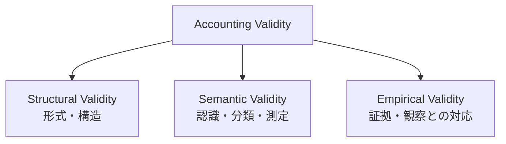
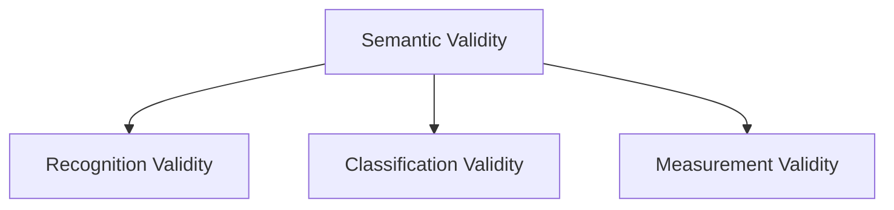
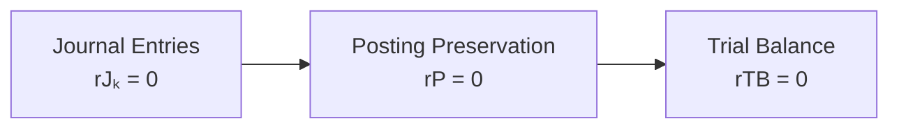
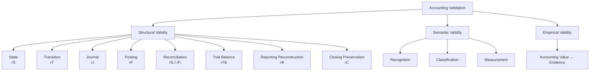
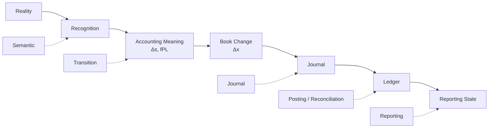

# 09 — Validation

## Scope

このモジュールは、
ASM全体に現れる、

- Structural Validity
- Semantic Validity
- Empirical Validity
- Residual
- Reconciliation
- Trial Balance
- Posting Preservation
- Reporting Reconstruction Validation
- Closing Preservation

を扱う。

ASMでは、

$$
\boxed{
\text{Accounting Correctness}
\neq
\text{one single condition}
}
$$

と考える。

会計情報は、
異なるレイヤーで異なる種類の正しさを要求される。

## Validity as Multiple Axes

ASMでは、
会計情報のValidityを少なくとも、

1. Structural Validity
2. Semantic Validity
3. Empirical Validity

の3つに分ける。

これらは単純な上下関係ではない。

むしろ、

$$
\boxed{
\text{different validation axes}
}
$$

として考える方がよい。

## Structural Validity

Structural Validityとは、

> ASMや帳簿システムで定義された形式的関係や制約を満たしていること

である。

例えば、

$$
A-L-E=0
$$

$$
\Delta A-\Delta L-\Delta E=0
$$

$$
D(J)-C(J)=0
$$

などである。

Structural Validityは、

> 定義された構造の内部で整合しているか

を検査する。

## Semantic Validity

Semantic Validityとは、

> 現実の経済事象を会計上適切に意味づけているか

を表す。

少なくとも、

- Recognition
- Classification
- Measurement

に分解できる。

したがって概念的に、

$$
\boxed{
V_{\mathrm{sem}}
=
V_{\mathrm{recognition}}
\land
V_{\mathrm{classification}}
\land
V_{\mathrm{measurement}}
}
$$

と考えられる。

例えば貸借が一致していても、
Equipmentとして認識すべきものを
Expenseへ誤分類していれば、

Structural Validityは満たしていても、
Semantic Validityは満たさない。

## Empirical Validity

Empirical Validityとは、

> 会計値が観察可能な証拠と対応しているか

を表す。

証拠には例えば、

- 現金実査
- 棚卸
- 銀行残高確認
- 請求書
- 契約書
- 外部確認
- その他の証憑

がある。

例えばCashについて、

$$
\boxed{
\mathrm{Cash}_{\mathrm{book}}
=
\mathrm{Cash}_{\mathrm{observed}}
}
$$

を確認する。

## Evidence Is Not Reality Itself

証拠も、
現実 $\omega$ そのものではない。

現実から観察可能な証拠を得る作用を、
概念的に、

$$
\boxed{
\mathcal O(\omega)
=
\text{observable evidence}
}
$$

と考えることができる。

したがって、

$$
\boxed{
\text{Reality}
\neq
\text{Evidence}
\neq
\text{Accounting Representation}
}
$$

である。

本モジュールでは、
$\mathcal O$ の正式な構造までは定義しない。

## Residual

制約、

$$
h(x)=0
$$

を考える。

この制約に対するResidualを、

$$
\boxed{
r=h(x)
}
$$

とする。

正常なら、

$$
\boxed{
r=0
}
$$

である。

## Meaning of Zero Residual

重要なのは、

$$
\boxed{
r=0
}
$$

が意味するのは、

> そのResidualが検査している特定の関係が成立している

ということだけである。

したがって、

$$
\boxed{
r=0
\not\Rightarrow
\text{economic correctness}
}
$$

である。

さらに、

$$
\boxed{
r_a=0
\not\Rightarrow
r_b=0
}
$$

も一般に成立する。

異なるResidualは、
異なる構造を検査する。

## Residual Family

ASMでは、
会計システム全体に複数のResidualが存在する。

概念的には、

$$
\boxed{
\mathcal R
=
\{
r_S,
r_T,
r_J,
r_P,
r_{\mathrm{rec}},
r_{\mathrm{TB}},
r_\Phi,
r_C,
r_{\mathrm{emp}},
\ldots
\}
}
$$

と考えられる。

各Residualは、
異なるレイヤーの異なる関係を検査する。

## State Residual

[02 — State](02-state.md)
で定義したReporting Stock Stateについて、

$$
A-L-E=0
$$

が成立する。

State Residualを、

$$
\boxed{
r_S
=
A-L-E
}
$$

とする。

有効なReporting Stateでは、

$$
\boxed{
r_S=0
}
$$

である。

## Transition Residual

[03 — Transition](03-transition.md)
では、
Semantic Stock Transitionについて、

$$
\Delta A-\Delta L-\Delta E=0
$$

を得た。

したがって、

$$
\boxed{
r_T
=
\Delta A-\Delta L-\Delta E
}
$$

とする。

Constraint-preserving transitionでは、

$$
\boxed{
r_T=0
}
$$

である。

## Journal Residual

[05 — Double Entry](05-double-entry.md)
ではJournal Entryについて、

$$
D(J)=C(J)
$$

を要求した。

したがって、

$$
\boxed{
r_J
=
D(J)-C(J)
}
$$

とする。

有効な複式仕訳では、

$$
\boxed{
r_J=0
}
$$

である。

## Journal Residual and Bookkeeping Change

05では、

$$
d_i
=
\operatorname{sgn}(\Delta x_i)\sigma_i
$$

と定義した。

したがって、

$$
d_i|\Delta x_i|
=
\sigma_i\Delta x_i
$$

である。

よって、

$$
\boxed{
r_J
=
\sum_i
\sigma_i\Delta x_i
}
$$

となる。

ベクトル表記では、

$$
\boxed{
r_J
=
\sigma^\top\Delta x
}
$$

である。

したがって、

$$
\boxed{
D(J)=C(J)
\quad\Longleftrightarrow\quad
\sigma^\top\Delta x=0
}
$$

である。

## Journal Balance Does Not Guarantee Correct Accounting Meaning

例えば、

$$
\mathrm{Dr}\ Expense\ 100
/
\mathrm{Cr}\ Cash\ 100
$$

という仕訳は、

$$
r_J=0
$$

を満たす。

しかし、
本来Equipmentとして認識すべき取引なら
Classificationは誤っている。

したがって、

$$
\boxed{
r_J=0
\not\Rightarrow
V_{\mathrm{sem}}=1
}
$$

である。

## Posting Residual

[06 — Journal and Ledger](06-journal-and-ledger.md)
では、
PostingはJournalとLedgerの記録内容を保存する
Re-indexingであるとした。

理想的には、

$$
\operatorname{Decode}(\mathcal J)
=
\operatorname{Decode}(\mathcal L)
$$

である。

したがってPosting Residualを、

$$
\boxed{
r_P
=
\operatorname{Decode}(\mathcal L)
-
\operatorname{Decode}(\mathcal J)
}
$$

とする。

正常なPostingでは、

$$
\boxed{
r_P=0
}
$$

である。

## Meaning of Posting Residual

$r_P=0$ が保証するのは、

> Journalの記録内容がLedgerへ正しく移された

ということだけである。

元のJournal自体がSemanticに誤っていても、

正確にPostingされれば、

$$
r_P=0
$$

になりうる。

したがって、

$$
\boxed{
r_P=0
\not\Rightarrow
\text{Journal is economically correct}
}
$$

である。

## Stock Reconciliation Residual

[08 — Aggregation](08-aggregation.md)
では、
Stock-valued account $i$ について、

$$
b_i(t)
=
\sum_{j\in D_i}
y_{ij}(t)
$$

というdetail / summary relationを定義した。

Stock Reconciliation Residualを、

$$
\boxed{
r_i^S(t)
=
b_i(t)
-
\sum_{j\in D_i}
y_{ij}(t)
}
$$

とする。

正常なら、

$$
\boxed{
r_i^S(t)=0
}
$$

である。

## Flow Reconciliation Residual

Flow-valued account $i$ について、

$$
f_i(I)
=
\sum_{j\in D_i}
z_{ij}(I)
$$

とした。

したがって、

$$
\boxed{
r_i^F(I)
=
f_i(I)
-
\sum_{j\in D_i}
z_{ij}(I)
}
$$

とする。

正常なら、

$$
\boxed{
r_i^F(I)=0
}
$$

である。

## Reconciliation Does Not Guarantee Classification Correctness

例えば、
A社の売掛金100を
B社へ誤分類したとしても、

総売掛金残高が一致する場合がある。

したがって、

$$
\boxed{
r_i^S=0
\not\Rightarrow
\text{detail classification is correct}
}
$$

である。

Flowについても同様に、

$$
\boxed{
r_i^F=0
\not\Rightarrow
\text{detail classification is correct}
}
$$

である。

## Debit and Credit Totals

Trial Balanceを定義するため、
勘定 $i$ の期間中Debit totalを、

$$
D_i
$$

Credit totalを、

$$
C_i
$$

とする。

ベクトルとして、

$$
D=
\begin{pmatrix}
D_1\\
\vdots\\
D_n
\end{pmatrix}
$$

$$
C=
\begin{pmatrix}
C_1\\
\vdots\\
C_n
\end{pmatrix}
$$

とする。

## D/C-signed Net Balance

Debitを正、
Creditを負とするD/C-signed net amountを、

$$
\boxed{
q_i
=
D_i-C_i
}
$$

と定義する。

ベクトルでは、

$$
\boxed{
q=D-C
}
$$

である。

重要なのは、

$$
\boxed{
q
\neq
b
}
$$

である。

## Natural Book Balance and D/C-signed Balance

06で定義した、

$$
b_i(t)
$$

は、

> 勘定の意味上の増加方向を正としたBook Balance

である。

一方、

$$
q_i=D_i-C_i
$$

は、

> Debitを正、Creditを負としたD/C-signed amount

である。

両者はNormal Orientation、

$$
\sigma_i
$$

によって接続される。

$$
\boxed{
b_i
=
\sigma_i q_i
}
$$

である。

## Examples

### Cash

CashはDebit-normalなので、

$$
\sigma_{\mathrm{Cash}}=+1
$$

である。

Debit balance 100なら、

$$
q_{\mathrm{Cash}}=100
$$

なので、

$$
b_{\mathrm{Cash}}
=
(+1)(100)
=
100
$$

となる。

### Debt

DebtはCredit-normalなので、

$$
\sigma_{\mathrm{Debt}}=-1
$$

である。

Credit balance 100なら、

$$
q_{\mathrm{Debt}}=-100
$$

なので、

$$
b_{\mathrm{Debt}}
=
(-1)(-100)
=
100
$$

となる。

## Vector Form of Book Balance

Normal Orientationを対角行列、

$$
\boxed{
\Sigma_\sigma
=
\operatorname{diag}
(
\sigma_1,
\sigma_2,
\ldots,
\sigma_n
)
}
$$

とする。

すると、

$$
\boxed{
b
=
\Sigma_\sigma q
}
$$

である。

また、

$$
\Sigma_\sigma^2=I
$$

なので、

$$
\boxed{
q
=
\Sigma_\sigma b
}
$$

でもある。

## Trial Balance Residual

Trial Balanceでは、
全勘定のDebit / Credit totalが一致するかを検査する。

したがって、

$$
\boxed{
r_{\mathrm{TB}}
=
\mathbf 1^\top(D-C)
}
$$

すなわち、

$$
\boxed{
r_{\mathrm{TB}}
=
\mathbf 1^\top q
}
$$

である。

貸借一致が保存されていれば、

$$
\boxed{
r_{\mathrm{TB}}=0
}
$$

となる。

## Trial Balance and Journal Balance

各仕訳について、

$$
r_{J_k}=0
$$

が成立し、
Postingも正しく保存されているなら、

期間全体についても、

$$
r_{\mathrm{TB}}=0
$$

となることが期待される。

概念的には、

Trial Balanceは、
新しい経済法則ではない。

Journalで成立したD/C balanceが、
Ledger levelまで保存されたかを検査する
集約的なStructural Validationと考えられる。

## Trial Balance Roles

Trial Balanceには少なくとも、

1. Validation
2. Aggregation

の2つの役割がある。

$$
\boxed{
\text{Trial Balance}
=
\text{Validation}
+
\text{Aggregation}
}
$$

である。

### Validation

全Ledgerを集約して、
Debit / Credit balanceが保存されているか確認する。

### Aggregation

各勘定の、

- Debit total
- Credit total
- Balance

を一覧化し、
後続のReporting処理へ渡す。

## Limits of Trial Balance

$$
r_{\mathrm{TB}}=0
$$

でも、例えば、

- 取引を丸ごと記録していない
- 誤った勘定へ同額を記録した
- 複数の誤記が相殺した
- 現実の現金と帳簿残高が異なる
- Revenue recognition timingを誤った

などは検出できない場合がある。

したがって、

$$
\boxed{
r_{\mathrm{TB}}=0
\not\Rightarrow
\text{accounting correctness}
}
$$

である。

## Reporting Reconstruction Residual

[07 — Period and Stock-Flow](07-period-stock-flow.md)
では、

$$
s(t_1)
=
\Phi_I
\left(
b_S^-(t_1),
f(I)
\right)
$$

というReporting Reconstructionを定義した。

この関係を検査するResidualを、

$$
\boxed{
r_\Phi
=
s(t_1)
-
\Phi_I
\left(
b_S^-(t_1),
f(I)
\right)
}
$$

とする。

正常なら、

$$
\boxed{
r_\Phi=0
}
$$

である。

## Structural and Semantic Meaning of Reporting Reconstruction

$r_\Phi=0$ が意味するのは、

> 与えられたReporting Reconstruction rule $\Phi_I$ に従って、
> InputとOutputが整合している

ということである。

しかし、

$$
\Phi_I
$$

そのものが
不適切な会計ルールや分類を表している可能性は残る。

したがって、

$$
\boxed{
r_\Phi=0
\not\Rightarrow
\Phi_I
\text{ is semantically correct}
}
$$

である。

## Closing Preservation Residual

07では、
Closing前後でReporting Meaningが保存されることを、

$$
\Phi_I(B_I^-)
=
\Phi_I(B_I^+)
$$

と表した。

したがってClosing Preservation Residualを、

$$
\boxed{
r_C
=
\Phi_I(B_I^-)
-
\Phi_I(B_I^+)
}
$$

とする。

正しいClosingでは、

$$
\boxed{
r_C=0
}
$$

である。

## Meaning of Closing Residual

Closingでは、

$$
\Delta x_{\mathrm{closing}}\neq0
$$

だが、

$$
\Delta s_{\mathrm{closing}}=0
$$

である。

したがって、

$$
r_C=0
$$

は、

> Book Representationは変わったが、
> Reporting Meaningは保存された

ことを検査する。

## Empirical Residual

会計値と観察証拠との差を、

$$
\boxed{
r_{\mathrm{emp}}
=
\text{Observed Evidence}
-
\text{Accounting Value}
}
$$

とする。

## Example: Cash Count

Cashについて、

$$
\boxed{
r_{\mathrm{Cash}}^{\mathrm{emp}}(t)
=
Cash_{\mathrm{observed}}(t)
-
b_{\mathrm{Cash}}(t)
}
$$

とする。

正常なら、

$$
\boxed{
r_{\mathrm{Cash}}^{\mathrm{emp}}(t)=0
}
$$

である。

## Example: Inventory

Inventoryについて、

$$
\boxed{
r_{\mathrm{Inventory}}^{\mathrm{emp}}(t)
=
Inventory_{\mathrm{observed}}(t)
-
b_{\mathrm{Inventory}}(t)
}
$$

とする。

これにより、
帳簿上の在庫と棚卸結果との差異を測れる。

## Empirical Match Does Not Guarantee Full Semantic Correctness

実査結果と帳簿残高が一致しても、
その価値測定や分類が会計的に適切とは限らない。

したがって、

$$
\boxed{
r_{\mathrm{emp}}=0
\not\Rightarrow
V_{\mathrm{sem}}=1
}
$$

である。

## Validation Matrix

3つのValidityは独立した観点を持つ。

概念的には、

| Structural | Semantic | Empirical | Interpretation |
| --- | --- | --- | --- |
| ✓ | ✓ | ✓ | 理想的に整合 |
| ✓ | ✗ | ? | 形式は正しいが意味が誤っている |
| ✓ | ✓ | ✗ | 会計処理は整合するが証拠と不一致 |
| ✗ | ? | ? | 形式構造自体に問題 |
| ✓ | ✗ | ✓ | 証拠総額は合うが分類・認識が誤る可能性 |

したがって、

$$
\boxed{
\text{Structural}
\neq
\text{Semantic}
\neq
\text{Empirical}
}
$$

である。

## Validation Graph

ASM全体のValidationを整理すると、

## Validation Along the Accounting Pipeline

Accounting pipelineに沿って見ると、
異なる場所で異なるValidationが行われる。

## Local Correctness Does Not Imply Global Correctness

各検査は局所的である。

例えば、

$$
r_J=0
$$

かつ、

$$
r_P=0
$$

かつ、

$$
r_{\mathrm{TB}}=0
$$

でも、

取引を最初から認識していなければ、
すべてのStructural checksを通過する場合がある。

したがって、

$$
\boxed{
\text{local consistency}
\not\Rightarrow
\text{global accounting correctness}
}
$$

である。

## Error Localization

一方、
複数のResidualを分離して持つ利点は、

> どのレイヤーで不整合が発生したか

を切り分けられることである。

例えば、

### Case 1

$$
r_J\neq0
$$

なら、
Journal Entry自体のD/C balanceに問題がある。

### Case 2

$$
r_J=0,
\qquad
r_P\neq0
$$

なら、
Journalは整合しているがPostingに問題がある。

### Case 3

$$
r_P=0,
\qquad
r_i^S\neq0
$$

なら、
Journal / Ledger間は一致しているが、
Subsidiary detailとの整合に問題がある。

### Case 4

$$
r_{\mathrm{TB}}=0,
\qquad
r_{\mathrm{emp}}\neq0
$$

なら、
帳簿内部では貸借一致しているが、
現実証拠との不一致がある。

## Validation as Layered Diagnostics

したがって、
ASMのResidual familyは、

$$
\boxed{
\text{binary correctness test}
}
$$

というより、

$$
\boxed{
\text{layered diagnostic system}
}
$$

として理解する方がよい。

## Core Residuals

本モジュールの中心Residualをまとめる。

### State

$$
\boxed{
r_S
=
A-L-E
}
$$

### Transition

$$
\boxed{
r_T
=
\Delta A-\Delta L-\Delta E
}
$$

### Journal

$$
\boxed{
r_J
=
D(J)-C(J)
=
\sigma^\top\Delta x
}
$$

### Posting

$$
\boxed{
r_P
=
\operatorname{Decode}(\mathcal L)
-
\operatorname{Decode}(\mathcal J)
}
$$

### Stock Reconciliation

$$
\boxed{
r_i^S(t)
=
b_i(t)
-
\sum_{j\in D_i}
y_{ij}(t)
}
$$

### Flow Reconciliation

$$
\boxed{
r_i^F(I)
=
f_i(I)
-
\sum_{j\in D_i}
z_{ij}(I)
}
$$

### Trial Balance

$$
\boxed{
r_{\mathrm{TB}}
=
\mathbf 1^\top q
=
\mathbf 1^\top(D-C)
}
$$

### Reporting Reconstruction

$$
\boxed{
r_\Phi
=
s(t_1)
-
\Phi_I
\left(
b_S^-(t_1),
f(I)
\right)
}
$$

### Closing Preservation

$$
\boxed{
r_C
=
\Phi_I(B_I^-)
-
\Phi_I(B_I^+)
}
$$

### Empirical

$$
\boxed{
r_{\mathrm{emp}}
=
\text{Observed Evidence}
-
\text{Accounting Value}
}
$$

## Core Principles

ASM Validationの中心原則は次の通りである。

### Principle 1

$$
\boxed{
r=0
\not\Rightarrow
\text{economic correctness}
}
$$

### Principle 2

$$
\boxed{
\text{Structural Validity}
\neq
\text{Semantic Validity}
}
$$

### Principle 3

$$
\boxed{
\text{Semantic Validity}
\neq
\text{Empirical Validity}
}
$$

### Principle 4

$$
\boxed{
\text{one residual}
=
\text{one specified consistency relation}
}
$$

### Principle 5

$$
\boxed{
\text{multiple residuals}
=
\text{layered diagnostics}
}
$$

## Relationship to Other Modules

- Reality / Recognition:
  [01 — Reality and Recognition](01-reality-and-recognition.md)
- Reporting State:
  [02 — State](02-state.md)
- Semantic Transition:
  [03 — Transition](03-transition.md)
- Classification / Temporal Type:
  [04 — Accounts and Classification](04-accounts-and-classification.md)
- Journal Balance:
  [05 — Double Entry](05-double-entry.md)
- Posting / Book Balance:
  [06 — Journal and Ledger](06-journal-and-ledger.md)
- Reporting Reconstruction / Closing:
  [07 — Period and Stock-Flow](07-period-stock-flow.md)
- Aggregation / Reconciliation:
  [08 — Aggregation](08-aggregation.md)

## Open Questions

- Semantic ValidityをBoolean predicateだけでなく、ルール体系としてどう表現するか。
- Recognition / Classification / Measurement errorを個別Residualへ落とせるか。
- Evidence作用 $\mathcal O(\omega)$ をどこまで形式化するか。
- Measurement uncertaintyをEmpirical Residualへどう組み込むか。
- Posting Residual $r_P$ をJournal / Ledger matrix上でより厳密に定義するか。
- Trial Balance residualと個別Journal residualの関係を線形代数として証明するか。
- Reporting Reconstruction $\Phi_I$ 自体のSemantic Validityをどう検証するか。
- Closing Preservation residualを決算振替仕訳から直接計算できるか。
- Residual familyを監査・内部統制の診断モデルへ拡張できるか。
