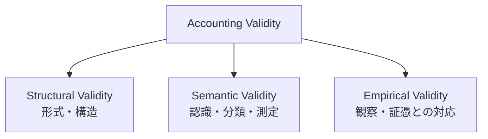
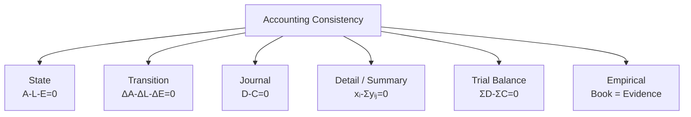

# 09 — Validation

## Scope

このモジュールは、会計システムに現れる整合条件と、正しさの異なるレイヤーを扱う。

## Three Kinds of Validity

ASM では、会計記録の正しさを少なくとも三つに分ける。

### Structural Validity

定義された形式や制約を満たすこと。例として、

$$
A-L-E=0
$$

$$
D(J)-C(J)=0
$$

$$
r_{\mathrm{TB}}=0
$$

がある。

### Semantic Validity

現実の事象を適切に認識し、正しい勘定へ分類し、適切な意味を持つ金額として測定していること。貸借が一致していても勘定科目が誤っていれば、Semantic Validity は満たさない。

### Empirical Validity

帳簿値が実査、証憑、外部確認などの観察可能な証拠と対応すること。例えば、

$$
\mathrm{Cash}_{\mathrm{book}}
=
\mathrm{Cash}_{\mathrm{actual}}
$$

を現金実査で確かめる。

## Residuals

制約 $h(x)=0$ に対して、残差を、

$$
r=h(x)
$$

とする。$r=0$ は、その制約に関する形式的整合性を意味する。

$$
\boxed{r=0\not\Rightarrow\text{economic correctness}}
$$

1つの残差がゼロでも、別レイヤーの誤りは残りうる。

## State and Transition Residuals

状態残差を、

$$
r_S=A-L-E
$$

とする。有効状態では $r_S=0$ である。

遷移残差を、

$$
r_T=\Delta A-\Delta L-\Delta E
$$

とする。制約保存遷移では $r_T=0$ である。

## Journal Residual

仕訳 $J$ について、

$$
\boxed{r_J=D(J)-C(J)}
$$

とする。有効な仕訳表現は $r_J=0$ を満たす。ただし、取引の記録漏れや勘定誤りは検出できない場合がある。

## Subsidiary Reconciliation Residual

総勘定元帳の勘定 $x_i$ と明細 $y_{ij}$ の整合性を、

$$
\boxed{r_i=x_i-\sum_jy_{ij}}
$$

で測る。$r_i=0$ は合計レベルの一致を示す。

## Trial Balance

各勘定の借方合計を $D_i$、貸方合計を $C_i$ とし、

$$
D=
\begin{pmatrix}D_1\\\vdots\\D_n\end{pmatrix},
\qquad
C=
\begin{pmatrix}C_1\\\vdots\\C_n\end{pmatrix}
$$

とする。残高ベクトルを、

$$
b=D-C
$$

とすれば、試算表残差は、

$$
\boxed{
r_{\mathrm{TB}}
=
\mathbf 1^\top(D-C)
=
\mathbf 1^\top b}
$$

である。正しく貸借一致が保存されていれば、

$$
\boxed{r_{\mathrm{TB}}=0}
$$

となる。

## Trial Balance Roles

試算表には少なくとも2つの役割がある。

$$
\boxed{
\text{Trial Balance}
=
\text{Validation}+\text{Aggregation}}
$$

- Validation: 転記後も貸借一致が保存されたか確かめる。
- Aggregation: 各勘定の合計・残高を財務諸表作成へ渡す。

ただし、$r_{\mathrm{TB}}=0$ でも次は検出できない場合がある。

- 取引を丸ごと記録しなかった。
- 誤った勘定へ同額を記録した。
- 複数の誤記が相殺した。
- 現実の現金と帳簿残高が異なる。

## Consistency Layers

これらは同一の式ではない。会計システムの異なるレイヤーに置かれた、異なる検査である。
