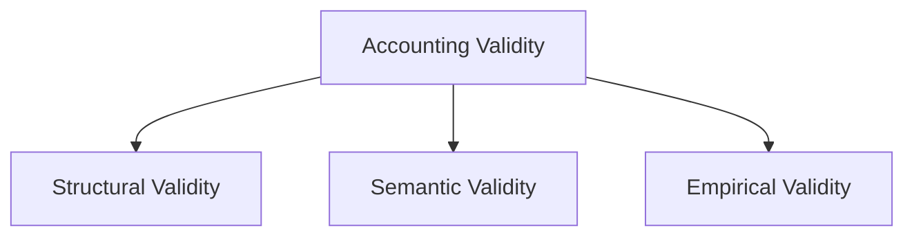
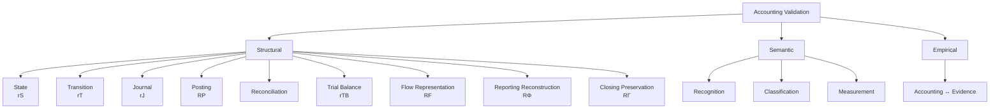

# 09 — Validation

## Scope

このモジュールは、
ASM全体の、

- Structural Validity
- Semantic Validity
- Empirical Validity
- Residual
- Journal Validation
- Posting Validation
- Reconciliation
- Trial Balance
- Reporting Reconstruction Validation
- Closing Preservation Validation

を扱う。

ASMでは、

$$
\boxed{
\text{Accounting Correctness}
\neq
\text{one single condition}
}
$$

と考える。

## Validity as Multiple Axes

Accounting Validityを少なくとも、

1. Structural Validity
2. Semantic Validity
3. Empirical Validity

の3つに分ける。

## Structural Validity

Structural Validityとは、

> ASMまたはBookkeeping systemで定義された形式的関係を満たすこと

である。

例えば、

$$
A-L-E=0
$$

$$
\Delta A-\Delta L-\Delta E=0
$$

$$
D(J)-C(J)=0
$$

などである。

## Semantic Validity

Semantic Validityとは、

> RealityをAccounting上適切に意味づけていること

である。

少なくとも、

- Recognition
- Classification
- Measurement

に分けられる。

$$
\boxed{
V_{\mathrm{sem}}
=
V_{\mathrm{recognition}}
\land
V_{\mathrm{classification}}
\land
V_{\mathrm{measurement}}
}
$$

## Empirical Validity

Empirical Validityとは、

> Accounting valueが観察可能なEvidenceと対応していること

である。

例えば、

- Cash count
- Inventory count
- Bank confirmation
- Invoice
- Contract
- External confirmation

などと比較する。

## Evidence Is Not Reality Itself

Realityを、

$$
\omega
$$

とする。

Realityから観測可能Evidenceを得る作用を、

$$
\boxed{
\mathcal O(\omega)
}
$$

とする。

したがって、

$$
\boxed{
\text{Reality}
\neq
\text{Evidence}
\neq
\text{Accounting Representation}
}
$$

である。

## Residual

Constraintを、

$$
h(x)=0
$$

とする。

Residualを、

$$
\boxed{
r=h(x)
}
$$

とする。

正常なら、

$$
r=0
$$

である。

## Residual May Be Scalar, Vector, or Matrix

ASMのResidualは、
必ずしもscalarとは限らない。

- Scalar residual
- Vector residual
- Matrix residual

がありうる。

必要に応じてNormを取って、

$$
\|R\|
$$

をscalar diagnosticとして使える。

## Meaning of Zero Residual

重要なのは、

$$
\boxed{
r=0
}
$$

が保証するのは、

> そのResidualが検査する特定の関係

だけである。

したがって、

$$
\boxed{
r=0
\not\Rightarrow
\text{economic correctness}
}
$$

である。

## Residual Family

ASMのResidual familyを概念的に、

$$
\boxed{
\mathcal R
=
\{
r_S,
r_T,
r_J,
R_P,
r_i^S,
r_i^F,
r_{\mathrm{TB}},
R_\Phi,
R_\Gamma,
r_{\mathrm{emp}},
\ldots
\}
}
$$

とする。

## State Residual

Reporting Stock Stateについて、

$$
\boxed{
r_S
=
A-L-E
}
$$

とする。

正常なら、

$$
\boxed{
r_S=0
}
$$

である。

## Transition Residual

Semantic Stock Transitionについて、

$$
\boxed{
r_T
=
\Delta A-\Delta L-\Delta E
}
$$

とする。

正常なら、

$$
\boxed{
r_T=0
}
$$

である。

## Journal Residual

Journal Entry $J$ について、

$$
\boxed{
r_J
=
D(J)-C(J)
}
$$

とする。

05より、

$$
\boxed{
r_J
=
\sigma^\top\Delta x
}
$$

である。

## Journal Balance Does Not Guarantee Correct Meaning

$$
r_J=0
$$

でも、
誤ったAccountへ記録している可能性がある。

したがって、

$$
\boxed{
r_J=0
\not\Rightarrow
V_{\mathrm{sem}}=1
}
$$

である。

## Posting Matrix Residual

06で、
Journalから復号したBookkeeping Matrixを、

$$
M^J
$$

Ledgerから再構成したMatrixを、

$$
M^L
$$

とした。

Posting Matrix Residualを、

$$
\boxed{
R_P
=
M^L-M^J
}
$$

とする。

## Posting Correctness

正常なPostingでは、

$$
\boxed{
R_P=0
}
$$

である。

Scalar diagnosticが必要なら、

$$
\boxed{
r_P
=
\|R_P\|
}
$$

とする。

## Posting Correctness Is Local

$$
R_P=0
$$

は、

> Journal contentがLedgerへ正しく移った

ことだけを保証する。

したがって、

$$
\boxed{
R_P=0
\not\Rightarrow
\text{Journal is semantically correct}
}
$$

である。

## Stock Reconciliation Residual

Stock Account $i$ について、

$$
\boxed{
r_i^S(t)
=
b_i(t)
-
\sum_{j\in\mathcal D_i}
y_{ij}(t)
}
$$

とする。

正常なら、

$$
r_i^S(t)=0
$$

である。

## Flow Reconciliation Residual

Flow coordinate $i$ について、

$$
\boxed{
r_i^F(I)
=
f_i(I)
-
\sum_{j\in\mathcal D_i}
z_{ij}(I)
}
$$

とする。

正常なら、

$$
r_i^F(I)=0
$$

である。

## Reconciliation Does Not Guarantee Classification Correctness

Detail classificationが誤っていても、
totalが一致する場合がある。

したがって、

$$
\boxed{
r_i^S=0
\not\Rightarrow
\text{detail classification is correct}
}
$$

$$
\boxed{
r_i^F=0
\not\Rightarrow
\text{detail classification is correct}
}
$$

## Selected Journal Entry Set

Trial Balanceを一般化するため、
Journal Entry indexの任意の部分集合を、

$$
\boxed{
H
\subseteq
K_J(I)
}
$$

とする。

例えば、

- Unadjusted entries
- Adjusted pre-closing entries
- Full post-closing entries

などを選べる。

## Debit and Credit Totals

Account $i$ について、
選択したJournal set $H$ のDebit totalを、

$$
\boxed{
\mathrm{Dr}_i(H)
}
$$

Credit totalを、

$$
\boxed{
\mathrm{Cr}_i(H)
}
$$

とする。

## D/C-signed Period Movement

D/C-signed net movementを、

$$
\boxed{
q_i(H)
=
\mathrm{Dr}_i(H)
-
\mathrm{Cr}_i(H)
}
$$

とする。

重要なのは、

$$
\boxed{
q_i
\neq
b_i
}
$$

である。

## Natural-direction Book Movement

Account $i$ の自然方向のBook movementを、

$$
\boxed{
m_i(H)
=
\sigma_iq_i(H)
}
$$

とする。

すると、

$$
\boxed{
m_i(H)
=
\sum_{k\in H}
\Delta x_i^{(k)}
}
$$

である。

## Book Balance and Period Movement

Stock-valued Account $i$ について、

$$
\boxed{
b_i(t_{\mathrm{end}})
=
b_i(t_{\mathrm{begin}})
+
m_i(H)
}
$$

である。

つまり、

$$
\boxed{
b_i(t_{\mathrm{end}})
=
b_i(t_{\mathrm{begin}})
+
\sigma_i
\left(
\mathrm{Dr}_i(H)
-
\mathrm{Cr}_i(H)
\right)
}
$$

である。

## Example: Cash

期首Cashが50、
期間中Debit 100、
Credit 30とする。

$$
\sigma_{\mathrm{Cash}}=+1
$$

$$
q_{\mathrm{Cash}}=100-30=70
$$

したがって、

$$
m_{\mathrm{Cash}}=70
$$

である。

期末Book Balanceは、

$$
b_{\mathrm{Cash}}(t_1)
=
50+70
=
120
$$

となる。

## Example: Debt

期首Debtが40、
期間中Debit 10、
Credit 50とする。

$$
\sigma_{\mathrm{Debt}}=-1
$$

$$
q_{\mathrm{Debt}}
=
10-50
=
-40
$$

したがって、

$$
m_{\mathrm{Debt}}
=
(-1)(-40)
=
40
$$

となる。

期末Book Balanceは、

$$
b_{\mathrm{Debt}}(t_1)
=
40+40
=
80
$$

である。

## Vector Form of Period Movement

Orientation diagonal matrixを、

$$
\boxed{
\Sigma_\sigma
=
\operatorname{diag}
(
\sigma_1,\ldots,\sigma_n
)
}
$$

とする。

D/C-signed movement vectorを、

$$
q(H)
$$

とすれば、

$$
\boxed{
m(H)
=
\Sigma_\sigma q(H)
}
$$

である。

重要なのは、

$$
\boxed{
m(H)
\neq
b(t)
}
$$

である。

## Trial Balance Residual

Selected Journal set $H$ のTrial Balance Residualを、

$$
\boxed{
r_{\mathrm{TB}}(H)
=
\sum_i
\mathrm{Dr}_i(H)
-
\sum_i
\mathrm{Cr}_i(H)
}
$$

とする。

同値に、

$$
\boxed{
r_{\mathrm{TB}}(H)
=
\mathbf 1^\top q(H)
}
$$

である。

## Trial Balance Theorem

各Journal Entry $J_k$ のResidualを、

$$
r_{J_k}
$$

とする。

すると、

$$
\boxed{
r_{\mathrm{TB}}(H)
=
\sum_{k\in H}
r_{J_k}
}
$$

である。

## Proof

Account / Entryの有限和の順序を交換すれば、

$$
\begin{aligned}
r_{\mathrm{TB}}(H)
&=
\sum_i
\mathrm{Dr}_i(H)
-
\sum_i
\mathrm{Cr}_i(H)\\
&=
\sum_{k\in H}
\left(
D(J_k)-C(J_k)
\right)\\
&=
\sum_{k\in H}
r_{J_k}.
\end{aligned}
$$

したがって証明された。

## Consequence

もし、

$$
\forall k\in H,
\qquad
r_{J_k}=0
$$

なら、

$$
\boxed{
r_{\mathrm{TB}}(H)=0
}
$$

である。

## Converse Does Not Hold

しかし、

$$
r_{\mathrm{TB}}(H)=0
$$

だからといって、

$$
\forall k,\ r_{J_k}=0
$$

とは限らない。

複数のJournal Errorが相殺する可能性がある。

したがって、

$$
\boxed{
r_{\mathrm{TB}}=0
\not\Rightarrow
\forall k,\ r_{J_k}=0
}
$$

である。

## Trial Balance Roles

Trial Balanceには、

1. Aggregation
2. Structural Validation

の2つの役割がある。

$$
\boxed{
\text{Trial Balance}
=
\text{Aggregation}
+
\text{Validation}
}
$$

## Limits of Trial Balance

$$
r_{\mathrm{TB}}=0
$$

でも、

- Missing transaction
- Wrong account classification
- Equal offsetting errors
- Incorrect recognition timing
- Book / reality mismatch

は検出できない場合がある。

## Semantic / Book Reconstruction Residual

07で、

Semantic routeを、

$$
s_{\mathrm{sem}}(t_1)
=
s(t_0)+F_S(I)
$$

Book routeを、

$$
\hat s_B(t_1)
=
\Phi_I(B_I^-)
$$

とした。

Reporting Reconstruction Residualを、

$$
\boxed{
R_\Phi
=
s_{\mathrm{sem}}(t_1)
-
\Phi_I(B_I^-)
}
$$

とする。

## Reporting Reconstruction Validity

正常なら、

$$
\boxed{
R_\Phi=0
}
$$

である。

これは、

> Semantic routeとBook routeが同じReporting Stateへ到達する

ことを表す。

## Structural and Semantic Meaning of Phi

$$
R_\Phi=0
$$

であっても、

$$
\Phi_I
$$

そのものが不適切なAccounting ruleを実装している可能性がある。

したがって、

$$
\boxed{
R_\Phi=0
\not\Rightarrow
\Phi_I
\text{ is semantically valid}
}
$$

である。

## Closing Preservation Residual

Closing前後について、

$$
B_I^-
\xrightarrow{\Gamma_I}
B_I^+
$$

である。

Closing Preservation Residualを、

$$
\boxed{
R_\Gamma
=
\Phi_I(B_I^-)
-
\Phi_I(B_I^+)
}
$$

とする。

正常なら、

$$
\boxed{
R_\Gamma=0
}
$$

である。

## Meaning of Closing Residual

$$
R_\Gamma=0
$$

は、

> ClosingによってBook representationは変化したがReporting meaningは変化していない

ことを検証する。

## Flow Representation Residual

Semantic FlowとBook Flow Accumulatorの関係、

$$
\Lambda_F(u_F^-)
=
f(I)
$$

に対して、

$$
\boxed{
R_F
=
f(I)
-
\Lambda_F(u_F^-(I))
}
$$

を定義できる。

正常なら、

$$
\boxed{
R_F=0
}
$$

である。

## Empirical Residual

Accounting valueとObserved Evidenceとの差を、

$$
\boxed{
r_{\mathrm{emp}}
=
\text{Observed Evidence}
-
\text{Accounting Value}
}
$$

とする。

## Example: Cash Count

$$
\boxed{
r_{\mathrm{Cash}}^{\mathrm{emp}}(t)
=
Cash_{\mathrm{observed}}(t)
-
b_{\mathrm{Cash}}(t)
}
$$

とする。

正常なら、

$$
r_{\mathrm{Cash}}^{\mathrm{emp}}=0
$$

である。

## Example: Inventory

$$
\boxed{
r_{\mathrm{Inventory}}^{\mathrm{emp}}(t)
=
Inventory_{\mathrm{observed}}(t)
-
b_{\mathrm{Inventory}}(t)
}
$$

とする。

## Empirical Match Does Not Guarantee Semantic Correctness

Observed amountがBook amountと一致しても、
ClassificationやMeasurement basisが適切とは限らない。

$$
\boxed{
r_{\mathrm{emp}}=0
\not\Rightarrow
V_{\mathrm{sem}}=1
}
$$

## Validation Matrix

| Structural | Semantic | Empirical | Interpretation |
| --- | --- | --- | --- |
| ✓ | ✓ | ✓ | 理想的に整合 |
| ✓ | ✗ | ? | 形式は正しいが意味が誤る |
| ✓ | ✓ | ✗ | Accounting structureは正しいがEvidenceと不一致 |
| ✗ | ? | ? | 形式構造自体に問題 |
| ✓ | ✗ | ✓ | Totalは合うが分類等が誤る可能性 |

## Validation Graph

## Local Correctness Does Not Imply Global Correctness

例えば、

$$
r_J=0
$$

$$
R_P=0
$$

$$
r_{\mathrm{TB}}=0
$$

でも、
そもそもRecognitionすべき取引を記録していなければ、
Accounting全体は正しくない。

したがって、

$$
\boxed{
\text{local consistency}
\not\Rightarrow
\text{global accounting correctness}
}
$$

## Error Localization

### Case 1

$$
r_J\neq0
$$

なら、
Journal balanceに問題がある。

### Case 2

$$
r_J=0,
\qquad
R_P\neq0
$$

なら、
JournalはBalancedだがPostingに問題がある。

### Case 3

$$
R_P=0,
\qquad
r_i^S\neq0
$$

なら、
General LedgerとSubsidiary Detailの不一致が疑われる。

### Case 4

$$
r_{\mathrm{TB}}=0,
\qquad
r_{\mathrm{emp}}\neq0
$$

なら、
Bookkeeping内部は整合していてもEvidenceとの不一致がある。

## Validation as Layered Diagnostics

ASMのResidual familyは、

$$
\boxed{
\text{one global pass/fail test}
}
$$

ではなく、

$$
\boxed{
\text{layered diagnostic system}
}
$$

として機能する。

## Core Residuals

**State Residual：**

$$
\boxed{
r_S
=
A-L-E
}
$$

**Transition Residual：**

$$
\boxed{
r_T
=
\Delta A-\Delta L-\Delta E
}
$$

**Journal Residual：**

$$
\boxed{
r_J
=
D(J)-C(J)
=
\sigma^\top\Delta x
}
$$

**Posting Residual：**

$$
\boxed{
R_P
=
M^L-M^J
}
$$

**Stock Reconciliation Residual：**

$$
\boxed{
r_i^S(t)
=
b_i(t)
-
\sum_{j\in\mathcal D_i}
y_{ij}(t)
}
$$

**Flow Reconciliation Residual：**

$$
\boxed{
r_i^F(I)
=
f_i(I)
-
\sum_{j\in\mathcal D_i}
z_{ij}(I)
}
$$

**D/C-signed Period Movement：**

$$
\boxed{
q_i(H)
=
\mathrm{Dr}_i(H)
-
\mathrm{Cr}_i(H)
}
$$

**Natural Book Movement：**

$$
\boxed{
m_i(H)
=
\sigma_iq_i(H)
}
$$

**Book Balance Evolution：**

$$
\boxed{
b_i(t_{\mathrm{end}})
=
b_i(t_{\mathrm{begin}})
+
m_i(H)
}
$$

**Trial Balance Residual：**

$$
\boxed{
r_{\mathrm{TB}}(H)
=
\mathbf 1^\top q(H)
}
$$

**Trial Balance Theorem：**

$$
\boxed{
r_{\mathrm{TB}}(H)
=
\sum_{k\in H}
r_{J_k}
}
$$

**Flow Representation Residual：**

$$
\boxed{
R_F
=
f(I)
-
\Lambda_F(u_F^-(I))
}
$$

**Reporting Reconstruction Residual：**

$$
\boxed{
R_\Phi
=
s_{\mathrm{sem}}(t_1)
-
\Phi_I(B_I^-)
}
$$

**Closing Preservation Residual：**

$$
\boxed{
R_\Gamma
=
\Phi_I(B_I^-)
-
\Phi_I(B_I^+)
}
$$

**Empirical Residual：**

$$
\boxed{
r_{\mathrm{emp}}
=
\text{Observed Evidence}
-
\text{Accounting Value}
}
$$

## Core Principles

**Principle 1：**

$$
\boxed{
r=0
\not\Rightarrow
\text{economic correctness}
}
$$

**Principle 2：**

$$
\boxed{
\text{Structural Validity}
\neq
\text{Semantic Validity}
}
$$

**Principle 3：**

$$
\boxed{
\text{Semantic Validity}
\neq
\text{Empirical Validity}
}
$$

**Principle 4：**

$$
\boxed{
\text{one residual}
=
\text{one specified consistency relation}
}
$$

**Principle 5：**

$$
\boxed{
\text{multiple residuals}
=
\text{layered diagnostics}
}
$$

## Relationship to Other Modules

- Reality / Recognition:
  [01 — Reality and Recognition](01-reality-and-recognition.md)
- Reporting State:
  [02 — State](02-state.md)
- Semantic Transition:
  [03 — Transition](03-transition.md)
- Classification / Temporal Type:
  [04 — Accounts and Classification](04-accounts-and-classification.md)
- Journal Balance:
  [05 — Double Entry](05-double-entry.md)
- Posting / Book Balance:
  [06 — Journal and Ledger](06-journal-and-ledger.md)
- Reporting Reconstruction / Closing:
  [07 — Period and Stock-Flow](07-period-stock-flow.md)
- Aggregation / Reconciliation:
  [08 — Aggregation](08-aggregation.md)

## Open Questions

- Semantic Validityをrule systemとしてどう形式化するか。
- Recognition / Classification / Measurementごとのdiagnosticを構成できるか。
- Evidence operator $\mathcal O$ をどこまで形式化するか。
- Measurement uncertaintyをResidualへどう含めるか。
- Matrix Residualのnormをどう選ぶか。
- $\Phi_I$ 自体のSemantic Validityをどう評価するか。
- $\Lambda_F$ のValidationをAccounting standardにどう接続するか。
- Residual familyをAudit / Internal Controlへどう拡張するか。
